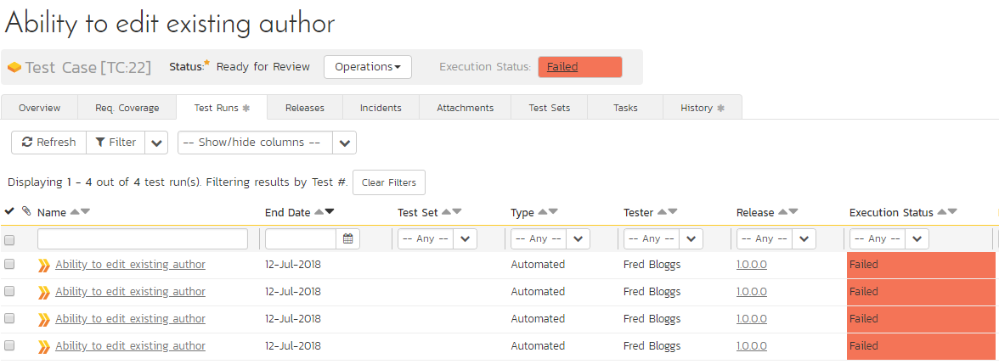
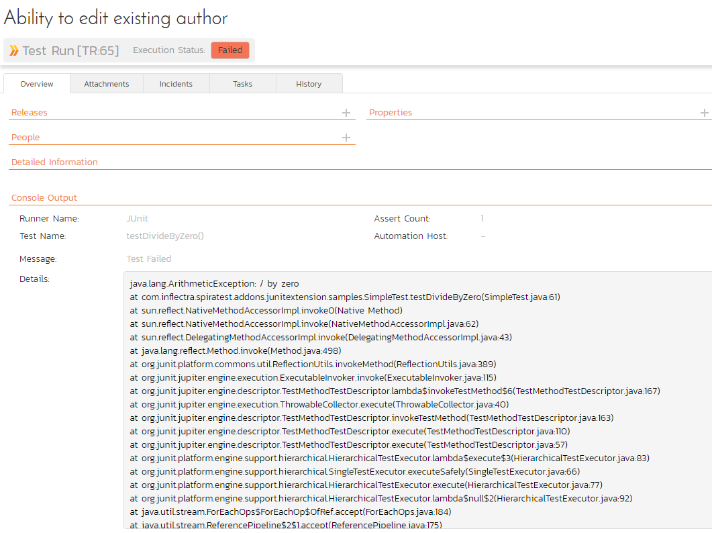

# Integrating with JUnit

The directions for using JUnit 5 and JUnit 4 are in different sections below:

## Installing the JUnit 5 Extension

This section outlines how to install the SpiraTest Extension for JUnit 5
onto a workstation so that you can then run automated JUnit tests
against a Java application and have the results be recorded as test runs
inside SpiraTest. It assumes that you already have a working
installation of SpiraTest v3.0 or later. If you have an earlier version
of SpiraTest you will need to upgrade to at least v3.0 before trying to
use this extension. You will also need to have at least version 5.0 of
Junit. If you are using an earlier version, please visit
[www.junit.org](http://www.junit.org) to obtain the latest version.

To obtain the version of the JUnit extension that is compatible with
your version of SpiraTest, you simply need to log-in as a project-level
administrator to SpiraTest, go to the Administration home page and
download the JUnit Extension compressed archive (.zip). This process is
described in the *SpiraTest Administration Guide* in more detail.

The JUnit extension is provided as a compressed zipfile that includes
both the binaries (packaged as a JAR-file) and the source code (stored
in a folder structure that mirrors the Java classpath). The JAR-file
binary was compiled for use on a Windows x86 platform, other platforms
(e.g. Linux) will require you to compile the Java source files into the
appropriate Java classfiles before using the extension. The rest of this
section will assume that you are using the pre-compiled JAR-file.

Once you have downloaded the Zip archive, you need to uncompress it into
a folder of your choice on your local system. Assuming that you
uncompressed it to the C:\\Program Files\\JUnit Extension
folder, you should have the following folder structure created:

C:\\Program Files\\JUnit Extension

C:\\Program Files\\JUnit Extension\\com

C:\\Program Files\\JUnit Extension\\com\\inflectra

C:\\Program Files\\JUnit Extension\\com\\inflectra\\spiratest

C:\\Program Files\\JUnit Extension\\com\\inflectra\\spiratest\\addons

C:\\Program Files\\JUnit
Extension\\com\\inflectra\\spiratest\\addons\\junitextension

C:\\Program Files\\JUnit
Extension\\com\\inflectra\\spiratest\\addons\\junitextension\\samples

The JAR-file is located in the root folder, the source-code for the
extension can be found in the "junitextension" subfolder, and the sample
test fixture can be found in the "samples" subfolder.

Now to use the extension within your test cases, you need to first make
sure that the JAR-file is added to the Java classpath. The method for
doing this is dependent on the platform you're using, so please refer to
FAQ on [www.junit.org](http://www.junit.org) for details on the
appropriate method for your platform. As an example, on a Windows
platform, the JAR-file would be added to the classpath by typing the
following:

set CLASSPATH=%CLASSPATH%; C:\\Program Files\\JUnit
Extension\\JUnitExtension.jar

Once you have completed this step, you are now ready to begin using your
JUnit test fixtures with SpiraTest.

## Using JUnit 5 with SpiraTest

The typical code structure for a JUnit test fixture coded in Java is as
follows:

```Java
package com.inflectra.spiratest.addons.junitextension.samples;

import org.junit.jupiter.api.BeforeEach;
import org.junit.jupiter.api.Test;
import static org.junit.jupiter.api.Assertions.assertEquals;
import static org.junit.jupiter.api.Assertions.assertTrue;


/**
 * Some simple tests using the ability to return results back to SpiraTest
 *
 * @author Inflectra Corporation
 * @version 4.0.0
 */
public class SimpleTest {
    protected int fValue1;
    protected int fValue2;

    /**
     * Sets up the unit test
     */
    @BeforeEach
    public void setUp() {
        fValue1 = 2;
        fValue2 = 3;
    }

    /**
     * Tests the addition of the two values
     */
    @Test
    public void testAdd() {
        double result = fValue1 + fValue2;

        // forced failure result == 5
        assertTrue(result == 6);
    }

    /**
     * Tests division by zero
     */
    @Test
    public void testDivideByZero() {
        int zero = 0;
        int result = 8 / zero;
    }

    /**
     * Tests two equal values
     */
    @Test
    public void testEquals() {
        assertEquals(12, 12);
        assertEquals(12L, 12L);
        assertEquals(new Long(12), new Long(12));

        assertEquals(12, 13, "Size");
        assertEquals(12.0, 11.99, 0.0, "Capacity");
    }

    /**
     * Tests success
     */
    @Test
    public void testSuccess() {
        //Successful test
        assertEquals(12, 12);
    }
}

```

The Java class is marked as a JUnit test fixture by applying the
@BeforeEach attribute to the setup method, and the @Test attribute to
each of the test assertion methods individually -- highlighted in yellow
above. When you open up the class in a JUnit runner or execute from the
command line it loads all the test classes and executes all the methods
marked with @Test in turn.

Each of the Assert statements is used to test the state of the
application after executing some sample code that calls the
functionality being tested. If the condition in the assertion is true,
then execution of the test continues, if it is false, then a failure is
logged and JUnit moves on to the next test method.

So, to use SpiraTest with JUnit, each of the test cases written for
execution by JUnit needs to have a corresponding test case in SpiraTest.
These can be either existing test cases that have manual test steps or
they can be new test cases designed specifically for automated testing
and therefore have no defined test steps. In either case, the changes
that need to be made to the JUnit test fixture for SpiraTest to record
the JUnit test run are illustrated below:

```Java
package com.inflectra.spiratest.addons.junitextension.samples;

import com.inflectra.spiratest.addons.junitextension.*;

import org.junit.jupiter.api.BeforeEach;
import org.junit.jupiter.api.Test;
import static org.junit.jupiter.api.Assertions.assertEquals;
import static org.junit.jupiter.api.Assertions.assertTrue;


/**
 * Some simple tests using the ability to return results back to SpiraTest
 *
 * @author Inflectra Corporation
 * @version 5.0.0
 */
@SpiraTestConfiguration(
        //following are REQUIRED
        url = "http://doctor/SpiraPlan",
        login = "fredbloggs",
        password = "{XXXXXXXXXXXXXXXX}", // make sure to use your API/RSS key and not your login password
        projectId = 1,`
        //following are OPTIONAL
        releaseId = 7,
        testSetId = 1
)

public class SimpleTest {
    protected int fValue1;
    protected int fValue2;

    /**
     * Sets up the unit test
     */
    @BeforeEach
    public void setUp() {
        fValue1 = 2;
        fValue2 = 3;
    }

    /**
     * Tests the addition of the two values
     */
    @Test
    @SpiraTestCase(testCaseId = 22)
    public void testAdd() {
        double result = fValue1 + fValue2;

        // forced failure result == 5
        assertTrue(result == 6);
    }

    /**
     * Tests division by zero
     */
    @Test
    @SpiraTestCase(testCaseId = 22)
    public void testDivideByZero() {
        int zero = 0;
        int result = 8 / zero;
    }

    /**
     * Tests two equal values
     */
    @Test
    @SpiraTestCase(testCaseId = 22)
    public void testEquals() {
        assertEquals(12, 12);
        assertEquals(12L, 12L);
        assertEquals(new Long(12), new Long(12));

        assertEquals(12, 13, "Size");
        assertEquals(12.0, 11.99, 0.0, "Capacity");
    }

    /**
     * Tests success
     */
    @Test
    @SpiraTestCase(testCaseId = 22)
    public void testSuccess() {
        //Successful test
        assertEquals(12, 12);
    }
}
```


The overall class is marked with a new @SpiraTestConfiguration
attribute that contains the following pieces of information needed to
access the SpiraTest test repository:

- **URL** - The URL to the instance of SpiraTest being accessed. This needs to start with http:// or https://.

- **Login** - A valid username for the instance of SpiraTest.
- **Password** -- Use the API key / RSS key for your user profile **NOT your login password**. This can be found in your profile page (RSS Feeds must be enabled for this to work).
- **Project Id** - The ID of the project (this can be found on the project homepage in the "Project Overview" section)
- **Release Id** (Optional) - The ID of the release to associate the test run with. This can be found on the releases list page (click on the Planning \> Releases tab). If you don't want to specify a release, just use the value -1.
- **Test Set Id** (Optional) -- The ID of the test set to associate the test run with. This can be found on the test set list page (click on the Testing \> Test Sets tab). If you don't want to specify a test set, just use the value -1. If you choose a test set that is associated with a release, then you don't need to explicitly set a release id (i.e. just use -1). However if you do set a release value, it will override the value associated with the test set.

In addition, each of the individual test methods needs to be mapped to a
specific test case within SpiraTest. This is done by adding a
@SpiraTestCase attribute to the test method together with the ID of the
corresponding test case in SpiraTest. The Test Case ID can be found on
the test cases list page (click the "Test Cases" tab).

For these attributes to be available in your test fixture, you also need
to add a reference to the
*com.inflectra.spiratest.addons.junitextension* package. This package is
bundled within the supplied JAR-file library for Windows, and can be
compiled from the provided source .java files on other platforms.

Now all you need to do is compile your code and then launch JUnit by
executing the test fixture through the command line (or through your
choice of IDE, e.g. Eclipse). E.g. for our sample test, you would use
the following command:

java com.inflectra.spiratest.addons.junitextension.samples.SimpleTest

Once the test has run, you can view the test cases in SpiraTest, you
should see a JUnit automated test run displayed in the list of executed
test runs:




Clicking on one of the JUnit test runs will bring up a screen that
provides information regarding what JUnit test method failed, what the
error was, together with the associated code stack-trace:




Congratulations... You are now able to run JUnit 5 automated tests and
have the results be recorded within SpiraTest. The sample test fixture
SimpleText.java is provided with the installation.


## Installing the JUnit 4 Extension

This section outlines how to install the SpiraTest Extension for JUnit
onto a workstation so that you can then run automated JUnit tests
against a Java application and have the results be recorded as test runs
inside SpiraTest. It assumes that you already have a working
installation of SpiraTest v3.0 or later. If you have an earlier version
of SpiraTest you will need to upgrade to at least v3.0 before trying to
use this extension. You will also need to have version 4.0 of JUnit. To
use version 5.0 of JUnit, please visit [Installing the JUnit 5 Extension](#installing-the-junit-5-extension)

To obtain the version of the JUnit extension that is compatible with
your version of SpiraTest, you simply need to log-in as a project-level
administrator to SpiraTest, go to the Administration home page and
download the JUnit Extension compressed archive (.zip). This process is
described in the *SpiraTest Administration Guide* in more detail.

The JUnit extension is provided as a compressed zipfile that includes
both the binaries (packaged as a JAR-file) and the source code (stored
in a folder structure that mirrors the Java classpath). The JAR-file
binary was compiled for use on a Windows x86 platform, other platforms
(e.g. Linux) will require you to compile the Java source files into the
appropriate Java classfiles before using the extension. The rest of this
section will assume that you are using the pre-compiled JAR-file.

Once you have downloaded the Zip archive, you need to uncompress it into
a folder of your choice on your local system. Assuming that you
uncompressed it to the C:\\Program Files\\JUnit Extension
folder, you should have the following folder structure created:

C:\\Program Files\\JUnit Extension

C:\\Program Files\\JUnit Extension\\com

C:\\Program Files\\JUnit Extension\\com\\inflectra

C:\\Program Files\\JUnit Extension\\com\\inflectra\\spiratest

C:\\Program Files\\JUnit Extension\\com\\inflectra\\spiratest\\addons

C:\\Program Files\\JUnit
Extension\\com\\inflectra\\spiratest\\addons\\junitextension

C:\\Program Files\\JUnit
Extension\\com\\inflectra\\spiratest\\addons\\junitextension\\samples

The JAR-file is located in the root folder, the source-code for the
extension can be found in the "junitextension" subfolder, and the sample
test fixture can be found in the "samples" subfolder.

Now to use the extension within your test cases, you need to first make
sure that the JAR-file is added to the Java classpath. The method for
doing this is dependent on the platform you're using, so please refer to
FAQ on [www.junit.org](http://www.junit.org) for details on the
appropriate method for your platform. As an example, on a Windows
platform, the JAR-file would be added to the classpath by typing the
following:

set CLASSPATH=%CLASSPATH%; C:\\Program Files\\JUnit
Extension\\JUnitExtension.jar

Once you have completed this step, you are now ready to begin using your
JUnit test fixtures with SpiraTest.

## Using JUnit 4 with SpiraTest

The typical code structure for a JUnit test fixture coded in Java is as
follows:

```Java
package com.inflectra.spiratest.addons.junitextension.samples;

import static org.junit.Assert.*;
import junit.framework.JUnit4TestAdapter;
import org.junit.Before;
import org.junit.Test;
import org.junit.runner.*;
import org.junit.runner.notification.*;

import java.util.*;

/**
 * Some simple tests using JUnit 4
 * 
 * @author		Inflectra Corporation
 * @version		2.3.0
 *
 */
public class SimpleTest
{
	protected int fValue1;
	protected int fValue2;

	/**
	 * Sets up the unit test
	 */
	@Before
	public void setUp()
	{
		fValue1= 2;
		fValue2= 3;
	}

	/**
	 * Tests the addition of the two values
	 */
	@Test
	public void testAdd()
	{
		double result = fValue1 + fValue2;

		// forced failure result == 5
		assertTrue (result == 6);
	}

	/**
	 * Tests division by zero
	 */
	@Test
	public void testDivideByZero()
	{
		int zero = 0;
		int result = 8 / zero;
		result++; // avoid warning for not using result
	}

	/**
	 * Tests two equal values
	 */
	@Test

	public void testEquals()
	{
		assertEquals(12, 12);
		assertEquals(12L, 12L);
		assertEquals(new Long(12), new Long(12));

		assertEquals("Size", 12, 13);
		assertEquals("Capacity", 12.0, 11.99, 0.0);
	}

	/**
	 * Tests success
	 */
	@Test
	public void testSuccess()
	{
		//Successful test
		assertEquals(12, 12);
	}

	/**
	 * Entry point for command line execution
	 * 
	 * @param args	The command line arguments
	 */
	public static void main (String[] args)
	{
		//Instantiate the JUnit core
		JUnitCore core = new JUnitCore();

		//Finally run the test fixture
		core.run (SimpleTest.class);
	}

	/**
	 * Entry point for JUnit 4.x runners
	 * 
	 * @return		Handle to the test framework
	 */
	public static junit.framework.Test suite() 
	{
		return new JUnit4TestAdapter(SimpleTest.class);
	}
}
```

The Java class is marked as a JUnit test fixture by applying the
@Before attribute to the setup method, and the @Test attribute to each
of the test assertion methods individually -- highlighted in yellow
above. When you open up the class in a JUnit runner or execute from the
command line it loads all the test classes and executes all the methods
marked with @Test in turn.

Each of the Assert statements is used to test the state of the
application after executing some sample code that calls the
functionality being tested. If the condition in the assertion is true,
then execution of the test continues, if it is false, then a failure is
logged and JUnit moves on to the next test method.

So, to use SpiraTest with JUnit, each of the test cases written for
execution by JUnit needs to have a corresponding test case in SpiraTest.
These can be either existing test cases that have manual test steps or
they can be new test cases designed specifically for automated testing
and therefore have no defined test steps. In either case, the changes
that need to be made to the JUnit test fixture for SpiraTest to record
the JUnit test run are illustrated below:

```Java
package com.inflectra.spiratest.addons.junitextension.samples;

import static org.junit.Assert.*;
import junit.framework.JUnit4TestAdapter;
import org.junit.Before;
import org.junit.Test;
import org.junit.runner.*;
import org.junit.runner.notification.*;

import com.inflectra.spiratest.addons.junitextension.*;

import java.util.*;

/**
 * Some simple tests using the ability to return results back to SpiraTest
 * 
 * @author		Inflectra Corporation
 * @version		2.3.0
 *
 */
@SpiraTestConfiguration(
	url="http://sandman/SpiraTest",
	login="fredbloggs",
	password="fredbloggs",
	projectId=1,
	releaseId=1,
	testSetId=1
)
public class SimpleTest
{
	protected int fValue1;
	protected int fValue2;

	/**
	 * Sets up the unit test
	 */
	@Before
	public void setUp()
	{
		fValue1= 2;
		fValue2= 3;
	}

	/**
	 * Tests the addition of the two values
	 */
	@Test
	@SpiraTestCase(testCaseId=5)
	public void testAdd()
	{
		double result = fValue1 + fValue2;

		// forced failure result == 5
		assertTrue (result == 6);
	}

	/**
	 * Tests division by zero
	 */
	@Test
	@SpiraTestCase(testCaseId=5)
	public void testDivideByZero()
	{
		int zero = 0;
		int result = 8 / zero;
		result++; // avoid warning for not using result
	}

	/**
	 * Tests two equal values
	 */
	@Test
	@SpiraTestCase(testCaseId=6)
	public void testEquals()
	{
		assertEquals(12, 12);
		assertEquals(12L, 12L);
		assertEquals(new Long(12), new Long(12));

		assertEquals("Size", 12, 13);
		assertEquals("Capacity", 12.0, 11.99, 0.0);
	}

	/**
	 * Tests success
	 */
	@Test
	@SpiraTestCase(testCaseId=6)
	public void testSuccess()
	{
		//Successful test
		assertEquals(12, 12);
	}

	/**
	 * Entry point for command line execution
	 * 
	 * @param args	The command line arguments
	 */
	public static void main (String[] args)
	{
		//Instantiate the JUnit core
		JUnitCore core = new JUnitCore();

		//Add the custom SpiraTest listener
		core.addListener(new SpiraTestListener());

		//Finally run the test fixture
		core.run (SimpleTest.class);
	}

	/**
	 * Entry point for JUnit 4.x runners
	 * 
	 * @return		Handle to the test framework
	 */
	public static junit.framework.Test suite() 
	{
		return new JUnit4TestAdapter(SimpleTest.class);
	}
}
```

The overall class is marked with a new @SpiraTestConfiguration
attribute that contains the following pieces of information needed to
access the SpiraTest test repository:

**URL** - The URL to the instance of SpiraTest being accessed. This
needs to start with http:// or https://.

**Login** - A valid username for the instance of SpiraTest.

**Password** - A valid password for the instance of SpiraTest.

**Project Id** - The ID of the project (this can be found on the project
homepage in the "Project Overview" section)

**Release Id** (Optional) - The ID of the release to associate the test
run with. This can be found on the releases list page (click on the
Planning \> Releases tab). If you don't want to specify a release, just
use the value -1.

**Test Set Id** (Optional) -- The ID of the test set to associate the
test run with. This can be found on the test set list page (click on the
Testing \> Test Sets tab). If you don't want to specify a test set, just
use the value -1. If you choose a test set that is associated with a
release, then you don't need to explicitly set a release id (i.e. just
use -1). However if you do set a release value, it will override the
value associated with the test set.

In addition, each of the individual test methods needs to be mapped to a
specific test case within SpiraTest. This is done by adding a
@SpiraTestCase attribute to the test method together with the ID of the
corresponding test case in SpiraTest. The Test Case ID can be found on
the test cases list page (click the "Test Cases" tab).

For these attributes to be available in your test fixture, you also need
to add a reference to the
*com.inflectra.spiratest.addons.junitextension* package. This package is
bundled within the supplied JAR-file library for Windows, and can be
compiled from the provided source .java files on other platforms.

Now all you need to do is compile your code and then launch JUnit by
executing the test fixture through the command line (or through your
choice of IDE, e.g. Eclipse). E.g. for our sample test, you would use
the following command:

java com.inflectra.spiratest.addons.junitextension.samples.SimpleTest

Once the test has run, you can view the test cases in SpiraTest, you
should see a JUnit automated test run displayed in the list of executed
test runs:


Clicking on one of the JUnit test runs will bring up a screen that
provides information regarding what JUnit test method failed, what the
error was, together with the associated code stack-trace:


Congratulations... You are now able to run JUnit automated tests and
have the results be recorded within SpiraTest. The sample test fixture
SimpleText.java is provided with the installation.

