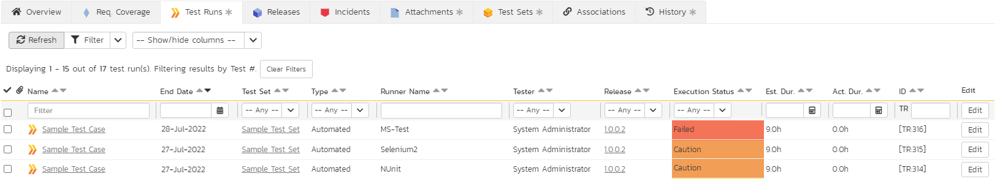

# Integrating with MS-Test

This section describes how to use SpiraTest in conjunction with the unit
testing features provided by Microsoft Visual Studio Team System (MS
VSTS) Test -- commonly known as MS-Test.

## Installing the MS-Test Extension

This section outlines how to install the SpiraTest extension for
Microsoft Visual Studio Team System Test (MS-Test) onto a workstation so
that you can then run automated MS-Test tests against a .NET application
and have the results be recorded as test runs inside SpiraTest. It
assumes that you already have a working installation of SpiraTest v2.3
or later. If you have an earlier version of SpiraTest you will need to
upgrade to at least v2.3 before trying to use this add-in. You will also
need to have either Visual Studio Team System 2005 or later or Visual
Studio 2008 Professional or later, since earlier versions do not come
with the test automation features.

To obtain the latest version of the SpiraTest extension, you can either
access the administration section of SpiraTest, and click on the Add-Ins
& Downloads link or simply visit the Inflectra corporate downloads
webpage (<http://www.inflectra.com/Products/Downloads.aspx>) and then
download the compressed archive (.zip) that contains the extension and
associated sample files.

The MS-Test extension is provided as a compressed zipfile that includes
both the binaries (packaged as a .NET dll assembly) and the source code
(stored in a Visual Studio project folder structure). The rest of this
section will assume that you are using the pre-compiled assembly.

Once you have downloaded the Zip archive, you need to uncompress it into
a folder of your choice on your local system. Assuming that you
uncompressed it to the C:\\Program Files\\SpiraTest\\MSTest
Extension folder, you should have the following folder
structure created:

C:\\Program Files\\SpiraTest\\MSTest Extension

C:\\Program Files\\SpiraTest\\MSTest Extension\\SampleMSTest

C:\\Program Files\\SpiraTest\\MSTest Extension\\SampleMSTest\\Properties

C:\\Program Files\\SpiraTest\\MSTest Extension\\SpiraTestMSExtension

C:\\Program Files\\SpiraTest\\MSTest
Extension\\SpiraTestMSExtension\\Properties

C:\\Program Files\\SpiraTest\\MSTest
Extension\\SpiraTestMSExtension\\Web References

The pre-built assembly SpiraTestMSTestExtension.dll is
located in the root folder, the source-code for the extension can be
found in the "SpiraTestMSExtension" subfolder, and the sample test
fixture can be found in the "SampleMSTest" subfolder.

Now to use the extension within your test cases, you need to first make
sure that the SpiraTestMSTestExtension.dll assembly is added to the
project references. Once you have completed this step, you are now ready
to begin using your MS-Test test fixtures with SpiraTest.

## Using MS-Test with SpiraTest

The typical code structure for a Visual Studio Team System Test
(MS-Test) test fixture coded in C\# is as follows:

```C#
 using System;
using System.Threading;
using Microsoft.VisualStudio.TestTools.UnitTesting;

namespace Inflectra.SpiraTest.AddOns.SpiraTestMSTestExtension.SampleMSTest
{
    /// <summary>
    /// Sample test fixture that tests the SpiraTest integration
    /// Written by Paul Tissue. Packed by Inflectra Corporation
    /// </summary>
    [
    TestClass
    ]
    public class SpiraTestCaseAttributeTest
    {
        /// <summary>
        /// Test fixture state
        /// </summary>
        protected static int testFixtureState = 1;

        /// <summary>
        /// Constructor method
        /// </summary>
        public SpiraTestCaseAttributeTest()
        {
            //Delegates to base

            //Set the state to 2
            testFixtureState = 2;
        }

        /// <summary>
        /// Sample test that asserts a failure and overrides the default configuration
        /// </summary>
        [
        TestMethod
        ]
        public void SampleFail()
        {
            //Verify the state
            Assert.AreEqual(2, testFixtureState, "*Real Error*: State not persisted");

            //Failure Assertion
            Assert.AreEqual(1, 0, "Failed as Expected");
        }

        /// <summary>
        /// Sample test that succeeds - uses the default configuration
        /// </summary>
        [
        TestMethod
        ]
        public void SamplePass()
        {
            //Verify the state
            Assert.AreEqual(2, testFixtureState, "*Real Error*: State not persisted");

            //Successful assertion
            Assert.AreEqual(1, 1, "Passed as Expected");
        }

        /// <summary>
        /// Sample test that does not log to SpiraTest
        /// </summary>
        [
        TestMethod,
        ExpectedException(typeof(AssertFailedException))
        ]
        public void SampleIgnore()
        {
            //Verify the state
            Assert.AreEqual(2, testFixtureState, "*Real Error*: State not persisted");

            //Failure Assertion
            Assert.AreEqual(1, 0, "Failed as Expected");
        }
    }
}
```

The .NET class is marked as a MS-Test unit test fixture by applying the
\[TestClass\] attribute to the class as a whole, and the \[TestMethod\]
attribute to each of the test assertion methods individually -- shown
above. When you open up the class in Visual Studio and click Tests \>
Run \> Run All Tests in Solution it loads all the test
classes marked with \[TestClass\] and executes all the methods marked
with \[TestMethod\] in turn.

Each of the Assert statements is used to test the state of the
application after executing some sample code that calls the
functionality being tested. If the condition in the assertion is true,
then execution of the test continues, if it is false, then a failure is
logged and MS-Test moves on to the next test method.

So, to use SpiraTest with MS-Test, each of the test cases written for
execution by MS-Test needs to have a corresponding test case in
SpiraTest. These can be either existing test cases that have manual test
steps or they can be new test cases designed specifically for automated
testing and therefore have no defined test steps. In either case, the
changes that need to be made to the MS-Test test fixture for SpiraTest
to record the MS-Test test run are illustrated below:

```C#
using System;
using System.Threading;
using Microsoft.VisualStudio.TestTools.UnitTesting;

namespace Inflectra.SpiraTest.AddOns.SpiraTestMSTestExtension.SampleMSTest
{
    /// <summary>
    /// Sample test fixture that tests the SpiraTest integration
    /// Written by Paul Tissue. Packed by Inflectra Corporation
    /// </summary>
    [
    TestClass
    ]
    public class SpiraTestCaseAttributeTest : MSTestExtensionsTestFixture
    {
        /// <summary>
        /// Test fixture state
        /// </summary>
        protected static int testFixtureState = 1;

        /// <summary>
        /// Constructor method
        /// </summary>
        public SpiraTestCaseAttributeTest()
        {
            //Delegates to base

            //Set the state to 2
            testFixtureState = 2;
        }

        /// <summary>
        /// Sample test that asserts a failure and overrides the default configuration
        /// </summary>
        [
        TestMethod,
        SpiraTestCase(5),
        SpiraTestConfiguration("http://localhost/SpiraTest", "fredbloggs", "fredbloggs", 1, 1, 2)
        ]
        public void SampleFail()
        {
            //Verify the state
            Assert.AreEqual(2, testFixtureState, "*Real Error*: State not persisted");

            //Failure Assertion
            Assert.AreEqual(1, 0, "Failed as Expected");
        }

        /// <summary>
        /// Sample test that succeeds - uses the default configuration
        /// </summary>
        [
        TestMethod,
        SpiraTestCase(6)
        ]
        public void SamplePass()
        {
            //Verify the state
            Assert.AreEqual(2, testFixtureState, "*Real Error*: State not persisted");

            //Successful assertion
            Assert.AreEqual(1, 1, "Passed as Expected");
        }

        /// <summary>
        /// Sample test that does not log to SpiraTest
        /// </summary>
        [
        TestMethod,
        ExpectedException(typeof(AssertFailedException))
        ]
        public void SampleIgnore()
        {
            //Verify the state
            Assert.AreEqual(2, testFixtureState, "*Real Error*: State not persisted");

            //Failure Assertion
            Assert.AreEqual(1, 0, "Failed as Expected");
        }
    }
}
```

And the following settings need to be added to the .config file
associated with the test fixture assembly:

```xml
<?xml version="1.0"?>
<configuration>
  <configSections>
    <sectionGroup name="applicationSettings" type="System.Configuration.ApplicationSettingsGroup, System, Version=2.0.0.0, Culture=neutral, PublicKeyToken=b77a5c561934e089" >
      <section name="Inflectra.SpiraTest.AddOns.SpiraTestMSTestExtension.Properties.Settings" type="System.Configuration.ClientSettingsSection, System, Version=2.0.0.0, Culture=neutral, PublicKeyToken=b77a5c561934e089" requirePermission="false" />
    </sectionGroup>
  </configSections>
  <applicationSettings>
    <Inflectra.SpiraTest.AddOns.SpiraTestMSTestExtension.Properties.Settings>
      <setting name="Url" serializeAs="String">
        <value>http://localhost/SpiraTest</value>
      </setting>
      <setting name="Login" serializeAs="String">
        <value>fredbloggs</value>
      </setting>
      <setting name="Password" serializeAs="String">
        <value>fredbloggs</value>
      </setting>
      <setting name="ProjectId" serializeAs="String">
        <value>1</value>
      </setting>
      <setting name="ReleaseId" serializeAs="String">
        <value>1</value>
      </setting>
      <setting name="TestSetId" serializeAs="String">
        <value>1</value>
      </setting>
      <setting name="RecordTestRun" serializeAs="String">
        <value>True</value>
      </setting>
    </Inflectra.SpiraTest.AddOns.SpiraTestMSTestExtension.Properties.Settings>
  </applicationSettings>
```

Firstly the settings in the .config file indicate the following
information to the test fixture:

The URL to the instance of SpiraTest being accessed. This needs to start
with http:// or https://.

A valid username and password for the instance of SpiraTest.

The ID of the project (this can be found on the project homepage in the
"Project Overview" section)

(Optional) The ID of the release to associate the test-run with. This
can be found on the releases list page (click on the Planning \>
Releases tab)

(Optional) The ID of the test set to associate the test-run with. This
can be found on the test set list page (click on the Testing \> Test
Sets tab)

A flag that tells MS-Test whether or not to record the results in
SpiraTest.

Next, the test fixture class needs to be derived from the
*MSTestExtensionsTestFixture* base class so that the test runner knows
that the test class will be reporting back to SpiraTest.

In addition, each of the individual test methods needs to be mapped to a
specific test case within SpiraTest. This is done by adding a
\[SpiraTestCase\] attribute to the test method together with the ID of
the corresponding test case in SpiraTest. The Test Case ID can be found
on the test cases list page (click the "Test Cases" tab).

In addition you can also override the default SpiraTest configuration
settings from the .config file by adding the \[SpiraTestConfiguration\]
attribute directly to the test method and specifying the SpiraTest URL,
authentication information, project id, release id (optional) and test
set id (optional). An example of this is shown above for the
SampleFail() method.

Now all you need to do is compile your code, launch Visual Studio, run
the test fixtures as you would normally do, and when you view the test
cases in SpiraTest, you should see a MSTest automated test run displayed
in the list of executed test runs:




Clicking on one of the MSTest test runs will bring up a screen that
provides information regarding what MSTest test method failed, what the
error was, together with the associated code stack-trace:


Congratulations. You are now able to run MSTest automated tests and have
the results be recorded within SpiraTest. The sample test project
SampleMSTest is provided with the installation.

## Have Questions or Need Assistance?
If you are an Inflectra customer, please contact our customer support at:
- Email: support@inflectra.com
- Help Desk: https://www.inflectra.com/Support/

Otherwise, please feel free to post a question on our public forums:
- [Test Case Integration Forum](https://www.inflectra.com/Support/Forum/integrations/unit-testing/List.aspx)