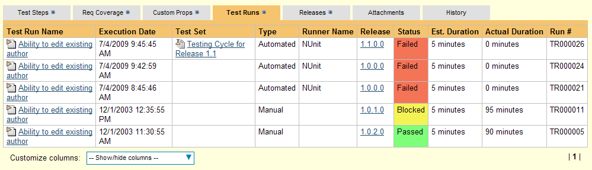
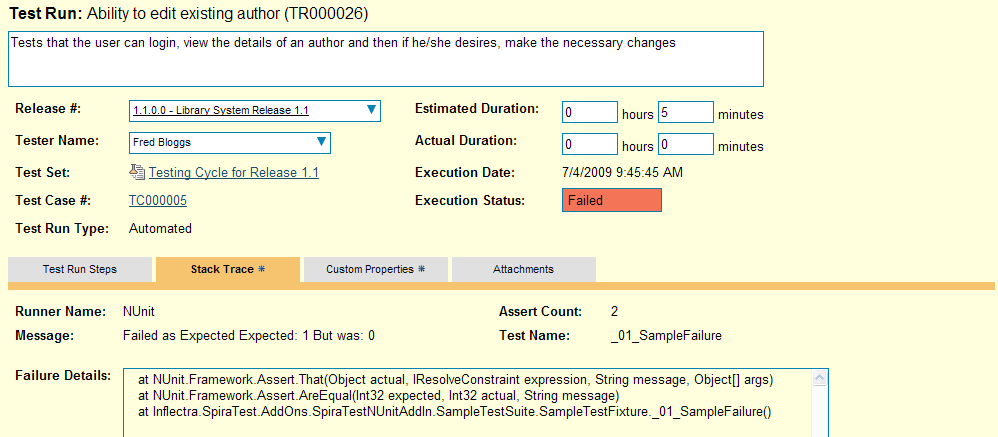

# Integrating with NUnit

The installation directions for NUnit 3 and NUnit 2.x are covered in different sections below:

## Installing the NUnit 3 Add-In

This section outlines how to use SpiraTest/SpiraTeam/SpiraPlan
(hereafter referred to as SpiraPlan) in conjunction with NUnit 3 and
above. With this add-in, you can run automated tests against a .NET
application and have the results recorded inside SpiraPlan as a test
run. This guide assumes that you already have a working installation of
SpiraTest/Team/Plan installed v5.0 or later. If you have an earlier
version of SpiraPlan, you need to upgrade to at least v5.0 before trying
to use this add-in. Additionally, you must have at least version 3.0 of
NUnit Console installed. If you have an earlier version, you can visit
[www.nunit.org](http://www.nunit.org/) to obtain the latest version.

To obtain the add-in, go to
[www.inflectra.com/SpiraPlan/Downloads.aspx](http://www.inflectra.com/SpiraPlan/Downloads.aspx)
and download the NUnit add-in zipfile. Extract the archive and copy
*SpiraTestNUnitAddIn.dll* and *Newtonsoft.Json.dll* into your
installation of the NUnit Console Runner (typically
*.\\packages\\NUnit.ConsoleRunner\\tools*). Once they've been copied,
edit the *.addins* file (typically *nunit.nuget.addins*) and add
*SpiraTestNUnitAddIn.dll* on a new line in the file. If you've followed
all the steps correctly, the SpiraPlan NUnit add-in should now be
properly installed.

## Using NUnit 3 with SpiraTest

For this example, we will be using the following sample test fixture:

```C#
using NUnit.Framework;

namespace SampleTestSuite
{
    [TestFixture]
    class SampleTest
    {
        int One, Two;
        [SetUp]
        protected void SetUp()
        {
            One = 1;
            Two = 2;
        }
        [Test]
        public void TestAdd()
        {
            int Result = One + Two;
            //will succeed
            Assert.AreEqual(Result, 3);
        }
        [Test]
        public void TestMultiply()
        {
            int Result = One * Two;
            //will fail
            Assert.AreEqual(Result, 3);
        }
        [Test]
        public void TestConcat()
        {
            string Result = string.Concat(One, Two);
            //will fail
            Assert.AreEqual(Result, "21");
        }   
    }
}
```

In your test root directory (the directory with your *.nunit* file),
create a new file called *SpiraConfig.json*, and populate it like so:
```JSON
{
  "credentials": {
    "url": "localhost/SpiraPlan",
    "username": "fredbloggs",
    "token": "{XXXXXXXX-XXXX-XXXX-XXXX-XXXXXXXXXXXX}",
    "project_id": 1,

    "release_id": 5,
    "test_set_id": 1
  },
  "test_cases": {
    "default": 20,
    "TestMultiply":  22
  }
}
```

For the plugin to work, you must have both settings groups (credentials
and test\_cases) with the following in the credentials group:

**url** -- The base url to your SpiraPlan installation, without a '/' at
the end.

**username** -- The username you use to sign into SpiraTest.

**token** -- Your RSS Token. Found in your profile page as the "RSS
Token" field, you must have RSS Feeds enabled for this to work.

**project\_id** -- The ID of the project you would like the test runs to
be sent to

**release\_id** -- OPTIONAL -- Use if you would like to associate the
test run with a release.

**test\_set\_id** -- OPTIONAL -- Use if you would like to associate the
test run with a test set.

Under the test\_cases group, put the following:

**default** -- The default test case ID for functions without an
assigned test case

**<method name\>** - Used to override the default setting for a
method's test case ID in SpiraPlan. Only include the method name,
without the parentheses.

Once you run your tests with the NUnit Console Runner, you should see
the results in SpiraPlan:


Clicking on one of the test runs will show you the results:


Congratulations... You are now able to run NUnit automated tests and
have the results be recorded within SpiraPlan. The sample test fixture
*SampleTest.cs* is provided with the installation.

## Installing the NUnit 2.x Add-In

This section outlines how to install the SpiraTest Add-In for NUnit onto
a workstation so that you can then run automated NUnit tests against a
.NET application and have the results be recorded as test runs inside
SpiraTest. It assumes that you already have a working installation of
SpiraTest v2.2 or later. If you have an earlier version of SpiraTest you
will need to upgrade to at least v2.2 before trying to use this add-in.
You will also need to have either version **v2.5.5** or **v2.6.3 of
NUnit**, since there are two versions of the add-in that have been
compiled with the v2.5.5 and v2.6.3 NUnit APIs. If you are using a
different version, please visit [www.nunit.org](http://www.nunit.org/)
to obtain the appropriate version (2.5.5 or 2.6.3).

To obtain the version of the add-in that is compatible with your version
of SpiraTest, you simply need to go to
<http://www.inflectra.com/SpiraTest/Downloads.aspx> or
<http://www.inflectra.com/SpiraTeam/Downloads.aspx> and download the
NUnit Add-In zipfile.

Once you have obtained the NUnit Zipfile from our website, you should
extract all the files from zip archive into a temporary folder on your
computer (e.g. C:\\Temp).

Next, you should copy the add-in libraries to the folder NUnit expects
to find them in. First, if you are running any instances of the NUnit
GUI, close them. Then, copy the SpiraTestNUnitAddIn.dll
assembly from its location in the temporary folder to the NUnit Add-In
folder (typically C:\\Program Files\\NUnit
2.5.5\\bin\\net-2.0\\addins).

Now you can restart the NUnit GUI application. To check that the add-in
was loaded successfully, click on Tools \> Addins... to bring up the
list of loaded add-ins:

 
 


You should see an entry marked "SpiraTest Addin" listed with its
detailed description and status "Loaded". If this does not happen, try
closing and reopening NUnit.

## Using NUnit 2.x with SpiraTest

The typical code structure for an NUnit test fixture coded in C\# is as
follows:

```C#
using System;
using NUnit.Framework;

namespace Inflectra.SpiraTest.AddOns.SpiraTestNUnitAddIn.SampleTestSuite
{
	/// <summary>
	/// Sample test fixture that tests the NUnit SpiraTest integration
	/// </summary>
	[TestFixture]
	public class SampleTestFixture
	{
		[SetUp]
		public void Init()
		{
			//Do Nothing
		}

		/// <summary>
		/// Sample test that asserts a failure
		/// </summary>
		[Test]
		public void _01_SampleFailure()
		{
			//Failure Assertion
			Assert.AreEqual (1, 0);
		}	

		/// <summary>
		/// Sample test that succeeds
		/// </summary>
		[Test]
		public void _02_SamplePass()
		{
			//Successful assertion
			Assert.AreEqual (1, 1);
		}	

		/// <summary>
		/// Sample test that fails
		/// </summary>
		[Test]
		public void _03_SampleIgnore()
		{
			//Failure Assertion
			Assert.AreEqual (1, 0);
		}	
	}
}
```

The .NET class is marked as an NUnit test fixture by applying the
\[TestFixture\] attribute to the class as a whole, and the \[Test\]
attribute to each of the test assertion methods individually --
highlighted in yellow above. When you open up the class in NUnit and
click the <Run\> button it loads all the test classes marked with
\[TestFixture\] and executes all the methods marked with \[Test\] in
turn.

Each of the Assert statements is used to test the state of the
application after executing some sample code that calls the
functionality being tested. If the condition in the assertion is true,
then execution of the test continues, if it is false, then a failure is
logged and NUnit moves on to the next test method.

So, to use SpiraTest with NUnit, each of the test cases written for
execution by NUnit needs to have a corresponding test case in SpiraTest.
These can be either existing test cases that have manual test steps or
they can be new test cases designed specifically for automated testing
and therefore have no defined test steps. In either case, the changes
that need to be made to the NUnit test fixture for SpiraTest to record
the NUnit test run are illustrated below:

```C#
using System;
using NUnit.Framework;
using Inflectra.SpiraTest.AddOns.SpiraTestNUnitAddIn.SpiraTestFramework;

namespace Inflectra.SpiraTest.AddOns.SpiraTestNUnitAddIn.SampleTestSuite
{
	/// <summary>
	/// Sample test fixture that tests the NUnit SpiraTest integration
	/// </summary>
	[
	TestFixture,
	SpiraTestConfiguration (
     "http://<server name>/SpiraTest",
     "<username>",
     "<password>",
     <project id>,
     <release id>,
     <test set id>,
     <runner name>
)
	]
	public class SampleTestFixture
	{
		[SetUp]
		public void Init()
		{
			//Do Nothing
		}

		/// <summary>
		/// Sample test that asserts a failure
		/// </summary>
		[
		Test,
		SpiraTestCase (<test case id>)
		]
		public void _01_SampleFailure()
		{
			//Failure Assertion
			Assert.AreEqual (1, 0);
		}	

		/// <summary>
		/// Sample test that succeeds
		/// </summary>
		[
		Test,
		SpiraTestCase (<test case id>))
		]
		public void _02_SamplePass()
		{
			//Successful assertion
			Assert.AreEqual (1, 1);
		}	

		/// <summary>
		/// Sample test that does not log to SpiraTest
		/// </summary>
		[
		Test
		]
		public void _03_SampleIgnore()
		{
			//Failure Assertion
			Assert.AreEqual (1, 0);
		}	
	}
}
```

The overall class is marked with a new \[SpiraTestConfiguration\]
attribute that contains the following pieces of information needed to
access the SpiraTest test repository:

**URL** - The URL to the instance of SpiraTest being accessed. This
needs to start with http:// or https://.

**User Name** - A valid username for the instance of SpiraTest.

**Password** - A valid password for the instance of SpiraTest.

**Project Id** - The ID of the project (this can be found on the project
homepage in the "Project Overview" section)

**Release Id** (Optional) - The ID of the release to associate the test
run with. This can be found on the releases list page (click on the
Planning \> Releases tab). If you don't want to specify a release, just
use the value -1.

**Test Set Id** (Optional) -- The ID of the test set to associate the
test run with. This can be found on the test set list page (click on the
Testing \> Test Sets tab). If you don't want to specify a test set, just
use the value -1. If you choose a test set that is associated with a
release, then you don't need to explicitly set a release id (i.e. just
use -1). However if you do set a release value, it will override the
value associated with the test set.

**Runner Name** -- This should be set to NUnit so that the test results
recorded in SpiraTest have the name 'NUnit' associated with them.

In addition, each of the individual test methods needs to be mapped to a
specific test case within SpiraTest. This is done by adding a
\[SpiraTestCase\] attribute to the test method together with the ID of
the corresponding test case in SpiraTest. The Test Case ID can be found
on the test cases list page (click the "Test Cases" tab).

For these attributes to be available in your test fixture, you also need
to add a reference to the SpiraTestFramework.dll assembly.
This assembly can be found in the temporary folder that you extracting
the add-in to. It is recommended that you move this file from the
temporary folder into a permanent folder located within your .NET
project.

Now all you need to do is compile your code, launch NUnit, run the test
fixtures as you would normally do, and when you view the test cases in
SpiraTest, you should see an NUnit automated test run displayed in the
list of executed test runs:




Clicking on one of the NUnit test runs will bring up a screen that
provides information regarding what NUnit test method failed, what the
error was, together with the associated code stack-trace:




Congratulations... You are now able to run NUnit automated tests and
have the results be recorded within SpiraTest. The sample test fixture
SampleTestSuite.cs is provided with the installation.

