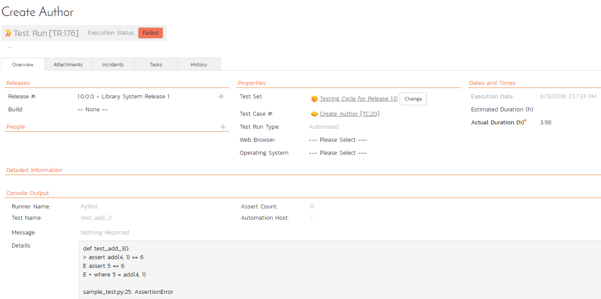

# Integrating with PyTest
!!! abstract "Compatible with SpiraTest, SpiraTeam, SpiraPlan"

This section describes how to use Spira in conjunction with python's pytest unit testing framework. The Spira pytest plugin enables the automated sending of unit test results from pytest to Spira with a specified Test Case, and (optionally), a release and/or test set as well.

The plugin supports multiple ways to map tests to Spira test cases:

- **Environment variables** for secure credential management
- **Pytest markers** for flexible test organization
- **Module-level mapping** for entire test files
- **Class-level mapping** for test suites
- **Function-level mapping** for individual tests

## Installing the pytest plugin
This section outlines how to install the Spira plugin for pytest. It assumes that you already have a working installation of Spira v6.0 or later. If you have an earlier version of Spira you will need to upgrade to at least v6.0 before trying to use this plugin. You will also need to have Python (with pip) and pytest version 3.0 or later.

To obtain the latest version of the Spira plugin, simply run the following command: `pip install pytest-spiratest`

This command will install the latest version of the plugin straight from the [Python Package Index](https://pypi.org/project/pytest-spiratest/) (PyPI). Once the Spira plugin is successfully installed, all you need to do is configure the extension, then you can begin testing!

## Configuring the pytest plugin
This section outlines how to configure the Spira plugin for pytest. It assumes that you are familiar with pytest, and already have some working tests configured.

### Configuration Options

The plugin supports two configuration methods:

1. **Environment variables** (recommended for credentials) - using a `.env.spira` file
2. **Configuration file** - using a `spira.cfg` file

You can use both methods together. Environment variables take priority over configuration file settings.

### Option 1: Using Environment Variables (Recommended)

Create a `.env.spira` file in your test root folder:

```ini
# Required settings
SPIRA_URL=http://localhost/Spira
SPIRA_USERNAME=fredbloggs
SPIRA_TOKEN={XXXXXXXX-XXXX-XXXX-XXXX-XXXXXXXXXXXXX}
SPIRA_PROJECT_ID=1

# Optional settings
SPIRA_RELEASE_ID=5
SPIRA_TEST_SET_ID=1
```

!!! tip "Security Best Practice"
    Add `.env.spira` to your `.gitignore` file to keep credentials out of version control. Share a `.env.spira.example` file (without real credentials) with your team instead.

### Option 2: Using Configuration File

Create a `spira.cfg` file in your test root folder:

```cfg
[credentials]
# Following are required
url = localhost/Spira
username = fredbloggs
token = {XXXXXXXX-XXXX-XXXX-XXXX-XXXXXXXXXXXXX}
project_id = 1

# Following are optional:
release_id = 5
test_set_id = 1

[test_cases]
# Default test case ID for unmapped tests (optional)
default = 20

# Function-level mapping
test_add_2 = 22

# Class-level mapping (all tests in class use this ID)
testcalculator = 25

[markers]
# Map pytest markers to test cases
smoke = 30
regression = 31
integration = 32

[modules]
# Map entire test files (modules) to test cases
# IMPORTANT: Use the full dotted module path as pytest sees it
tests.features.authentication.test_login = 40
tests.features.payment.test_checkout = 41

[settings]
# Optional: Enable verbose logging
verbose = false
```

### Option 3: Combining Both (Recommended)

For best security and flexibility, use `.env.spira` for credentials and `spira.cfg` for test mappings:

**.env.spira** (keep this out of version control):
```ini
# Credentials - DO NOT commit to git
SPIRA_URL=http://localhost/Spira
SPIRA_USERNAME=fredbloggs
SPIRA_TOKEN={XXXXXXXX-XXXX-XXXX-XXXX-XXXXXXXXXXXXX}
SPIRA_PROJECT_ID=1
SPIRA_RELEASE_ID=5
SPIRA_TEST_SET_ID=1
```

**spira.cfg** (safe to commit to version control):
```cfg
# No [credentials] section needed when using .env.spira!

[test_cases]
# Default test case ID for unmapped tests (optional)
default = 20

# Function-level mapping
test_add_2 = 22

# Class-level mapping (all tests in class use this ID)
testcalculator = 25

[markers]
# Map pytest markers to test cases
smoke = 30
regression = 31
integration = 32
```

!!! success "Best Practice"
    This approach keeps sensitive credentials out of version control while allowing test mappings to be shared with the team. You only need `.env.spira` for credentials - the `[credentials]` section in `spira.cfg` is optional when using environment variables.

!!! note "Priority"
    When both files exist, environment variables from `.env.spira` take priority over settings in `spira.cfg`. This allows you to override configuration per environment (dev, staging, production) without changing the config file.

**Example: Different Environments**

You can have different `.env.spira` files for different environments while keeping the same `spira.cfg`:

**.env.spira.dev**:
```ini
SPIRA_URL=http://dev-spira.company.com/Spira
SPIRA_USERNAME=dev-user
SPIRA_TOKEN={DEV-TOKEN}
SPIRA_PROJECT_ID=1
```

**.env.spira.prod**:
```ini
SPIRA_URL=http://spira.company.com/Spira
SPIRA_USERNAME=prod-user
SPIRA_TOKEN={PROD-TOKEN}
SPIRA_PROJECT_ID=5
```

Then copy the appropriate file before running tests:
```bash
# For development
cp .env.spira.dev .env.spira
pytest

# For production
cp .env.spira.prod .env.spira
pytest
```

### Configuration Parameters

**Credentials Section:**

- **url**: The base url to your Spira installation, without a '/' at the end.
- **username**: The username you use to sign into Spira.
- **token**: Your RSS Token. Found in your profile page as the "RSS Token" field, you must have RSS Feeds enabled for this to work.
- **project_id**: The ID of the project you would like the test runs to be sent to
- **release_id**: OPTIONAL -- Use if you would like to associate the test run with a release.
- **test_set_id**: OPTIONAL -- Use if you would like to associate the test run with a test set.

**Test Cases Section:**

- **default**: OPTIONAL -- The default test case ID for tests without an assigned test case. If not specified, unmapped tests will not be logged to Spira.
- **\<function name>**: Maps a specific test function to a test case ID (e.g., `test_add_2 = 22`)
- **\<class name>**: Maps all tests in a class to a test case ID (e.g., `testcalculator = 25`)

**Markers Section (Optional):**

- **\<marker name>**: Maps all tests with a specific pytest marker to a test case ID (e.g., `smoke = 30`)

**Modules Section (Optional):**

- **\<module name>**: Maps all tests in a module (test file) to a test case ID
- **Must use the full dotted module path** as pytest sees it (e.g., `tests.features.mywork.test_myincidents = 40`)
- To find the correct module name, run with verbose mode and check the debug output

!!! tip "Finding Module Names"
    Run `pytest path/to/test_file.py -v` and look for:
    ```
    [pytest-spiratest DEBUG] Checking module mapping for module: 'actual.module.name'
    ```
    Use that exact string in your `[modules]` configuration.

**Settings Section (Optional):**

- **verbose**: Enable detailed logging showing test case mappings and API calls (values: `true`, `false`, `yes`, `no`, `1`, `0`, `on`, `off`)
- **enabled**: Enable or disable Spira integration (values: `true`, `false`, `yes`, `no`, `1`, `0`, `on`, `off`). Can be overridden by `--spira-enabled` or `--spira-disabled` CLI flags
- **batch_mode**: Enable batch mode to post all results at once for better performance (values: `true`, `false`, `yes`, `no`, `1`, `0`, `on`, `off`). Can be overridden by `--spira-batch` or `--spira-no-batch` CLI flags

!!! note "Case Insensitivity"
    Function names, class names, marker names, and module names in the configuration file are case-insensitive.

## Choosing the Right Mapping Method

Different mapping methods suit different use cases:

| Method               | Best For                                | Granularity  | Configuration |
| -------------------- | --------------------------------------- | ------------ | ------------- |
| **@spira_id marker** | Individual test control, overrides      | Per test     | In code       |
| **Marker mapping**   | Test categories (smoke, regression)     | Per marker   | Config file   |
| **Function mapping** | Specific important tests                | Per function | Config file   |
| **Class mapping**    | Test suites, related tests              | Per class    | Config file   |
| **Module mapping**   | Feature/component tracking              | Per file     | Config file   |
| **Default**          | Catch-all for unmapped tests (optional) | All unmapped | Config file   |

**Quick Decision Guide:**

- 📁 **Tracking entire features?** → Use module mapping (`test_authentication = 40`)
- 📦 **Grouping related tests?** → Use class mapping (`TestAuth = 30`)
- 🏷️ **Already using pytest markers?** → Use marker mapping (`smoke = 20`)
- 🎯 **Need precise control?** → Use function mapping or `@spira_id` marker
- 🔄 **Want minimal config?** → Use module or class mapping for broader coverage
- 🎚️ **Only track specific tests?** → Omit `default` and only map what you need

## Mapping Tests to Spira Test Cases

The plugin provides multiple ways to map your pytest tests to Spira test cases. The mapping priority (from highest to lowest) is:

1. **@pytest.mark.spira_id() marker** - Explicit test case ID in code
2. **Other pytest markers** - Existing markers mapped in configuration
3. **Function name** - Specific function mapping in configuration
4. **Class name** - All tests in a class mapped in configuration
5. **Module name** - All tests in a file mapped in configuration
6. **Default** - Fallback test case ID

### Method 1: Using @pytest.mark.spira_id() Marker

Apply the `@pytest.mark.spira_id()` marker directly to test functions or classes for explicit control:

```python
import pytest

# Map a single test function
@pytest.mark.spira_id(100)
def test_login():
    assert True

# Map all tests in a class
@pytest.mark.spira_id(200)
class TestAuthentication:
    def test_login(self):
        # Maps to test case 200
        assert True
    
    def test_logout(self):
        # Maps to test case 200
        assert True
    
    # Override class-level mapping
    @pytest.mark.spira_id(300)
    def test_password_reset(self):
        # Maps to test case 300
        assert True
```

!!! tip "When to Use"
    Use this method when you want the mapping visible in your test code, or when different tests in the same class need different mappings.

### Method 2: Using Existing Pytest Markers

Map your existing pytest markers (like `@pytest.mark.smoke`, `@pytest.mark.regression`) to Spira test cases:

**Configuration (spira.cfg):**
```cfg
[markers]
smoke = 100
regression = 101
integration = 102
critical = 103
```

**Test Code:**
```python
import pytest

@pytest.mark.smoke
def test_critical_login():
    # Maps to test case 100
    assert True

@pytest.mark.regression
class TestCheckout:
    # All tests in class map to test case 101
    def test_add_to_cart(self):
        assert True
    
    def test_payment(self):
        assert True
```

!!! tip "When to Use"
    Use this method when you already organize tests with pytest markers. Works seamlessly with `pytest -m` filtering.

### Method 3: Function-Level Mapping

Map specific test functions in the configuration file:

**Configuration (spira.cfg):**
```cfg
[test_cases]
default = 20
test_add_2 = 22
test_login = 25
```

**Test Code:**
```python
def test_add_1():
    # Uses default: 20
    assert True

def test_add_2():
    # Maps to test case 22
    assert True

def test_login():
    # Maps to test case 25
    assert True
```

### Method 4: Class-Level Mapping

Map entire test classes to a single test case:

**Configuration (spira.cfg):**
```cfg
[test_cases]
default = 20
testcalculator = 25
testauthentication = 30
```

**Test Code:**
```python
class TestCalculator:
    def test_add(self):
        # Maps to test case 25
        assert True
    
    def test_subtract(self):
        # Maps to test case 25
        assert True

class TestAuthentication:
    def test_login(self):
        # Maps to test case 30
        assert True
    
    def test_logout(self):
        # Maps to test case 30
        assert True
```

!!! tip "When to Use"
    Use this method to reduce configuration verbosity when all tests in a class should map to the same test case.

### Method 5: Module-Level Mapping

Map entire test files (modules) to a single test case. All tests in the file are aggregated into one test run result:

**Configuration (spira.cfg):**
```cfg
[modules]
# Use the full dotted module path (recommended)
tests.features.authentication.test_login = 40
tests.features.payment.test_checkout = 41

# For packages, always use the full dotted path
tests.integration.test_api = 50
tests.unit.test_models = 51
```

!!! warning "Module Path Requirements"
    **Always use the full dotted module path** as pytest sees it. The module name must match exactly what pytest imports.
    
    **How to find the correct module name:**
    
    1. Run with verbose mode: `pytest path/to/test_file.py -v`
    2. Look for the debug output: `Checking module mapping for module: 'actual.module.name'`
    3. Use that exact string in your config
    
    **Example:**
    
    - ✅ Correct: `tests.features.mywork.test_myincidents = 4870`
    - ❌ Wrong: `test_myincidents = 4870` (missing path)
    - ❌ Wrong: `test.features.mywork.test_myincidents = 4870` (typo: "test" vs "tests")

**Test File (tests/features/authentication/test_login.py):**
```python
def test_login():
    # Maps to test case 40
    assert True

def test_logout():
    # Maps to test case 40
    assert True

class TestSecurity:
    def test_2fa(self):
        # Maps to test case 40
        assert True
```

**Aggregated Result in Spira:**
```
Module: tests.features.authentication.test_login
Total: 3 tests - Passed: 3, Failed: 0, Skipped: 0

[PASSED] test_login
[PASSED] test_logout
[PASSED] TestSecurity.test_2fa
```

!!! tip "When to Use"
    Use this method for high-level traceability when you want to track entire test files as a single test case. Perfect for feature-based or component-based test organization. Reduces API calls by ~90% for module-mapped tests.

!!! note "Aggregation Behavior"
    - All tests in the module are aggregated into a single test run
    - Overall status: Failed if any test fails, Passed if all pass
    - Individual test results are shown in the aggregated message
    - Stack traces from failed tests are included

### Method 6: Default Mapping

Any test without a specific mapping uses the default test case ID (if configured):

```cfg
[test_cases]
default = 20
```

!!! note "Optional Default"
    The `default` setting is optional. If not specified, tests without explicit mappings will not be logged to Spira. This gives you precise control over which tests are tracked.

## Complete Example

Here is a complete example showing all mapping methods:

**Configuration (.env.spira):**
```ini
SPIRA_URL=http://localhost/Spira
SPIRA_USERNAME=fredbloggs
SPIRA_TOKEN={XXXXXXXX-XXXX-XXXX-XXXX-XXXXXXXXXXXXX}
SPIRA_PROJECT_ID=1
```

**Configuration (spira.cfg):**
```cfg
[test_cases]
default = 20
test_add_2 = 22
testcalculator = 25

[markers]
smoke = 30
regression = 31

[modules]
# Use the full dotted module path
tests.features.calculator.test_calculator = 35
```

**Test File:**
```python
import pytest

# Function we are testing
def add(num1, num2):
    return num1 + num2

# Uses default mapping (20)
def test_add_1():
    assert add(1, 1) == 2

# Uses function mapping (22)
def test_add_2():
    assert add(2, 1) == 3

# Uses marker mapping (30)
@pytest.mark.smoke
def test_add_smoke():
    assert add(3, 3) == 6

# Uses explicit spira_id marker (100)
@pytest.mark.spira_id(100)
def test_add_special():
    assert add(4, 4) == 8

# All tests use class mapping (25)
class TestCalculator:
    def test_add(self):
        assert add(5, 5) == 10
    
    def test_subtract(self):
        assert 10 - 5 == 5
    
    # Override with explicit marker (200)
    @pytest.mark.spira_id(200)
    def test_multiply(self):
        assert 2 * 3 == 6

# All tests use regression marker (31)
@pytest.mark.regression
class TestRegression:
    def test_feature_a(self):
        assert True
    
    def test_feature_b(self):
        assert True
```

## Running Tests

Running the pytest (or py.test) command will run your unit tests, send the data to Spira, and show the results to you. Here is an example of the test_add_3 function inside Spira:



### Command-Line Options

The plugin provides several CLI options to control behavior:

```bash
# Disable Spira integration for this run
pytest --spira-disabled

# Enable Spira integration (overrides config)
pytest --spira-enabled

# Dry run - show what would be posted without posting
pytest --spira-dry-run

# Enable batch mode - post all results at once (faster for large suites)
pytest --spira-batch

# Disable batch mode - post results individually
pytest --spira-no-batch
```

### Batch Mode for Performance

For large test suites (100+ tests), batch mode provides significant performance improvements by posting all results in a single API call:

**Enable batch mode:**
```bash
pytest --spira-batch
```

Or in configuration:
```ini
[settings]
batch_mode = true
```

**Performance comparison:**
- Individual mode: 100 tests = 100 API calls (~10s overhead)
- Batch mode: 100 tests = 1 API call (~1s overhead)
- **Result: 50-70% faster for large test suites**

!!! tip "When to Use Batch Mode"
    - ✅ CI/CD pipelines for faster builds
    - ✅ Large test suites (100+ tests)
    - ✅ Network-constrained environments
    - ❌ Real-time monitoring (results appear all at once)
    - ❌ Debugging individual tests

### Dry Run Mode

Preview what would be posted to Spira without actually posting:

```bash
pytest --spira-dry-run
```

**Example output:**
```
[pytest-spiratest INFO] [DRY RUN] Would post test result for: test_login
[pytest-spiratest INFO]   Test case ID: 100
[pytest-spiratest INFO]   Status: 2 (PASSED)
[pytest-spiratest INFO]   Duration: 0.45s
```

Use dry run to:
- Verify test case mappings
- Debug configuration issues
- Test new configurations safely

### Running Specific Test Categories

When using marker mapping, you can run specific test categories and have results automatically sent to the correct Spira test case:

```bash
# Run only smoke tests - results go to smoke test case
pytest -m smoke

# Run only regression tests - results go to regression test case
pytest -m regression

# Run critical tests
pytest -m critical
```

## Priority Resolution Examples

Understanding how the plugin resolves test case mappings:

**Example 1: spira_id marker overrides everything**
```python
@pytest.mark.spira_id(999)  # This wins
@pytest.mark.smoke          # Ignored
def test_login():
    # Maps to 999
    assert True
```

**Example 2: Marker beats function name**
```python
# Config has: test_login = 100, smoke = 200

@pytest.mark.smoke
def test_login():
    # Maps to 200 (marker beats function)
    assert True
```

**Example 3: Function name beats class name**
```python
# Config has: test_login = 100, testauth = 200

class TestAuth:
    def test_login(self):
        # Maps to 100 (function beats class)
        assert True
```

**Example 4: Class name beats module name**
```python
# Config has: testauth = 200, test_auth = 150

# In file: test_auth.py
class TestAuth:
    def test_logout(self):
        # Maps to 200 (class beats module)
        assert True
```

**Example 5: Module name beats default**
```python
# Config has: test_auth = 150, default = 20

# In file: test_auth.py
def test_logout():
    # Maps to 150 (module beats default)
    assert True
```

## Migration from Earlier Versions

If you're upgrading from an earlier version of the plugin, your existing configuration will continue to work without changes. The old format of mapping class methods (`MyClass.myFunction = 22`) is still supported.

To take advantage of new features:

1. **Move credentials to .env.spira** for better security
2. **Use module-level mapping** for high-level traceability of entire test files
3. **Use class-level mapping** to simplify configuration (instead of mapping each method individually)
4. **Use marker mapping** if you already organize tests with pytest markers
5. **Use @pytest.mark.spira_id()** for explicit control when needed

## Troubleshooting

**Tests not appearing in Spira?**

- Verify credentials in `.env.spira` or `spira.cfg`
- Check that project_id exists in Spira
- Ensure test case IDs are valid
- Check if test has a mapping (function, class, module, marker, or default)
- If no `default` is configured, only explicitly mapped tests will be logged
- Enable verbose mode to see detailed logging

**Wrong test case mapping?**

- Check the priority order: spira_id marker > other markers > function name > class name > module name > default
- Verify spelling of function/class/marker/module names in configuration
- Remember that names are case-insensitive in the config file
- **For module mapping:** Use the full dotted path as pytest sees it
  - Run `pytest path/to/test.py -v` to see: `Checking module mapping for module: 'actual.module.name'`
  - Use that exact string in your config (e.g., `tests.features.mywork.test_myincidents = 4870`)
  - Common mistake: Using `test_myincidents` instead of `tests.features.mywork.test_myincidents`
- Enable verbose mode to see which test case ID is being used

**Environment variables not working?**

- Ensure `.env.spira` is in the same directory where you run pytest
- Check variable names: `SPIRA_URL`, `SPIRA_USERNAME`, `SPIRA_TOKEN`, etc.
- Environment variables override `spira.cfg` settings

## Verbose Mode and Logging

The plugin provides detailed logging to help debug issues.

### Enabling Verbose Mode

**Option 1: Configuration file (spira.cfg)**
```cfg
[settings]
verbose = true
```

**Option 2: Environment variable (.env.spira)**
```ini
SPIRA_VERBOSE=true
```

### What Verbose Mode Shows

When enabled, you'll see:

- Configuration summary at startup
- Test case ID mapping for each test
- API call details and responses
- Success/failure status for each post

**Example output:**
```
[pytest-spiratest INFO] Spira integration initialized
[pytest-spiratest DEBUG]   URL: http://localhost/spira
[pytest-spiratest DEBUG]   Project ID: 1
[pytest-spiratest DEBUG]   Default test case: 22
[pytest-spiratest DEBUG] Test 'test_login' mapped to Spira test case ID: 100
[pytest-spiratest DEBUG] Posting test result to Spira: http://localhost/spira/...
[pytest-spiratest DEBUG] Successfully posted test result for: test_login
```

### Error Messages

Errors are always shown, even without verbose mode:

```
[pytest-spiratest ERROR] HTTP error 401 posting test result to Spira for test: test_login
[pytest-spiratest ERROR]   URL: http://localhost/spira/Services/v6_0/RestService.svc/projects/1/test-runs/record
[pytest-spiratest ERROR]   Test case ID: 100
[pytest-spiratest ERROR]   Response: {"Message":"Invalid credentials"}
```

This helps you quickly identify:
- Connection issues
- Authentication problems
- Invalid test case IDs
- API errors

!!! tip "Debugging Tip"
    Enable verbose mode when setting up the integration or troubleshooting issues. Disable it in CI/CD for cleaner logs.

## Have Questions or Need Assistance?
If you are an Inflectra customer, please contact our customer support at:

- Email: support@inflectra.com
- Help Desk: https://www.inflectra.com/Support/

Otherwise, please feel free to post a question on our public forums:

- [Test Case Integration Forum](https://www.inflectra.com/Support/Forum/integrations/unit-testing/List.aspx)