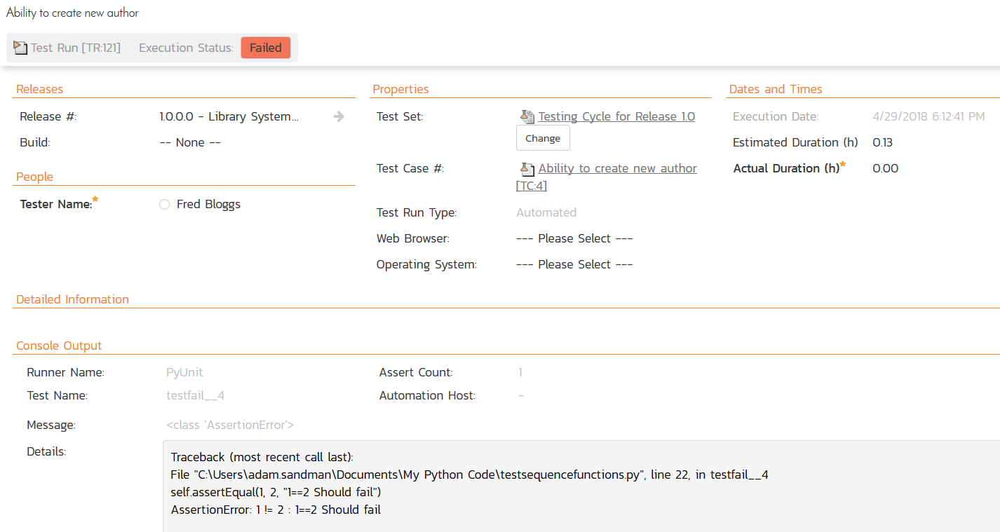

# Integrating with PyUnit

## Installing the PyUnit Extension

This section outlines how to install the SpiraTest plugin for Python unittesting (pyunit). It
assumes that you already have a working installation of SpiraTest v6.0
or later. If you have an earlier version of SpiraTest you will need to
upgrade to at least v6.0 before trying to use this plugin. You will also
need to have Python v3.6 (with pip) or later.

To obtain the latest version of the SpiraTest plugin, simply run the
following command:

`pip install pyunit-spiratest`

This command will install the latest version of the plugin straight from
the [Python Package Index](https://pypi.org/project/pyunit-spiratest/)
(PyPI). Once the SpiraTest plugin is successfully installed, you are now ready to begin using your PyUnit test fixtures with SpiraTest.

## Using PyUnit with SpiraTest

The typical code structure for a PyUnit test fixture coded in Python is
as follows:

```python
import random
import unittest

# sample PyUnit test case
class TestSequenceFunctions(unittest.TestCase):
    def setUp(self):
        self.seq = range(10)

    def testshuffle(self):
        # make sure the shuffled sequence does not lose any elements
        random.shuffle(self.seq)
        self.seq.sort()
        self.assertEqual(self.seq, range(10))

    def testchoice(self):
        element = random.choice(self.seq)
        self.assert_(element in self.seq)

    def testfail(self):
        self.assertEqual(1, 2, "1==2 Should fail")

    def testsample(self):
        self.assertRaises(ValueError, random.sample, self.seq, 20)
        for element in random.sample(self.seq, 5):
            self.assert_(element in self.seq)

    suite = unittest.TestLoader().loadTestsFromTestCase(TestSequenceFunctions)
    testResult = unittest.TextTestRunner(verbosity=2).run(suite)
```

The Python class is marked as a PyUnit test fixture by inheriting from
the unittest.TestCase base class, and the individual test methods are
identified by using the `test` prefix, with special `setUp()` and
`tearDown()` methods reserved for the respective purposes. When you open
up the class in a PyUnit runner or execute from the command line it
loads all the test classes and executes all the methods marked with
`test...` in turn.

Each of the Assert statements is used to test the state of the
application after executing some sample code that calls the
functionality being tested. If the condition in the assertion is true,
then execution of the test continues, if it is false, then a failure is
logged and PyUnit moves on to the next test method.

So, to use SpiraTest with PyUnit, each of the test cases written for
execution by PyUnit needs to have a corresponding test case in
SpiraTest. These can be either existing test cases that have manual test
steps or they can be new test cases designed specifically for automated
testing and therefore have no defined test steps. In either case, the
changes that need to be made to the PyUnit test fixture for SpiraTest to
record the PyUnit test run are illustrated below:

```python
import random
import unittest
import spiratestextension

# sample PyUnit test case
class TestSequenceFunctions(unittest.TestCase):
    def setUp(self):
        self.seq = range(10)

    def testshuffle__2(self):
        # make sure the shuffled sequence does not lose any elements
        random.shuffle(self.seq)
        self.seq.sort()
        self.assertEqual(self.seq, range(10))

    def testchoice__3(self):
        element = random.choice(self.seq)
        self.assert_(element in self.seq)

    def testfail__4(self):
        self.assertEqual(1, 2, "1==2 Should fail")

    def testsample__5(self):
        self.assertRaises(ValueError, random.sample, self.seq, 20)
        for element in random.sample(self.seq, 5):
            self.assert_(element in self.seq)

    suite = unittest.TestLoader().loadTestsFromTestCase(TestSequenceFunctions)
    testResult = unittest.TextTestRunner(verbosity=2).run(suite)

    releaseId = 1
    testSetId = 1
    spiraTestExtension = spiratestextension.SpiraTestExtension()
    spiraTestExtension.projectId = 1
    spiraTestExtension.url = "http://localhost/Spira"
    spiraTestExtension.userName = "fredbloggs"
    spiraTestExtension.apiKey = "{xxxxxxxxxxxxxxxxxxxxx}"
    spiraTestExtension.recordResults(TestSequenceFunctions, testResult,
    releaseId, testSetId)
```

Firstly, each of the individual test methods is appended with two
underscores followed by the ID of the corresponding test case in
SpiraTest. So for example `testshuffle()` is now `testshuffle__2()` as it
maps to test case `TC:2` inside SpiraTest.

Second, at the end of the test run, the `testResults` object generated by
the test run is passed to a special `SpiraTestExtension()` class via the
`recordResults()` method. This class takes the results from the test run
and uses it to generate the web-service messages that are sent to
SpiraTest to communicate the test results.

The following attributes need to be set on the instance of the
`SpiraTestExtension()` object so that the extension can access the
SpiraTest repository:

- **spiraTestExtension.projectId** -- The ID of the project inside
SpiraTest (this can be found on the project homepage in the "Project
Overview" section)

- **spiraTestExtension.url** - The base url of your SpiraTest instance

- **spiraTestExtension.userName** - A valid username for the instance of
SpiraTest that has access to the project specified above

- **spiraTestExtension.apiKey** - A valid API Key / RSS Token for the user
specified above

In addition, when calling the `recordResults()` method, you should also
pass the **Release ID** and the **Test Set ID** which is used to tell SpiraTest
which release and/or test set to associate the test execution with.

The Release ID can be found on the releases list page (click on the
Planning \> Releases tab) -- just remove the RL prefix from the number
as well as any leading zeros. Similarly, the Test Set ID can be found on
the test set list page (click on the Testing \> Test Sets tab) -- just
remove the TX prefix from the number as well as any leading zeros. If
you don't want to associate the test run with a specific release or test
set, just use the special value -1 to indicate N/A.

Now all you need to do is save your code, launch PyUnit, run the test
fixtures as you would normally do, and when you view the test cases in
SpiraTest, you should see a PyUnit automated test run displayed in the
list of executed test runs:


Clicking on one of the PyUnit test runs will bring up a screen that
provides information regarding what PyUnit test method failed, what the
error was, together with the associated code stack-trace:




Congratulations... You are now able to run PyUnit automated tests and
have the results be recorded within SpiraTest. The sample test fixture
`testsequencefunctions.py` is provided with the
installation.

## Have Questions or Need Assistance?
If you are an Inflectra customer, please contact our customer support at:
- Email: support@inflectra.com
- Help Desk: https://www.inflectra.com/Support/

Otherwise, please feel free to post a question on our public forums:
- [Test Case Integration Forum](https://www.inflectra.com/Support/Forum/integrations/unit-testing/List.aspx)