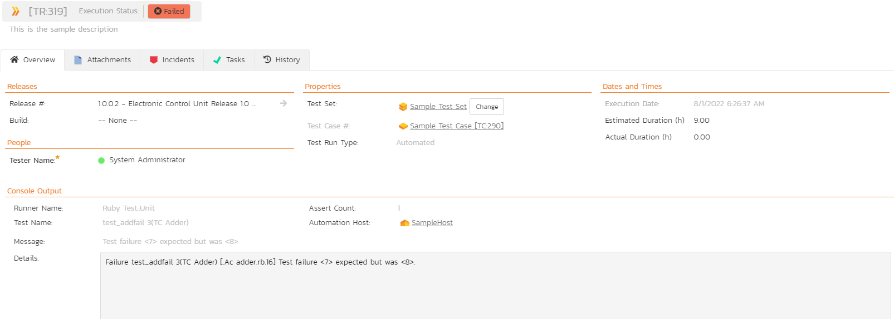

# Integrating with Ruby Test::Unit

## Installing the Ruby Test::Unit Test Runner

This section outlines how to install the SpiraTest custom Test Runner
for Test::Unit onto a workstation so that you can then run automated
Test::Unit tests against a Ruby application and have the results be
recorded as test runs inside SpiraTest. It assumes that you already have
a working installation of SpiraTest v2.3 or later, and a working Ruby
development environment. If you have an earlier version of SpiraTest you
will need to upgrade to at least v2.3 before trying to use this
extension.

To obtain the version of the Test::Unit test runner that is compatible
with your version of SpiraTest, you simply need to log-in as a
project-level administrator to SpiraTest, go to the Administration home
page and download the Test::Unit test runner compressed archive (.zip).
This process is described in the *SpiraTest Administration Guide* in
more detail.

The Test::Unit test runner is provided as a set of Ruby source files
that can be imported into your existing unit tests to add the SpiraTest
reporting functionality. Once you have downloaded the Zip archive, you
simply need to uncompress it into a folder of your choice on your local
system (e.g. C:\\Program Files\\SpiraTest\\RubyTestUnitRunner)

Now to use the custom test runner within your test cases, you need to
first make sure that the folder is added to the Ruby *RUBYPATH (or just
the system PATH)*. The method for doing this is dependent on the
platform you're using, so please refer to the documentation on
<http://ruby-lang.org> for details on the appropriate method for your
platform. As an example, on a Windows platform, the folder would be
added to the RUBYPATH by typing the following:

set RUBYPATH=%RUBYPATH%; C:\\Program
Files\\SpiraTest\\RubyTestUnitRunner

Once you have completed this step, you are now ready to begin using your
Test::Unit test fixtures with SpiraTest.

## Using Ruby Test::Unit with SpiraTest

The typical code structure for a Test::Unit test suite and test case
coded in Ruby is as follows:

> \#this is a test case that tests addition operations
>
> class TC\_Adder < Test::Unit::TestCase
>
> def setup
>
> @adder = Adder.new(5)
>
> end
>
> def test\_add
>
> assert\_equal(7, @adder.add(2), "Should have added correctly")
>
> end
>
> def test\_addfail
>
> assert\_equal(7, @adder.add(3), "Test failure")
>
> end
>
> def teardown
>
> @adder = nil
>
> end
>
> end
>
> \#this is a test suite that calls the test case
>
> class TS\_Examples
>
> def self.suite
>
> suite = Test::Unit::TestSuite.new
>
> suite << TC\_Adder.suite
>
> return suite
>
> end
>
> end
>
> Test::Unit::UI::Console::TestRunner.run(TS\_Examples)

The Test::Unit test case is marked as a Test::Unit test case by
inheriting from the Test::Unit::TestCase base class, and the individual
test methods are identified by using the 'test' prefix, with special
setup and teardown methods reserved for the respective purposes. When
you open up the class in a Ruby Test::Unit runner or execute from the
command line it loads all the test classes and executes all the methods
marked with 'test...' in turn.

Each of the Assert statements is used to test the state of the
application after executing some sample code that calls the
functionality being tested. If the condition in the assertion is true,
then execution of the test continues, if it is false, then a failure is
logged and Test::Unit moves on to the next test method.

So, to use SpiraTest with Test::Unit, each of the test cases written for
execution by Test::Unit needs to have a corresponding test case in
SpiraTest. These can be either existing test cases that have manual test
steps or they can be new test cases designed specifically for automated
testing and therefore have no defined test steps. In either case, the
changes that need to be made to the Test::Unit test case and test suite
for SpiraTest to record the Test::Unit test run are illustrated below:

> \#this is a test case that tests addition operations
>
> class TC\_Adder < Test::Unit::TestCase
>
> def setup
>
> @adder = Adder.new(5)
>
> end
>
> def test\_add\_\_2
>
> assert\_equal(7, @adder.add(2), "Should have added correctly")
>
> end
>
> def test\_addfail\_\_3
>
> assert\_equal(7, @adder.add(3), "Test failure")
>
> end
>
> def teardown
>
> @adder = nil
>
> end
>
> end
>
> \#this is a test suite that calls the test case
>
> class TS\_Examples
>
> def self.suite
>
> suite = Test::Unit::TestSuite.new
>
> suite << TC\_Adder.suite
>
> return suite
>
> end
>
> end
>
> projectId = 1
>
> releaseId = 2
>
> testSetId = -1
>
> testRunner = Test::Unit::SpiraTest::TestRunner.new(TS\_Examples,
> "http://servername/SpiraTest", "fredbloggs", "fredbloggs",
> projectId, releaseId, testSetId)
>
> testRunner.start

Firstly, each of the individual test methods is appended with two
underscores followed by the ID of the corresponding test case in
SpiraTest. So for example test\_add is now test\_add\_\_2 as it maps to
test case TC00002 inside SpiraTest.

Second, at the end of the test suite, instead of just creating the
standard Console Test Runner class and passing it a reference to the
test suite (e.g. TS\_Examples), we now create an instance of the special
Test::Unit::SpiraTest::TestRunner class, passing it a reference to the
test suite as well as specifying the SpiraTest connection information.

This class takes the results from the test suite being executed and uses
it to generate the web-service messages that are sent to SpiraTest to
communicate the test results.

The following parameters need to be passed during the instantiation of
the Test::Unit::SpiraTest::TestRunner object so that the custom test
runner can access the SpiraTest repository:

**suite**: the reference to the Test::Unit test suite that contains
the test cases being executed. In our example above, this is the
TS\_Examples class.

**baseUrl**-- The base URL used to access your instance of SpiraTest
(e.g. <http://myserver/SpiraTest>). It should include the protocol (e.g.
http/https), the server-name, the port number (if not 80/443) and the
virtual directory (if there is one).

**userName** - A valid username for the instance of SpiraTest that has
access to the project specified above

**password** - A valid password for the user specified above

**projectId** - The ID of the project inside SpiraTest (this can be
found on the project homepage in the "Project Overview" section)

**releaseId** - The ID of the SpiraTest release to associate the test
run with. This can be found on the releases list page (click on the
Planning \> Releases tab). If you don't want to associate the test run
with a specific release, just use the value -1 to indicate N/A.

**testSetId** - The ID of the SpiraTest test set to associate the test
run with. This can be found on the test set list page (click on the
Testing \> Test Sets tab). If you don't want to associate the test run
with a specific test set, just use the value -1 to indicate N/A.

Now all you need to do is save your code, launch Test::Unit, run the
test fixtures as you would normally do (e.g. by executing the
TS\_Examples ruby file from the command line), and when you view the
test cases in SpiraTest, you should see a Ruby Test::Unit automated test
run displayed in the list of executed test runs:

Clicking on one of the Ruby Test::Unit test runs will bring up a screen
that provides information regarding what Ruby Test::Unit test method
failed, what the error was, together with the associated code
stack-trace:

Congratulations... You are now able to run Test::Unit automated tests
and have the results be recorded within SpiraTest. The sample test suite
ts\_examples.rb together with two test cases (tc\_adder
and tc\_subtracter) is provided with the installation.

## Have Questions or Need Assistance?
If you are an Inflectra customer, please contact our customer support at:
- Email: support@inflectra.com
- Help Desk: https://www.inflectra.com/Support/

Otherwise, please feel free to post a question on our public forums:
- [Test Case Integration Forum](https://www.inflectra.com/Support/Forum/integrations/unit-testing/List.aspx)