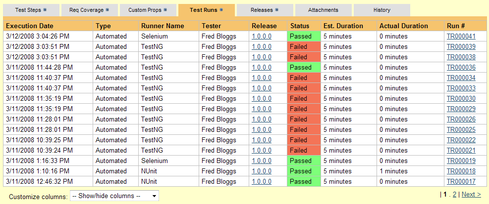
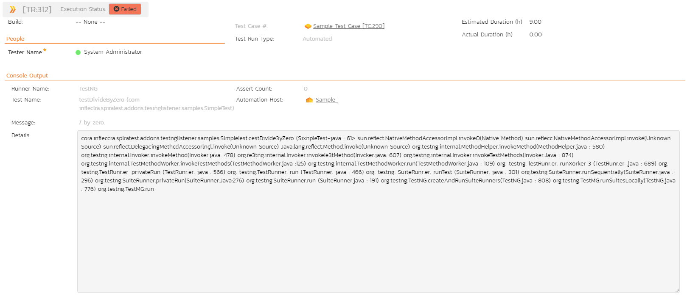

# Integrating with TestNG

## Installing the TestNG Listener

This section outlines how to install the SpiraTest Listener for TestNG
onto a workstation so that you can then run automated TestNG unit tests
against a Java application and have the results be recorded as test runs
inside SpiraTest. It assumes that you already have a working
installation of SpiraTest v3.0 or later. If you have an earlier version
of SpiraTest you will need to upgrade to at least v3.0 before trying to
use this listener. You will also need to have at least version 1.0 of
TestNG running under JDK 1.5 or later, since earlier versions do not
have support for annotations and custom listeners. If you are using an
earlier version, please visit [testng.org](https://testng.org) to
obtain the latest version.

To obtain the latest version of the TestNG listener, you simply need to
log-in as a project-level administrator to SpiraTest, go to the
Administration home page and download the SpiraTest TestNG Listener
compressed archive (.zip) from the section that lists downloads and
add-ons. This process is described in the *SpiraTest Administration
Guide* in more detail.

The TestNG listener is provided as a compressed zipfile that includes
both the binaries (packaged as a JAR-file) and the source code (stored
in a folder structure that mirrors the Java classpath). The JAR-file
binary was compiled for use on a Windows x86 platform, other platforms
(e.g. Linux) will require you to compile the Java source files into the
appropriate Java classfiles before using the extension. The rest of this
section will assume that you are using the pre-compiled JAR-file.

Once you have downloaded the Zip archive, you need to uncompress it into
a folder of your choice on your local system. Assuming that you
uncompressed it to the C:\\Program
Files\\SpiraTestListener folder, you should have the
following folder structure created:

C:\\Program Files\\SpiraTestListener

C:\\Program Files\\SpiraTestListener\\com

C:\\Program Files\\SpiraTestListener\\com\\inflectra

C:\\Program Files\\SpiraTestListener\\com\\inflectra\\spiratest

C:\\Program Files\\SpiraTestListener\\com\\inflectra\\spiratest\\addons

C:\\Program
Files\\SpiraTestListener\\com\\inflectra\\spiratest\\addons\\testnglistener

C:\\Program
Files\\SpiraTestListener\\Extension\\com\\inflectra\\spiratest\\addons\\testnglistener\\samples

The JAR-file is located in the root folder, the source-code for the
extension can be found in the "testnglistener" subfolder, and the sample
test fixture can be found in the "samples" subfolder.

Now to use the listener within your test cases, you need to first make
sure that the JAR-file is added to the Java classpath. The method for
doing this is dependent on the platform you're using, so please refer to
FAQ on [www.testngorg](http://www.testngorg) for details on the
appropriate method for your platform. As an example, on a Windows
platform, the JAR-file would be added to the classpath by typing the
following:

set CLASSPATH=%CLASSPATH%; C:\\Program
Files\\SpiraTestListener\\TestNGListener.jar

Once you have completed this step, you are now ready to begin using your
TestNG test fixtures with SpiraTest.

## Using TestNG with SpiraTest

The typical code structure for a TestNG test fixture coded in Java is as
follows:

```Java
package com.inflectra.spiratest.addons.testnglistener.samples;

import org.testng.annotations.*;
import static org.testng.AssertJUnit.*;

import java.util.*;

/**
 * Some simple tests using the ability to return results back to SpiraTest
 * 
 * @author		Inflectra Corporation
 * @version		2.3.0
 *
 */
@Test(groups={"unittest"})
public class SimpleTest
{
	protected int fValue1;
	protected int fValue2;

	/**
	 * Sets up the unit test
	 */
	@BeforeClass
	public void setUp()
	{
		fValue1= 2;
		fValue2= 3;
	}

	/**
	 * Tests the addition of the two values
	 */
	@Test(groups={"unittest"})
	public void testAdd()
	{
		double result = fValue1 + fValue2;

		// forced failure result == 5
		assertTrue (result == 6);
	}

	/**
	 * Tests division by zero
	 */
	@Test(groups={"unittest"})
	public void testDivideByZero()
	{
		int zero = 0;
		int result = 8 / zero;
		result++; // avoid warning for not using result
	}

	/**
	 * Tests two equal values
	 */
	@Test(groups={"unittest"})
	public void testEquals()
	{
		assertEquals(12, 12);
		assertEquals(12L, 12L);
		assertEquals(new Long(12), new Long(12));

		assertEquals("Size", 12, 13);
		assertEquals("Capacity", 12.0, 11.99, 0.0);
	}

	/**
	 * Tests success
	 */
	@Test(groups={"unittest"})
	public void testSuccess()
	{
		//Successful test
		assertEquals(12, 12);
	}
}
```

The Java class is marked as a TestNG test fixture by applying the @Test
attribute to the class definition, and the @Test attribute to each of
the test assertion methods individually -- highlighted in yellow above.
In addition, special setup methods are marked with annotations such as
@BeforeClass. When you open up the class in a TestNG runner or execute
from the command line it loads all the test classes and executes all the
methods marked with @Test in turn.

Each of the Assert statements is used to test the state of the
application after executing some sample code that calls the
functionality being tested. If the condition in the assertion is true,
then execution of the test continues, if it is false, then a failure is
logged and TestNG moves on to the next test method.

So, to use SpiraTest with TestNG, each of the test cases written for
execution by TestNG needs to have a corresponding test case in
SpiraTest. These can be either existing test cases that have manual test
steps or they can be new test cases designed specifically for automated
testing and therefore have no defined test steps. In either case, the
changes that need to be made to the TestNG test fixture for SpiraTest to
record the TestNG test run are illustrated below:

```Java
package com.inflectra.spiratest.addons.testnglistener.samples;

import org.testng.annotations.*;
import static org.testng.AssertJUnit.*;

import com.inflectra.spiratest.addons.testnglistener.*;

import java.util.*;

/**
 * Some simple tests using the ability to return results back to SpiraTest
 * 
 * @author		Inflectra Corporation
 * @version		2.3.0
 *
 */
@SpiraTestConfiguration(
	url="http://localhost/SpiraTest",
	login="fredbloggs",
	apiKey="{00000000-0000-0000-0000-000000000000}",
	projectId=1,
	releaseId=1,
	testSetId=-1
)
@Test(groups={"unittest"})
public class SimpleTest
{
	protected int fValue1;
	protected int fValue2;

	/**
	 * Sets up the unit test
	 */
	@BeforeClass
	public void setUp()
	{
		fValue1= 2;
		fValue2= 3;
	}

	/**
	 * Tests the addition of the two values
	 */
	@Test(groups={"unittest"})
	@SpiraTestCase(testCaseId=5)
	public void testAdd()
	{
		double result = fValue1 + fValue2;

		// forced failure result == 5
		assertTrue (result == 6);
	}

	/**
	 * Tests division by zero
	 */
	@Test(groups={"unittest"})
	@SpiraTestCase(testCaseId=5)
	public void testDivideByZero()
	{
		int zero = 0;
		int result = 8 / zero;
		result++; // avoid warning for not using result
	}

	/**
	 * Tests two equal values
	 */
	@Test(groups={"unittest"})
	@SpiraTestCase(testCaseId=6)
	public void testEquals()
	{
		assertEquals(12, 12);
		assertEquals(12L, 12L);
		assertEquals(new Long(12), new Long(12));

		assertEquals("Size", 12, 13);
		assertEquals("Capacity", 12.0, 11.99, 0.0);
	}

	/**
	 * Tests success
	 */
	@Test(groups={"unittest"})
	@SpiraTestCase(testCaseId=6)
	public void testSuccess()
	{
		//Successful test
		assertEquals(12, 12);
	}
}
```

The overall class is marked with a new @SpiraTestConfiguration
attribute that contains the following pieces of information needed to
access the SpiraTest test repository:

**URL** - The URL to the instance of SpiraTest being accessed. This
needs to start with http:// or https://

**Login** - A valid username for the instance of SpiraTest.

**apiKey** - A valid API Key / RSS Token for the instance of SpiraTest (for the user specified in Login).

**Project Id** - The ID of the project (this can be found on the project
homepage in the "Project Overview" section)

**Release Id** (Optional) - The ID of the release to associate the test
run with. This can be found on the releases list page (click on the
Planning \> Releases tab). If you don't want to specify a release, just
use the value -1.

**Test Set Id** (Optional) -- The ID of the test set to associate the
test run with. This can be found on the test set list page (click on the
Testing \> Test Sets tab). If you don't want to specify a test set, just
use the value -1. If you choose a test set that is associated with a
release, then you don't need to explicitly set a release id (i.e. just
use -1). However if you do set a release value, it will override the
value associated with the test set.

In addition, each of the individual test methods needs to be mapped to a
specific test case within SpiraTest. This is done by adding a
@SpiraTestCase attribute to the test method together with the ID of the
corresponding test case in SpiraTest. The Test Case ID can be found on
the test cases list page (click the "Test Cases" tab).

For these attributes to be available in your test fixture, you also need
to add a reference to the
*com.inflectra.spiratest.addons.testnglistener* package. This package is
bundled within the supplied JAR-file library for Windows machines, and
can be compiled from the provided source .java files on other platforms.

### Running the TestNG Tests from the Command-Line

Now all you need to do is compile your code and then launch TestNG by
executing the test fixture through the command line (or through your
choice of IDE, e.g. Eclipse) with the SpiraTest listener option
specified as a command argument. E.g. for our sample test, you would use
the following command:

`java
-classpath "C:\Program
Files\SpiraTestListener\TestNGListener.jar;C:\Program
Files\TestNG-5.7\testng-5.7\testng-5.7-jdk15.jar" org.testng.TestNG
-listener
com.inflectra.spiratest.addons.testnglistener.SpiraTestListener
com\inflectra\spiratest\addons\testnglistener\samples\unittests.xml`

Once the test has run, you can view the test cases in SpiraTest, you
should see a TestNG automated test run displayed in the list of executed
test runs:




Clicking on one of the TestNG test runs will bring up a screen that
provides information regarding what TestNG test method failed, what the
error was, together with the associated code stack-trace:




Congratulations... You are now able to run TestNG automated tests and
have the results be recorded within SpiraTest. The sample test fixture
SimpleText.java is provided with the installation.

## Have Questions or Need Assistance?
If you are an Inflectra customer, please contact our customer support at:
- Email: support@inflectra.com
- Help Desk: https://www.inflectra.com/Support/

Otherwise, please feel free to post a question on our public forums:
- [Test Case Integration Forum](https://www.inflectra.com/Support/Forum/integrations/unit-testing/List.aspx)