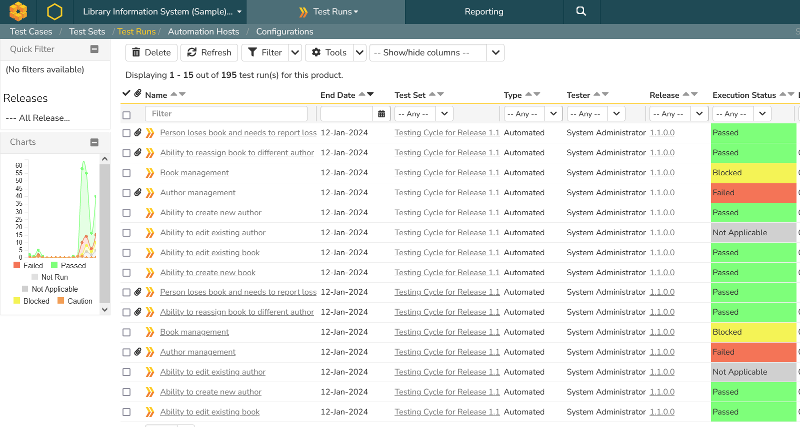
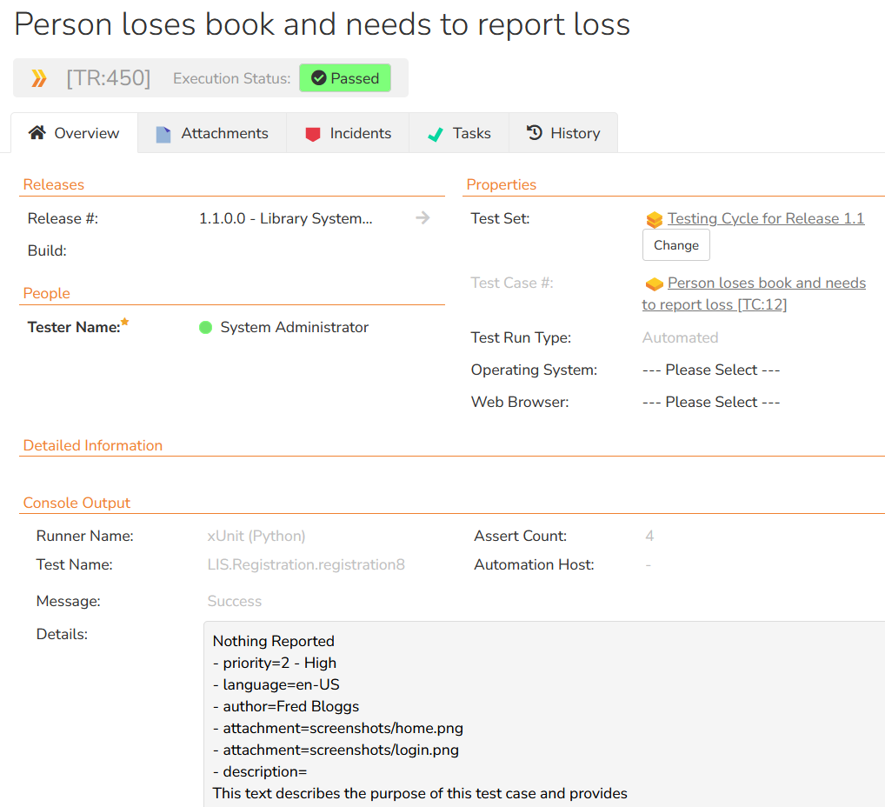
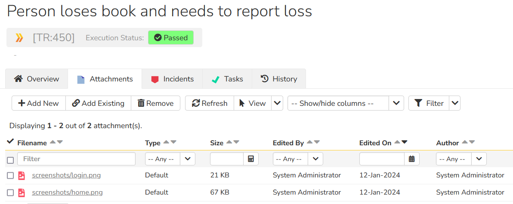
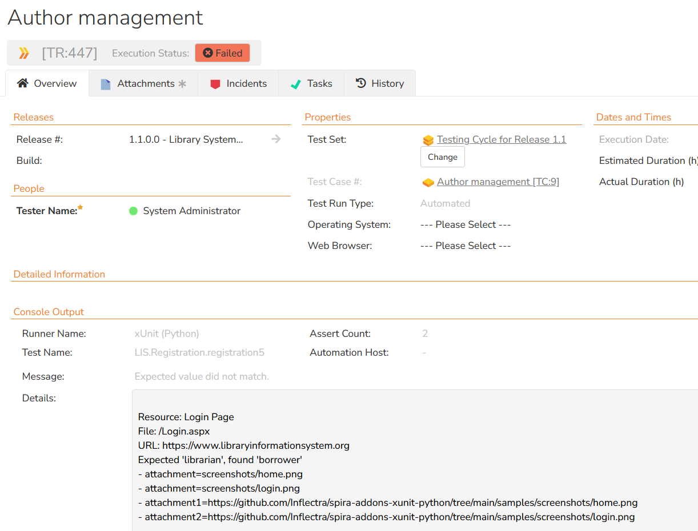
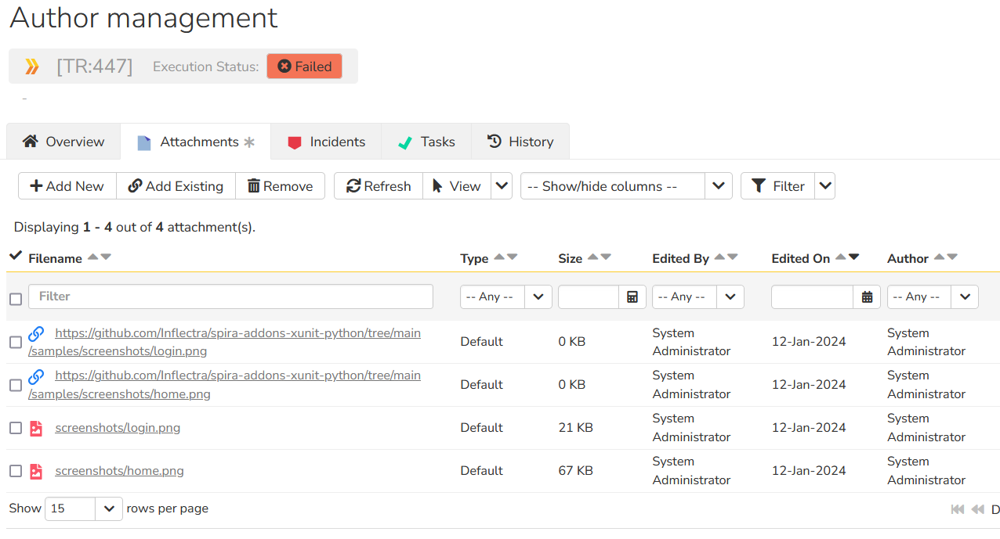
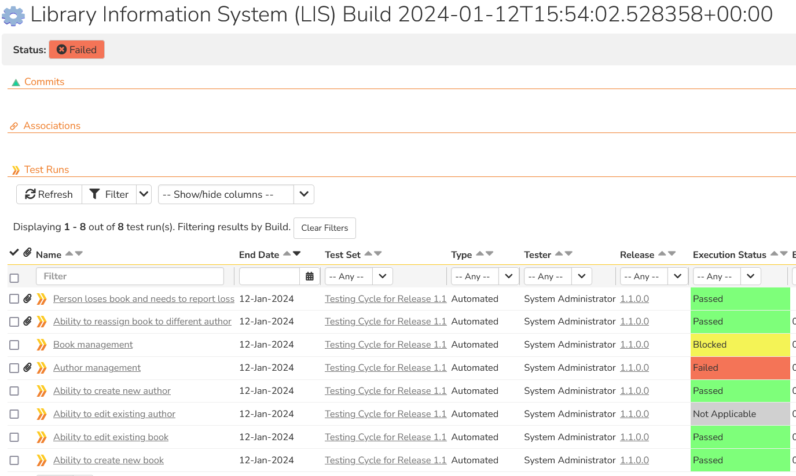
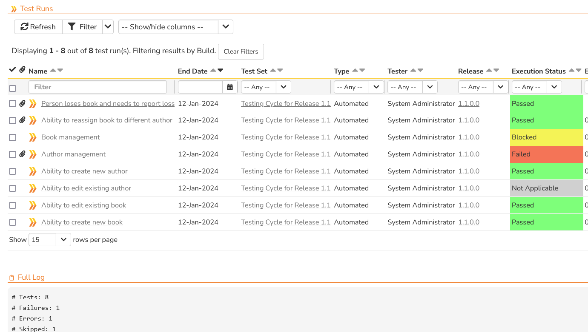

# Spira xUnit Integration (Python)
This repository contains the source code for the Spira add-on that lets you read [xUnit](https://en.wikipedia.org/wiki/XUnit) XML files and import the test results into Spira. This add-on
works with SpiraTest, SpiraTeam and SpiraPlan editions on Spira.

## Overview
When you run automated tests using a framework such as JUnit, the test results are often generated in a standard XML format known as the xUnit format. This XML file contains a list of the test cases that were executed, the results that occured and potentially a list of associated screenshots or other attachments.

This application will read and parse the xUnit XML file and import the test results into the [Spira test management](https://www.inflectra.com/SpiraTest/) platform from [Inflectra](https://www.inflectra.com/). Spira already comes with a variety of dedicated integrations for different test automation frameworks such as JUnit, NUnit, PyTest, etc. however as new frameworks (such as WebDriver.io and Playwright) are released, this new **general purpose integration** will able to handle the integration from day one.

## About Spira
Spira is the end-to-end platform from [Inflectra](https://www.inflectra.com) for product creation, from idea to release. Whether you are building software yourself, or deploying third-party systems, Spira is the integrated hub into which you can plug in specialized tools for the rest of the software development lifecycle. 

Spira comes in three flavors:
- [SpiraTest](https://www.inflectra.com/SpiraTest/), powerful requirements and test management
- [SpiraTeam](https://www.inflectra.com/SpiraTeam/), agile planning and test management for teams
- [SpiraPlan](https://www.inflectra.com/SpiraPlan/), enterprise planning and testing platform

## Installing the Integration
This section outlines how to install the Spira plugin for xUnit. It assumes that you already have a working installation of Spira v6.0 or later. If you have an earlier version of Spira you will need to upgrade to at least v6.0 before trying to use this plugin. You will also need to have Python (with pip) installed.

To obtain the latest version of the plugin, simply run the following command:

`pip install spira-addons-xunit`

This command will install the latest version of the plugin straight from the Python Package Index (PyPI). Once the Spira plugin is successfully installed, all you need to do is configure the plugin, map your xUnit test cases to Spira test cases, then you can begin testing!

## How to Use the Integration
The integration consists of a Python module called `spira_xunit_reader.py` that is executed after your xUnit tests are executed, and the appropriate XML report file has been created. This module will then read the results in the xUnit report file and send the results to Spira, mapping each xUnit **test case** to a matching Spira test case.

For advanced users, you can also optionally map the xUnit **test suites** to corresponding Spira **test sets**, and/or have the plugin generate a new **build** in Spira that contains all of executed test cases and test suites.

### Configuring the Spira connection
In your test root folder (the folder you have your xUnit tests),
create a file named `spira.cfg` with the following:

```cfg
[credentials]
# Following are required
url = http://localhost/spira
username = administrator
token = {XXXXXXXXXXXXXXXXXXXXXXXXXXXXXXXXXXXXXXX}}
project_id = 1
# Following are optional:
release_id = 5
test_set_id = 1
create_build = true

# Spira Test case for a specific classname.name
[test_cases]
LIS.Registration.registration1 = 2
LIS.Registration.registration2 = 3
LIS.Registration.registration3 = 4
LIS.Authentication.Login.login1 = 5
LIS.Authentication.Login.login2 = 9
LIS.Authentication.Login.login3 = 8
LIS.Authentication.auth1 = 6
LIS.Authentication.auth2 = 12
LIS.Authentication.auth3 = 13

LIS.Registration.registration4 = 5
LIS.Registration.registration5 = 9
LIS.Registration.registration6 = 8
LIS.Registration.registration7 = 6
LIS.Registration.registration8 = 12

# Spira Test sets for a specific name
# If not, the global value is used instead
[test_sets]
LIS.Registration = 2
LIS.Authentication = 5
LIS.Authentication.Login = 2
```

For the plugin to work, you must have the following in the credentials group:

- **url** -- The base url to your Spira installation, without a '/' at
the end.
- **username** -- The username you use to sign into Spira.
- **token** -- Your API Key / RSS Token. Found in your profile page as the "RSS
Token" field, you must have RSS Feeds enabled for this to work.
- **project_id** -- The ID of the project you would like the test runs to
be sent to

In addition, you can set the following **optional** configuration parameters as well:

- **release_id** -- Use if you would like to associate the
test run with a release.
- **test_set_id** -- Use if you would like to associate the
test run with a default test set.
- **create_build** -- Set to true if you would like the plugin to create a new Spira build artifact with every run that all the individual test case runs get associated with.

### Mapping The Test Cases

This section is required, and is where you map the `classname.name` of the test case in the xUnit XML file to the appropriate test case in Spira. For details of which attribute is needed from the XML file, please refer to the sample XML files included at the end of this file.

- `classname.name` - Used to map the combination of the test case's classname and name to the corresponding **test case ID** in Spira. The ID in Spira should be the test case id `TC:xxx` without the **TC** prefix. 

### Mapping The Test Sets \[Optional\]

This section is optional, and is used when you want the different **test suites** in the XML file to map to different **test sets** in Spira. If you don't complete this section, all of the test results will be associated with the **test_set_id** specified in the main configuration section.

In this section you map the `name` of the test suite in the xUnit XML file to the appropriate test set in Spira. For details of which attribute is needed from the XML file, please refer to the sample XML files included at the end of this file.

- `name` - Used to map the test set's name to the corresponding **test set ID** in Spira. The ID in Spira should be the test set id `TX:xxx` without the **TX** prefix. 

### Executing the Tests
Now you are ready to execute your tests and send the results back so Spira. This happens in two steps:
- Execute the unit tests and generate the `output.xml` xUnit style report file
- Parse the `output.xml` report file and send the results to Spira

First run your tests using your existing framework code. That will generate an output file. We have two supplied example files you can use:

- `junit-basic.xml` -- this is a minimalistic jUnit style example that contains several test cases nested in test suites with one test failure. It uses only the minimum set of attributes.
- `junit-complete.xml` -- this is a more advanced, complete example that includes file attachments, URL attachments, errors, warnings, failures and additional optional xUnit attributes such as assertions, properties and standard error/output streams.

Next, you need to run the Spira results parser module `spira_xunit_reader.py` to upload the results to Spira. For example, with the sample tests you can use either:

`python spira_xunit_reader.py samples\junit-basic.xml spira.cfg`

OR

`python spira_xunit_reader.py samples\junit-complete.xml spira.cfg`

The second parameter is the location and name of the Spira configuration file `spira.cfg`. One you run the XML parser, you should see a message similar to the following:

```
Sending test results to Spira at URL 'https://myserver/spiraservice.net'.
Successfully reported 4 test cases to Spira.
```

If there are any errors or warnings, they will be displayed instead.

### Viewing the Results
Finally, to view the results in Spira, you can go to the **Test Runs** tab to see the list of test runs:



If you click on one of the **passed** test runs, it will display the name of the test case from the xUnit XML file, together with the status (pass), the test set, release and actual duration:



If you scroll down to the **Console Output** section, it displays the full name and path of the xUnit test case as well as the contents of any **properties**, **standard output** or **standard error** streams.

In this example we have several screenshots attached as well:



If you click on one of the **failed** test runs, it will display the name of the test case from the xUnit XML file, together with the status (fail), the test set, release and actual duration:



If you scroll down to the **Console Output** section, it displays the full name and path of the xUnit test case as well as the details of what caused the test to fail as well as any test case properties or standard output/error streams.

In this example we have several screenshots attached as well:



The integration supports both file attachments (which are uploaded to Spira) and URL attachments which are simply linked.

Finally, if you enabled the feature to **create builds**, you will also see a new build entry in Spira:



If you scroll down to the **Full Log** section you can see any attributes from the overall xUnit run, including the number of failed tests and assertions:



Congratulations, you have now executed your xUnit framework tests and integrated the reporting with Spira.

## Have Questions or Need Assistance?
If you are an Inflectra customer, please contact our customer support at:
- Email: support@inflectra.com
- Help Desk: https://www.inflectra.com/Support/

Otherwise, please feel free to post a question on our public forums:
- [Test Case Integration Forum](https://www.inflectra.com/Support/Forum/integrations/unit-testing/List.aspx)

# Sample xUnit XML Files

The following two samples are provided with this plugin:

- `junit-basic.xml`
- `junit-complete.xml`

## Basic Sample `junit-basic.xml`
This is a minimalistic jUnit style example that contains several test cases nested in test suites with one test failure. It uses only the minimum set of attributes:

```xml
<?xml version="1.0" encoding="UTF-8"?>
<!--
This is a basic JUnit-style XML example to highlight the basic structure.
-->
<testsuites time="15.682687">
    <testsuite name="LIS.Registration" time="6.605871">
        <testcase name="registration1" classname="LIS.Registration" time="2.113871" />
        <testcase name="registration2" classname="LIS.Registration" time="1.051" />
        <testcase name="registration3" classname="LIS.Registration" time="3.441" />
    </testsuite>
    <testsuite name="LIS.Authentication" time="9.076816">
        <testsuite name="LIS.Authentication.Login" time="4.356">
            <testcase name="login1" classname="LIS.Authentication.Login" time="2.244" />
            <testcase name="login2" classname="LIS.Authentication.Login" time="0.781" />
            <testcase name="login3" classname="LIS.Authentication.Login" time="1.331" />
        </testsuite>
        <testcase name="auth1" classname="LIS.Authentication" time="2.508" />
        <testcase name="auth2" classname="LIS.Authentication" time="1.230816" />
        <testcase name="auth3" classname="LIS.Authentication" time="0.982">
            <failure message="Assertion error message" type="AssertionError">
                Resource: Login Page
                File: /Login.aspx
                URL: https://www.libraryinformationsystem.org
                Login failed with error message: XYZ
            </failure>
        </testcase>
    </testsuite>
</testsuites>
```

## Complete Sample `junit-complete.xml`
this is a more advanced, complete example that includes file attachments, URL attachments, errors, warnings, failures and additional optional xUnit attributes such as assertions, properties and standard error/output streams.

```xml
<?xml version="1.0" encoding="UTF-8"?>
<!--
This is a JUnit-style XML example with commonly used tags and attributes.
-->

<!-- <testsuites> Usually the root element of a JUnit XML file. Some tools leave out
the <testsuites> element if there is only a single top-level <testsuite> element (which
is then used as the root element).

name        Name of the entire test run
tests       Total number of tests in this file
failures    Total number of failed tests in this file
errors      Total number of errored tests in this file
skipped     Total number of skipped tests in this file
assertions  Total number of assertions for all tests in this file
time        Aggregated time of all tests in this file in seconds
timestamp   Date and time of when the test run was executed (in ISO 8601 format)
-->
<testsuites name="Library Information System (LIS)" tests="8" failures="1" errors="1" skipped="1"
    assertions="20" time="16.082687" timestamp="2021-04-02T15:48:23">

    <!-- <testsuite> A test suite usually represents a class, folder or group of tests.
    There can be many test suites in an XML file, and there can be test suites under other
    test suites.

    name        Name of the test suite (e.g. class name or folder name)
    tests       Total number of tests in this suite
    failures    Total number of failed tests in this suite
    errors      Total number of errored tests in this suite
    skipped     Total number of skipped tests in this suite
    assertions  Total number of assertions for all tests in this suite
    time        Aggregated time of all tests in this file in seconds
    timestamp   Date and time of when the test suite was executed (in ISO 8601 format)
    file        Source code file of this test suite
    -->
    <testsuite name="LIS.Registration" tests="8" failures="1" errors="1" skipped="1"
        assertions="20" time="16.082687" timestamp="2021-04-02T15:48:23"
        file="tests/registration.cs">

        <!-- <properties> Test suites (and test cases, see below) can have additional
        properties such as environment variables or version numbers. -->
        <properties>
            <!-- <property> Each property has a name and value. Some tools also support
            properties with text values instead of value attributes. -->
            <property name="version" value="1.774" />
            <property name="commit" value="d205f50f6463cf4e684b6f81411a859346580fa5" />
            <property name="browser" value="Google Chrome" />
            <property name="ci" value="https://github.com/actions/runs/1234" />
            <property name="config">
                Config line #1
                Config line #2
                Config line #3
            </property>
        </properties>

        <!-- <system-out> Optionally data written to standard out for the suite.
        Also supported on a test case level, see below. -->
        <system-out>Data written to standard out.</system-out>

        <!-- <system-err> Optionally data written to standard error for the suite.
        Also supported on a test case level, see below. -->
        <system-err>Data written to standard error.</system-err>

        <!-- <testcase> There are one or more test cases in a test suite. A test passed
        if there isn't an additional result element (skipped, failure, error).

        name        The name of this test case, often the method name
        classname   The name of the parent class/folder, often the same as the suite's name
        assertions  Number of assertions checked during test case execution
        time        Execution time of the test in seconds
        file        Source code file of this test case
        line        Source code line number of the start of this test case
        -->
        <testcase name="registration1" classname="LIS.Registration" assertions="2"
            time="2.436" file="tests/registration.cs" line="24" />
        <testcase name="registration2" classname="LIS.Registration" assertions="6"
            time="1.534" file="tests/registration.cs" line="62" />
        <testcase name="registration3" classname="LIS.Registration" assertions="3"
            time="0.822" file="tests/registration.cs" line="102" />

        <!-- Example of a test case that was skipped -->
        <testcase name="registration4" classname="LIS.Registration" assertions="0"
            time="0" file="tests/registration.cs" line="164">
            <!-- <skipped> Indicates that the test was not executed. Can have an optional
            message describing why the test was skipped. -->
            <skipped message="Test was skipped." />
        </testcase>

        <!-- Example of a test case that failed with different types of attachment. -->
        <testcase name="registration5" classname="LIS.Registration" assertions="2"
            time="2.902412" file="tests/registration.cs" line="202">
            <!-- <failure> The test failed because one of the assertions/checks failed.
            Can have a message and failure type, often the assertion type or class. The text
            content of the element often includes the failure description or stack trace. -->
            <failure message="Expected value did not match." type="AssertionError">
                Resource: Login Page
                File: /Login.aspx
                URL: https://www.libraryinformationsystem.org
                Expected 'librarian', found 'borrower'
            </failure>
            <properties>
                <property name="attachment" value="screenshots/home.png" />
                <property name="attachment" value="screenshots/login.png" />
                <property name="attachment1" value="https://github.com/Inflectra/spira-addons-xunit-python/tree/main/samples/screenshots/home.png" />
                <property name="attachment2" value="https://github.com/Inflectra/spira-addons-xunit-python/tree/main/samples/screenshots/login.png" />
            </properties>
        </testcase>

        <!-- Example of a test case that had errors. -->
        <testcase name="registration6" classname="LIS.Registration" assertions="0"
            time="3.819" file="tests/registration.cs" line="235">
            <!-- <error> The test had an unexpected error during execution. Can have a
            message and error type, often the exception type or class. The text
            content of the element often includes the error description or stack trace. -->
            <error message="Division by zero." type="ArithmeticError">
                15. var x = total / count;
            </error>
        </testcase>

        <!-- Example of a test case with outputs. -->
        <testcase name="registration7" classname="LIS.Registration" assertions="3"
            time="2.944" file="tests/registration.cs" line="287">
            <!-- <system-out> Optional data written to standard out for the test case. -->
            <system-out>
                Data written to standard out.
            </system-out>

            <!-- <system-err> Optional data written to standard error for the test case, including attachments. -->
            <system-err>
                Data written to standard error.
                [[ATTACHMENT|screenshots/home.png]]
                [[ATTACHMENT|screenshots/login.png]]
            </system-err>
        </testcase>

        <!-- Example of a test case with properties and attachments -->
        <testcase name="registration8" classname="LIS.Registration" assertions="4"
            time="1.625275" file="tests/registration.cs" line="302">
            <!-- <properties> Some tools also support properties for test cases. -->
            <properties>
                <property name="priority" value="2 - High" />
                <property name="language" value="en-US" />
                <property name="author" value="Fred Bloggs" />
                <property name="attachment" value="screenshots/home.png" />
                <property name="attachment" value="screenshots/login.png" />
                <property name="description">
                    This text describes the purpose of this test case and provides
                    an overview of what the test does and how it works.
                </property>
            </properties>
        </testcase>
    </testsuite>
</testsuites>
```
