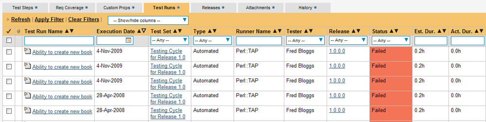
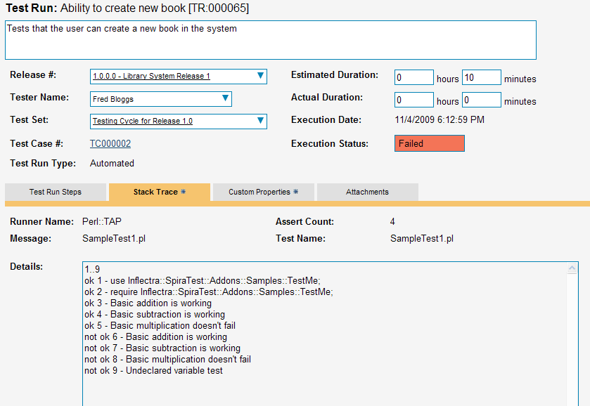

# Integrating with Perl TAP

## Installing the Perl TAP Extension

This section outlines how to install the SpiraTest extensions for Perl's
Test Anything Protocol (TAP) so that you can then run automated Perl TAP
unit tests against a Perl application and have the results be recorded
as test runs inside SpiraTest. It assumes that you already have a
working installation of SpiraTest v2.3 or later, and a working Perl
development environment. If you have an earlier version of SpiraTest you
will need to upgrade to at least v2.3 before trying to use this
extension.

To obtain the latest version of the TAP extension you simply need to go
to <http://www.inflectra.com/SpiraTest/Downloads.aspx> page and download
the Perl TAP Extension compressed archive (.zip). This process is
described in the *SpiraTest Administration Guide* in more detail.

The TAP extension is provided as a set of Perl library files (.pm) that
can be imported into your existing TAP test harnesses to add the
SpiraTest reporting functionality. Once you have downloaded the Zip
archive, you simply need to uncompress it and copy the **Inflectra
folder** (and subfolders) into the standard Perl library location (e.g.
C:\\Perl\\lib on Windows). The sample files (the ones ending in .pl)
that are not located in a folder can be put into a folder of your
choice.

Once you have completed this step, you are now ready to begin running
one of the provided samples or use your existing TAP unit tests with
SpiraTest.

## Using Perl TAP Extension with SpiraTest

The typical code structure for a Perl TAP test harness is as follows:

a) The sample test harness - SampleHarness.pl

> \#this is a test case that tests addition operations
>
> \#!/usr/bin/perl -w
>
> use TAP::Harness;
>
> \#instantiate the harness
>
> my \$harness = TAP::Harness -\>new;
>
> \#define the list of tests to be executed
>
> my @tests = ("SampleTest1.pl", "SampleTest2.pl");
>
> \$harness-\>runtests(@tests);

b) One of the sample test fixtures -- Sample1Test.pl

> \#!/usr/bin/perl -w
>
> \# Specify our plan, how many tests we're writing
>
> use Test::More tests =\> 9;
>
> \# or alternately, if we don't know how many:
>
> \# use Test::More qw(no\_plan);
>
> \# Check that our module compiles and can be "use"d.
>
> BEGIN { use\_ok( 'Inflectra::SpiraTest::Addons::Samples::TestMe' );
> }
>
> \# Check our module can be required. Very similar test to that above.
>
> require\_ok( 'Inflectra::SpiraTest::Addons::Samples::TestMe' );
>
> \# There are a number of ways to generate the "ok" tests. These are:
>
> \# ok: first argument is true, second argument is name of test.
>
> \# is: first argument equals (eq) second argument, third argument is
> name of test.
>
> \# isnt: first argument does not equal (ne) the second, third is name
> of test
>
> \# like: first argument matches regexp in second, third is name of
> test
>
> \# unlike: first argument does not match regexp, third is name of test
>
> \# cmp\_ok: compares first and third argument with comparison in
> second. Forth is test name.
>
> \# Here are some examples that should PASS
>
> ok( add(1,1) == 2, "Basic addition is working");
>
> is ( subtract(2,1), 1, "Basic subtraction is working");
>
> isnt( multiply(2,2), 5, "Basic multiplication doesn't fail");
>
> \# Here are some examples that should FAIL
>
> ok( add(1,1) == 3, "Basic addition is working");
>
> is ( subtract(2,1), 0, "Basic subtraction is working");
>
> isnt( multiply(2,2), 4, "Basic multiplication doesn't fail");
>
> \# Here is an example of a test that throws an ERROR
>
> is(\$notdeclared, 1, "Undeclared variable test");

The TAP test cases in the sample code use the Test::More library which
provides the necessary assertion methods for testing results from the
code under test. The tests are themselves executed by adding their
filenames to an array passed to the default TAP::Harness class. To run
the test cases, you just need to execute the SampleHarness.pl file from
the command line, and the test output will be echoed onto the screen.

Now, to use SpiraTest with TAR, each of the TAP test case files (e.g.
SampleTest1.pl, SampleTest2.pl in our example) needs to have a
corresponding test case in SpiraTest. These can be either existing test
cases that have manual test steps or they can be new test cases designed
specifically for automated testing and therefore have no defined test
steps. In either case, *no changes need to be made to the individual
test cases*, but the following changes need to be made to the test
harness (illustrated in yellow below):

> \#this is a test case that tests addition operations
>
> \#!/usr/bin/perl -w
>
> use Inflectra::SpiraTest::Addons::SpiraHarness::Harness;
>
> \#instantiate the harness
>
> my \$harness =
> Inflectra::SpiraTest::Addons::SpiraHarness::Harness-\>new;
>
> \#specify the spiratest custom harness properties
>
> \$spira\_args = {};
>
> \$spira\_args-\>{"base\_url"} = "http://localhost/SpiraTest";
>
> \$spira\_args-\>{"user\_name"} = "fredbloggs";
>
> \$spira\_args-\>{"password"} = "fredbloggs";
>
> \$spira\_args-\>{"project\_id"} = 1;
>
> \$spira\_args-\>{"release\_id"} = 1;
>
> \$spira\_args-\>{"test\_set\_id"} = 1;
>
> \$harness-\>{"spira\_args"} = \$spira\_args;
>
> \#define the list of tests and their SpiraTest Mapping
>
> \#Hash is of the format: TestFile =\> Test Case ID
>
> my \$tests = {};
>
> \$tests-\>{"SampleTest1.pl"} = 2;
>
> \$tests-\>{"SampleTest2.pl"} = 3;
>
> \$harness-\>runtests(\$tests);

Firstly you need to use the SpiraTest specific harness rather than the
general TAP::Harness library. This new class is actually a subclass of
the standard one, so it supports all the same methods, with the
exception of the runtests command, which now accepts a Perl hashref
rather than a simple array.

Also you need to create and pass a hashref of arguments to the test
harness (the spira\_args property on the instantiated harness class) so
that it knows how to access the SpiraTest server during test execution:

**base\_url**-- The base URL used to access your instance of SpiraTest
(e.g. <http://myserver/SpiraTest>). It should include the protocol (e.g.
http/https), the server-name, the port number (if not 80/443) and the
virtual directory (if there is one).

**user\_name** - A valid username for the instance of SpiraTest that has
access to the project specified above

**password** - A valid password for the user specified above

**project\_id** - The ID of the project inside SpiraTest (this can be
found on the project homepage in the "Project Overview" section)

**release\_id** - The ID of the SpiraTest release to associate the test
run with. This can be found on the releases list page (click on the
Planning \> Releases tab). If you don't want to associate the test run
with a specific release, just comment out the line.

**test\_set\_id** - The ID of the SpiraTest test set to associate the
test run with. This can be found on the test set list page (click on the
Testing \> Test Sets tab). If you don't want to associate the test run
with a specific test set, just comment out the line.

Finally instead of passing a simple array of the test case files to be
executed, you instead need to create a Perl hashref and pass that to the
runtests(...) method. The hashref needs to contain a list of the various
test case files and their associated SpiraTest Test Case ID with the TC
prefix removed (e.g. test case TC00005 would be just 5).

Now all you need to do is save your code, run the test fixtures as you
would normally do (e.g. by executing from the command line), and when
you view the test cases in SpiraTest, you should see a Perl::TAP
automated test run displayed in the list of executed test runs:

Clicking on one of the Perl::TAP test runs will bring up a screen that
provides information regarding what Perl::TAP test method failed, what
the error was, together with the associated code stack-trace:

Congratulations... You are now able to run Perl TAP unit tests and have
the results be recorded within SpiraTest. The sample test suite
SampleHarness.pl together with its two test cases (SampleTest1.pl and
SampleTest2.pl) is provided with the installation.

