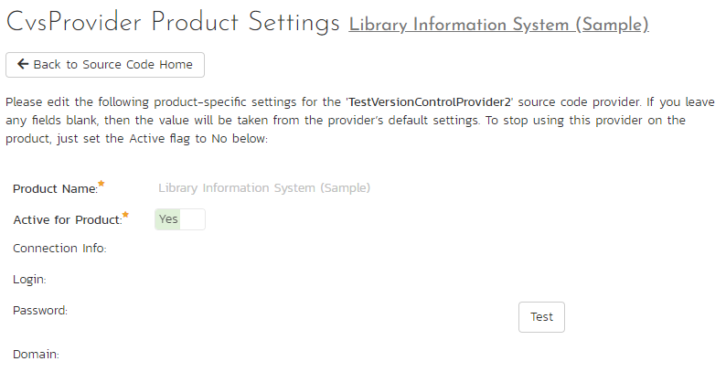

# Integrating with CVS

The Concurrent Versions System (CVS) is a Software Configuration Management (SCM) system that enables users to work on code simultaneously while preserving previous versions by avoiding collisions in code edits. This plug-in will allow users of SpiraPlan or SpiraTeam (hereafter referred to as SpiraTeam) to be able to browse a CVS repository and view commits linked to SpiraTeam artifacts.

The plug-in will download a working-copy of the CVS repository onto the SpiraTeam server and use that for displaying the list of files/folders. The list of commits will be queries dynamically from the CVS repository on an as-needed basis. The rest of this section outlines how to install and use the plug-in with SpiraTeam.

*Note: The plug-in will allow users to download and view different commits of files and view commit logs, but no changes to the repository are allowed through the plug-in.*

## Installing the CVS Plug-In 

To install the CVS Version Control plug-in, copy the following files from the plug-in zip-archive into the "VersionControl" sub-folder of the SpiraTeam installation:
-   CvsProvider.dll
-   DocsVision.Remoting.dll
-   ICSharpCode.SharpCvsLib.dll
-   ICSharpCode.SharpZipLib.dll
-   log4net.dll

## Configuring CVS in SpiraPlan
Before you can start using CVS in SpiraPlan you need to setup, at a system level, how CVS and SpiraPlan should work together: 

- Log in as a system admin, and go to System Admininstration > Integration > Source Code
- If there is not already an antry for "CvsProvider" click "Add" to go to the Plug-in details page

Complete the form on this page as below:

-   **Name**: The name must be "CvsProvider".
-   **Description**: The description is for your use only, and does not affect operation of the plug-in.
-   **Active**: If checked, the plug-in is active and able to be used for any project.
-   **Connection Info**: This field holds the root of the repository for any project accessing the plug-in, unless overridden in the Project Settings. Please use the following format: <cvs repository url\>:/cvsroot/<repository path\>. For example: `sharpcvslib.cvs.sourceforge.net:/cvsroot/sharpcvslib`
-   **Login / Password**: The user id and the password of the user to use while accessing and retrieving information from the CVS server. If you are accessing a public repository anonymously, use "*anonymous*" for both username and password and it will be handled correctly.
-   **Custom 01**: This must contain the name of the connection protocol being used to access the CVS server. The following protocols are supported:

    -   **pserver**: the first access protocol according to the client-server scheme, the most simple and the fastest one. Its imperfection - it transfers all the data unsecured. If you need to secure codes and user passwords, do not use this protocol in public nets.
    -   **ext** or **ssh**: access protocol using SSH (Secure Shell). It is used for accessing UNIX servers and it supports all data encodings.
    -   **sspi**: access protocol for Windows server with data encoding support.

-   **Custom 02**: This must contain the name of the *module* you wish to access in the CVS repository.

When finished, click "Insert". You will be taken back to the Source Code list page, with CvsProvider listed as an available plug-in.

## Use CVS for Your Product
Once CVS has been configured at the system level, you are ready to use it for any products you need to. 

- First go to the product you want to use for CVS as a product admin
- Go to Product Admin > General Settings > Source Code
- You will be taken to a list of all the providers on your system. Find the CvsProvider row; make sure the product dropdown has your current product selected; and click the arrow to the right of the product name to manage CVS for that Product
- You will now be on the "CvsProvider Product Settings" page for your chosen product
- If not already active, set "Active" to use and click "Save"
- The product CVS settings screen will now let you fully manage all its settings
- Make sure to override any of the system wide defaults (as outlined above). In particular, the **Connection Info** (the URL to the repo) should be set to the right repo for this product.
- Click "Save" after making any changes.

## Using CVS with SpiraPlan
Source code setup for your product is complete. Click on the "Source Code" or "Commits" menu items under the Developing tab to navigate and browse the source code repository.

You can read more about working with source code in SpiraPlan at the links below:

- [Source code files](../Spira-User-Manual/Source-Code.md/#source-code-file-list)
- [Commits](../Spira-User-Manual/Commits.md/#commit-list)
- [Linking to artifacts in commit messages](../Spira-User-Manual/Commits.md/#linking-to-artifacts-in-commit-messages)
- [Troubleshooting source code integration](../Spira-User-Manual/Source-Code.md/#troubleshooting-source-code-integration)

## Data Purging
Since the integration with CVS requires that a working copy of the CVS repository be stored on the SpiraTeam server, you may decide at some point to unlink a disused CVS repository from SpiraTeam to save disk-space. However unlinking the repository through the SpiraTeam web interface will not remove the working copy of the repository from the server.

To permanently remove a repository from the SpiraTeam server, you need to locate the following path:

-   **(Windows XP, 2003)** - C:\\Documents and Settings\\All Users\\Application Data
-   **(Windows 2008, 7, Vista)** -- C:\\ProgramData

If you look inside this folder, you will see a subfolder called "Inflectra", and under that will be a subfolder called "CvsProvider". If you open up this subfolder, you will see a list of all the CVS modules that have been accessed through SpiraTeam. To purge a module, just select it and choose the Delete Folder option in Windows.