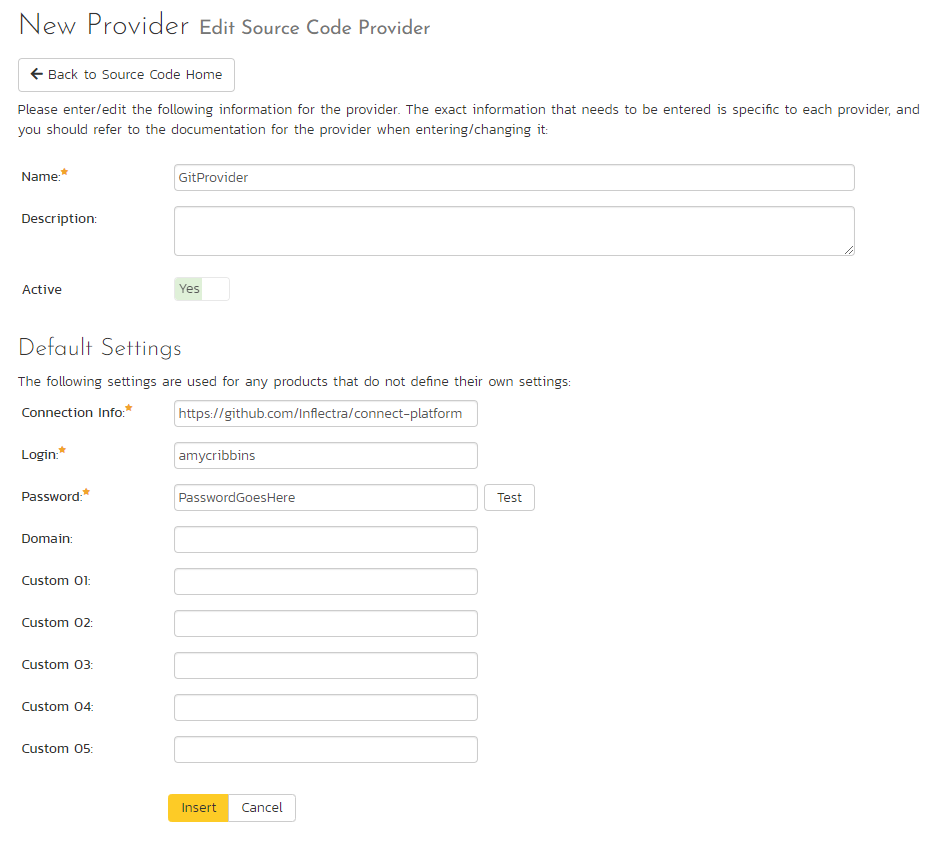
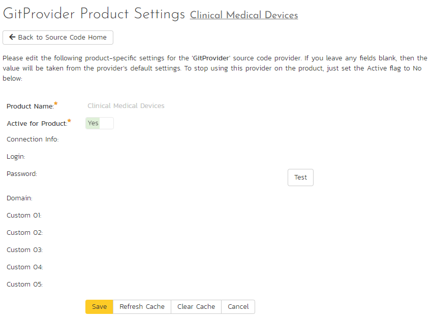

# Integrating with Git

## Introduction to Git

Git is a Distributed Version Control System (DVCS) system that keeps track of software commits and allows many developers to work on a given project without necessarily being connected to a common network since it doesn't rely on a central repository. Instead Git distributes copies of relevant branches of the entire source code repository to each user's machine.

SpiraPlan's Git plug-in allows users of SpiraTeam or SpiraPlan (hereafter referred to as SpiraPlan) to browse a Git repository and view commits linked to SpiraPlan artifacts.

The plug-in will clone a read-only "bare" (i.e. no working folder) copy of the Git repository onto the SpiraPlan server. The plugin use that bare repository to parse data about the various branches, files, folders, and commits. The plug-in performs all necessary 'pull' requests from the remote repository to keep the local bare repository up to date. **Note: the plugin does not make any changes to the repo at all.**

The current version of the Git plugin is compatible with SpiraPlan v4.2.0.2 or later.

## Installing the Git Plug-In 
Cloud hosted users and on-premise users on SpiraPlan 6+ can skip this section: all required files are included as part of the normal installation process. 

To install the Git plug-in on your SpiraPlan service:

- Copy the following files from the plug-in zip-archive into the "VersionControl" sub-folder of the SpiraPlan installation:

    - GitProvider.dll
    - Inflectra.Global.dll
    - LibGit2Sharp.dll

- If your server operating system is 64-bit, copy "**git2.dll**" from the "**x64**" directory of the downloaded plug-in zip file into the "VersionControl" sub-folder of the SpiraPlan installation. *Note: Do not create an x64 folder under VersionControl, make sure the file lives in the VersionControl folder itself.*
- If your server operating system is 32-bit, then copy "**git2.dll**" from the "**x32**" directory of the downloaded plug-in zip file into the "VersionControl" sub-folder of the SpiraPlan installation. *Note: Do not create an x32 folder under VersionControl, make sure the file lives in the VersionControl folder itself.*

## Configuring Git in SpiraPlan
Before you can start using Git in SpiraPlan you need to setup, at a system level, how Git and SpiraPlan should work together: 

- Log in as a system admin, and go to System Admininstration > Integration > Source Code
- If there is not already an antry for "GitProvider" click "Add" to go to the Plug-in details page

Complete the form on this page as below:

- **Name**: The name must be "GitProvider"
- **Description**: The description is for your use only, and does not affect operation of the plug-in
- **Active**: If checked, the plug-in is active and able to be used for any product
- **Connection Info**: This field holds the clone URL of the defaults repository for any product accessing the plug-in, unless overridden in the product admin
- **Login / Password**: The default user id and password (this should be a Personal Access Token (PAT) for many providers) to use while accessing and retrieving information from the remote repositories. If you are accessing a public repository anonymously enter "*anonymous*" for both the username and password fields
- **Custom 01**: By default, SpiraPlan will store a copy of the Git working directory in the C:\ProgramData\Inflectra\Spira\GitProvider\URL folder (where URL is the Git connection URL). If you would like to use an override location for the Git repository, specify the full filepath here (e.g. C:\Git\Repositories)
- **Custom 02 -- Custom 05**: Not used by this plugin.

When finished, click "Insert". You will be taken back to the Source Code list page, with GitProvider listed as an available plug-in.

!!! info "Github and Gitlab"
    When connecting to repositories on Github or Gitlab please use a Personal Access Token instead of your password in the password field. Your password may work for public repos, but you will always need to use the Personal Access Token for private repos.

    Learn more about setting up these tokens for [Github](https://docs.github.com/en/authentication/keeping-your-account-and-data-secure/creating-a-personal-access-token) and [Gitlab](https://docs.gitlab.com/ee/user/profile/personal_access_tokens.html).

## Use Git for Your Product
Once Git has been configured at the system level, you are ready to use it for any products you need to. 

- First go to the product you want to use for Git as a product admin
- Go to Product Admin > General Settings > Source Code
- You will be taken to a list of all the providers on your system. Find the GitProvider row; make sure the product dropdown has your current product selected; and click the arrow to the right of the product name to manage Git for that Product
- You will now be on the "GitProvider Product Settings" page for your chosen product
- If not already active, set "Active" to use and click "Save"
- The product git settings screen will now let you fully manage all its settings
- Make sure to override any of the system wide defaults (as outlined above). In particular, the **Connection Info** (the URL to the repo) should be set to the right repo for this product.
- Click "Save" after making any changes.

## Using Git with SpiraPlan
Source code setup for your product is complete. Click on the "Source Code" or "Commits" menu items under the Developing tab to navigate and browse the source code repository.

You can read more about working with source code in SpiraPlan at the links below:

- [Source code files](../Spira-User-Manual/Source-Code.md/#source-code-file-list)
- [Commits](../Spira-User-Manual/Commits.md/#commit-list)
- [Linking to artifacts in commit messages](../Spira-User-Manual/Commits.md/#linking-to-artifacts-in-commit-messages)
- [Troubleshooting source code integration](../Spira-User-Manual/Source-Code.md/#troubleshooting-source-code-integration)

## Data Purging
Git integration needs a bare copy of the Git repository to be stored on the SpiraPlan server. If you decide to deactivate a SpiraPlan product from using a Git repository, the bare repository will still exist on the server.

To permanently remove a repository from the SpiraPlan server, you need to locate the following path: `C:\ProgramData\Inflectra\Spira\GitProvider`

In this folder, you will see a list of all the Git repositories that have been accessed through SpiraPlan. To purge a repository, select it and choose the Delete Folder option in Windows.