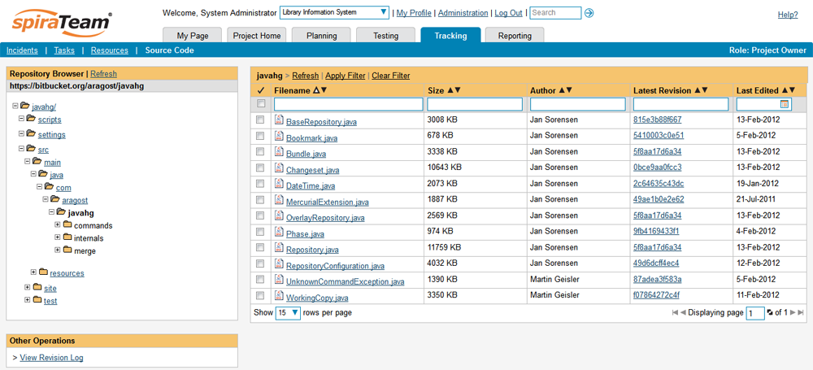
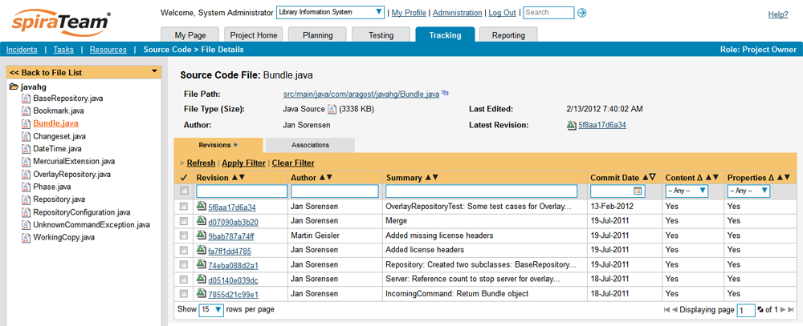
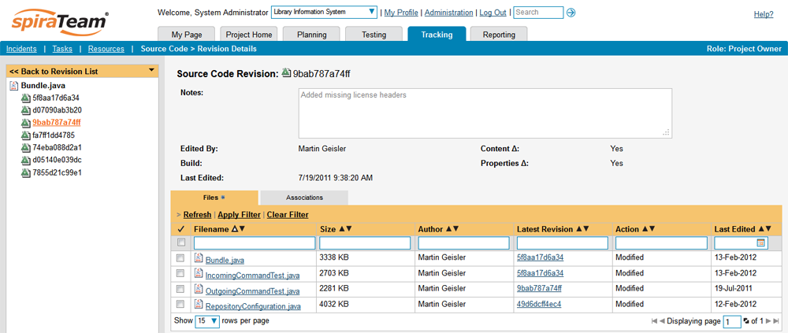

# Integrating with Mercurial

Mercurial is a Distributed Version Control System (DVCS) system that keeps track of software commits and allows many developers to work on a given project without necessarily being connected to a common network since it doesn't rely on a central repository, but instead distributes copies of the entire source code repository to each user's workstation.

The SpiraTeam plug-in for Mercurial allows users of SpiraPlan or SpiraTeam (hereafter referred to as SpiraTeam) to be able to browse a Mercurial repository and view commits linked to SpiraTeam artifacts.

The plug-in will download a read-only working-copy of the Mercurial repository onto the SpiraTeam server and use that for displaying the list of files/folders. The list of commits will be queried dynamically from this local repository on an as-needed basis. The plug-in also performs 'pull' requests from the specified remote repository to ensure that the local repository remains up to date.

The rest of this section outlines how to install and use the plug-in with SpiraTeam.

*Note: The plug-in will allow users to download and view different commits of files and view commit logs, but no changes to the repository are allowed through the plug-in.*

## Installing the Mercurial Plug-In To install the Mercurial Version Control plug-in, follow these steps:

-   Copy the following files from the plug-in zip-archive into the "VersionControl" sub-folder of the SpiraTeam installation:

    -   MercurialProvider.dll
    -   Mercurial.Net.dll

-   Log in as the Administrator and go into SpiraTeam main Administration page and click on the "Version Control" link under **System**.
-   Click the "Add" button to enter the Plug-in details page. The fields required are as follows:

-   **Name**: The name must be "MercurialProvider".
-   **Description**: The description is for your use only, and does not affect operation of the plug-in.
-   **Active**: If checked, the plug-in is active and able to be used for any project.
-   **Connection Info**: This field holds the clone URL of the repository for any project accessing the plug-in, unless overridden in the Project Settings:
-   For example: <https://bitbucket.org/aragost/javahg> ssh://example.com/hg/
-   **Login / Password**: The user id and the password of the user to use while accessing and retrieving information from the remote Mercurial repository. If you are accessing a public repository anonymously, just use "*anonymous*" for both username and password and it will be handled correctly.
-   **Custom 01 --** This needs to contain the path on the SpiraTeam server where the Mercurial executable (Hg.exe) can be found. If left blank, it will attempt to automatically discover Mercurial from the Windows %PATH% environment variable.
-   **Custom 02 -- Custom 05** -- Not used by this plugin.

When finished, click the "Insert" button and you will be taken back to the Version Control integration list page, with MercurialProvider listed as an available plug-in.

Verify that you are in the correct project using the drop-down at top, and click on the "Project Settings" link for the MercurialProvider. You will get a screen listing all the same configuration settings:

-   Be sure to change the Active field to Yes, or the repository will not be available for the current project.
-   Any other settings entered on this page will override - and have the same use as - the general settings that you created above. You would use these settings if you will have more than one project access different code repositories.
-   Initial setup is complete, click on the "Source Code" menu under the Tracking tab to navigate and browse the source code repository.

## Using Mercurial with SpiraTeam

While being able to browse the source code repository can be useful in itself, the real strength comes from linking artifacts in SpiraTeam -
including Incidents, Requirements, and Tasks - to commits checked into the software repository.

### Viewing the Repository Tree

View the source code tree by selecting the "Source Code" link under the Tracking tab. You will get a screen similar to:

The folder tree of the repository is on the left, and files in the current selected directory will be listed in the right table. Note that this view will always show the current (TIP) branch of the repository. The file view will display the filename, the current commit number of the file and the date of the last commit. You can filter and sort on any of the columns, as well.

### Viewing File Details

To view the file details, click on a file in the right-hand side of the repository. The file details page displays the details on the selected commit. By default, it will be the TIP branch, unless you clicked to view the file details from a commit. By clicking on the file name, you can download the specified commit of the file to your local machine. This does not do a Mercurial clone or pull; you are merely downloading the file to your local machine.

Underneath the file details is a list of all the commits (Mercurial changesets) that this file belongs in, or was committed to, who performed the commit, and the log message for the commit. Throughout SpiraTeam, commits are indicated by the

 icon.

### Commit Details

By clicking on a commit in SpiraTeam, you will be taken to the commit details page.

The commit details screen shows the log for the changeset, the commit date and author. At the bottom of the page are two tabs, Files and Associations. The Files tab lists all files that were a part of this commit, with their full path, size, latest commit and date of edit.

The Associations tab shows any artifact (Incident, Requirement, Test Case, Test Set) that the log message references. See [Linking Artifacts](#linking-artifacts) for information on how to link a commit with a Mercurial changeset:

### Linking Artifacts

Linking an artifact is quite simple. To maintain the readability of Mercurial changeset messages, we adopted a square bracket token. The token is in the format of:

**\[<artifact identifier\>:<artifact id\>\]**

The first half, the Artifact Identifier, is a two-letter code that is used throughout SpiraTeam, and is visible on almost every page in the application. For example, a requirement's identifier is "**RQ**". Incidents are "**IN**", and test cases are "**TC**". The artifact ID is the number of the artifact. So by creating a commit message that reads:

SpiraTeam will automatically detect tokens and will include links to them under the Associations tab for a commit detail.

## Troubleshooting

While integration with Mercurial is sophisticated behind the scenes, as a user you will only receive a couple of errors that will prevent the integration from working:

-   When you first load the list of folders and files for a repository > it may take several minutes to load as it's cloning the entire > repository from the remote Mercurial server to the SpiraTeam > server. This delay will not occur on subsequent views of the page.

-   SpiraTeam will not display the login page, and there is an error > (either on the page or in the Application Event Log) that says > "Could not load file or assembly.". If this error occurs, it is > most likely that the MercurialProvider.dll or some of its > dependent assemblies were not correctly placed in the > VersionControl folder of the SpiraTeam installation.

-   SpiraTeam reports that the login information is incorrect. In this > case, double check the Version Control settings, both for the > Project (which overrides the general settings) and the general > settings. Project settings will over-ride the general settings. Be > sure to use a user that has access to all nodes in the tree > starting from the root repository location.

-   If you are taken back to the repository screen and given a message > saying that the requested file was deleted from the system, this > means that an attempt was made to view details on a file that is > no longer part of the TIP branch. This can happen when a file is > deleted or renamed, and this is a normal condition in the code > repository, not necessarily an error with Mercurial or SpiraTeam.

## Data Purging

Since the integration with Mercurial requires that a working copy of the Mercurial repository be stored on the SpiraTeam server, you may decide at some point to unlink a disused Mercurial repository from SpiraTeam to save disk-space. However unlinking the repository through the SpiraTeam web interface will not remove the working copy of the repository from the server.

To permanently remove a repository from the SpiraTeam server, you need to locate the following path:

-   **(Windows XP, 2003)** - C:\\Documents and Settings\\All Users\\Application Data

-   **(Windows 2008, 7, Vista)** -- C:\\ProgramData

If you look inside this folder, you will see a subfolder called "Inflectra", and under that will be a subfolder called "MercurialProvider". If you open up this subfolder, you will see a list of all the Mercurial repositories that have been accessed through SpiraTeam. To purge a module, just select it and choose the Delete Folder option in Windows.

