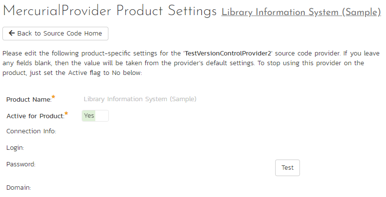

# Integrating with Mercurial

Mercurial is a Distributed Version Control System (DVCS) system that keeps track of software commits and allows many developers to work on a given project without necessarily being connected to a common network since it doesn't rely on a central repository, but instead distributes copies of the entire source code repository to each user's workstation.

The SpiraTeam plug-in for Mercurial allows users of SpiraPlan or SpiraTeam (hereafter referred to as SpiraTeam) to be able to browse a Mercurial repository and view commits linked to SpiraTeam artifacts.

The plug-in will download a read-only working-copy of the Mercurial repository onto the SpiraTeam server and use that for displaying the list of files/folders. The list of commits will be queried dynamically from this local repository on an as-needed basis. The plug-in also performs 'pull' requests from the specified remote repository to ensure that the local repository remains up to date.

The rest of this section outlines how to install and use the plug-in with SpiraTeam.

*Note: The plug-in will allow users to download and view different commits of files and view commit logs, but no changes to the repository are allowed through the plug-in.*

## Installing the Mercurial Plug-In To install the Mercurial Version Control plug-in, follow these steps:

Copy the following files from the plug-in zip-archive into the "VersionControl" sub-folder of the SpiraTeam installation:

    -   MercurialProvider.dll
    -   Mercurial.Net.dll

## Configuring Mercurial in SpiraPlan
Before you can start using Mercurial in SpiraPlan you need to setup, at a system level, how Mercurial and SpiraPlan should work together: 

- Log in as a system admin, and go to System Admininstration > Integration > Source Code
- If there is not already an antry for "MercurialProvider" click "Add" to go to the Plug-in details page

Complete the form on this page as below:

-   **Name**: The name must be "MercurialProvider".
-   **Description**: The description is for your use only, and does not affect operation of the plug-in.
-   **Active**: If checked, the plug-in is active and able to be used for any project.
-   **Connection Info**: This field holds the clone URL of the repository for any project accessing the plug-in, unless overridden in the Project Settings:
-   For example: `<https://bitbucket.org/aragost/javahg> ssh://example.com/hg/`
-   **Login / Password**: The user id and the password of the user to use while accessing and retrieving information from the remote Mercurial repository. If you are accessing a public repository anonymously, just use "*anonymous*" for both username and password and it will be handled correctly.
-   **Custom 01 --** This needs to contain the path on the SpiraTeam server where the Mercurial executable (Hg.exe) can be found. If left blank, it will attempt to automatically discover Mercurial from the Windows %PATH% environment variable.
-   **Custom 02 -- Custom 05** -- Not used by this plugin.

When finished, click "Insert". You will be taken back to the Source Code list page, with MercurialProvider listed as an available plug-in.

## Use Mercurial for Your Product
Once Mercurial has been configured at the system level, you are ready to use it for any products you need to. 

- First go to the product you want to use for Mercurial as a product admin
- Go to Product Admin > General Settings > Source Code
- You will be taken to a list of all the providers on your system. Find the MercurialProvider row; make sure the product dropdown has your current product selected; and click the arrow to the right of the product name to manage Mercurial for that Product
- You will now be on the "MercurialProvider Product Settings" page for your chosen product
- If not already active, set "Active" to use and click "Save"
- The product Mercurial settings screen will now let you fully manage all its settings
- Make sure to override any of the system wide defaults (as outlined above). In particular, the **Connection Info** (the URL to the repo) should be set to the right repo for this product.
- Click "Save" after making any changes.

## Using Mercurial with SpiraPlan
Source code setup for your product is complete. Click on the "Source Code" or "Commits" menu items under the Developing tab to navigate and browse the source code repository.

You can read more about working with source code in SpiraPlan at the links below:

- [Source code files](../../Spira-User-Manual/Source-Code/#source-code-file-list)
- [Commits](../../Spira-User-Manual/Commits/#commit-list)
- [Linking to artifacts in commit messages](../../Spira-User-Manual/Commits/#linking-to-artifacts-in-commit-messages)
- [Troubleshooting source code integration](../../Spira-User-Manual/Source-Code/#troubleshooting-source-code-integration)

## Data Purging
Since the integration with Mercurial requires that a working copy of the Mercurial repository be stored on the SpiraTeam server, you may decide at some point to unlink a disused Mercurial repository from SpiraTeam to save disk-space. However unlinking the repository through the SpiraTeam web interface will not remove the working copy of the repository from the server.

To permanently remove a repository from the SpiraTeam server, you need to locate the following path:

-   **(Windows XP, 2003)**: C:\\Documents and Settings\\All Users\\Application Data
-   **(Windows 2008, 7, Vista)**: C:\\ProgramData

If you look inside this folder, you will see a subfolder called "Inflectra", and under that will be a subfolder called "MercurialProvider". If you open up this subfolder, you will see a list of all the Mercurial repositories that have been accessed through SpiraTeam. To purge a module, just select it and choose the Delete Folder option in Windows.

