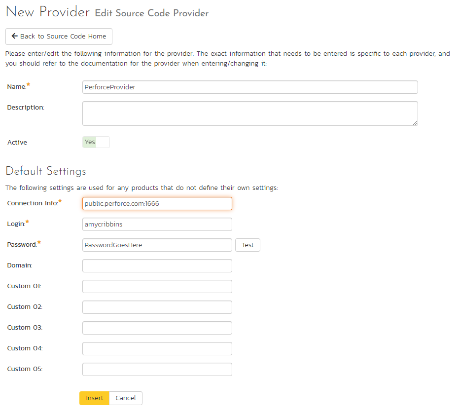
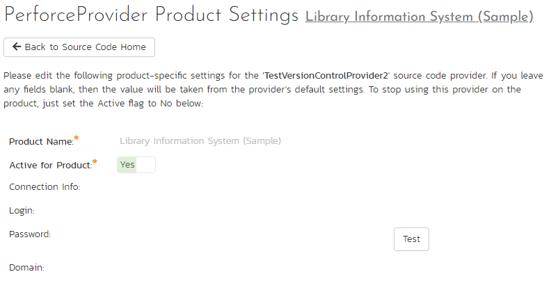
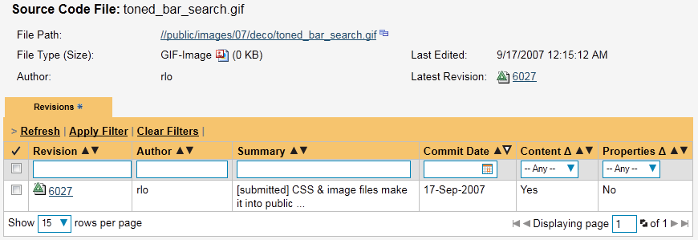
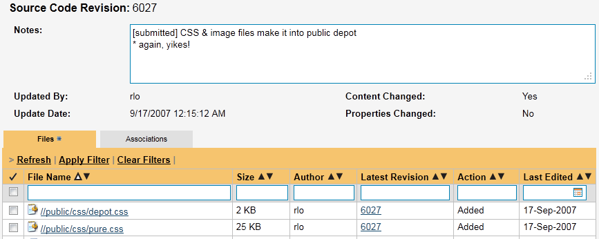
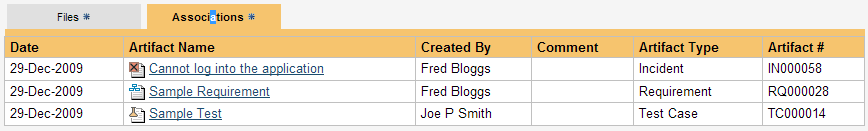

# Integrating with Perforce

## Installing the Perforce Plug-In
 To install the Perforce Version Control plug-in, follow these steps:

-   Copy the following files to the folder named "VersionControl" in the SpiraTeam installation folder:

-   Inflectra.Global.dll

-   P4API.dll

-   P4DN.dll

-   PerforceProvider.dll

-   Log in as the Administrator and go into SpiraTeam main
Administration page and click on the "Version Control" link under
**System**.

-   

Click the "Add" button to enter the
Plug-in details page. The fields required are as follows:

-   **Name**: The name must be "PerforceProvider".

-   **Description**: The description is for your use only, and does
not affect operation of the plug-in.

-   **Active**: If checked, the plug-in is active and able to be
used for any project.

-   **Connection Info**: This field is the server's DNS or IP with
the port to connect to. No depot information or root directory
is to be specified here. Do not enter in any protocol, like
http:// or ftp://.

-   **Login / Password**: The user id and the password of the user
to use while accessing and retrieving information from the
Subversion server. If either field needs to be blank, enter in
'anonymous'.

-   **Domain**: Not used.

-   **Custom01**: The client name is to be entered here. The plugin
will attempt to create the client if it does not exist. Unless
you have a client pre-defined for the plugin, we recommend using
the default, "PerforceProvider".

-   **Custom02**: The base depot or root directory must be entered
here.

- **Custom04**: *(This is not used and can be left empty)*

-   **Custom03**: The encoding to use for the Perforce server (Optional). Depending on your instance you may need to use: *utf-8, utf-16, utf, utf8-bom*

-   **Custom05**: Normally this should be left empty. However if you need to enable more detailed logging, just enter the word *'true'* in the box to enable trace logging.

-   When finished, click the "Insert" button and you will be taken back
to the Version Control integration list page, with PerforceProvider
listed as an available plug-in.

-   

Verify that you are in the correct
project using the drop-down at top, and click on the "Project
Settings" link for the PerforceProvider. You will get a screen
listing all the same configuration settings:

-   Be sure to change the Active field to Yes, or the repository
will not be available for the current project.

-   Any other settings entered on this page will override - and have
the same use as - the general settings that you created above.
You would use these settings if you will have more than one
project access different code repositories.

-   Initial setup is complete, click on the "Source Code" menu under the
Tracking tab to navigate and browse the source code repository.

## Using Perforce with SpiraTeam

While being able to browse the source code repository can be useful in
itself, the real strength comes from linking artifacts in SpiraTeam -
including Incidents, Requirements, and Tasks - to revisions checked into
the software repository.

### Viewing the Repository Tree

View the source code tree by selecting the "Source Code" link under the
Tracking tab. You will get a screen similar to:

The folder tree of the repository is on the left, and files in the
current selected directory will be listed in the right table. Note that
this view will always show the current (HEAD) changelist of the depot.
The file view will display the filename, the current change number of
the file, the author of the last change, and the date of the last
change. You can filter and sort on any of the columns, as well.

### Viewing File Details

To view the file details, click on a file in the right-hand side of the
screen. The file details page displays the details on the selected file.
By default, it will be the HEAD change, unless you clicked to view the
file details from a change. By clicking on the file name, you can
download the specified change version of the file to your local machine.
This does not open the file on the depot; you are merely downloading the
file to your local machine.

Underneath the file's details is a list of all the changes that this
file was changed in, who performed the change, and the log message for
the change. Throughout SpiraTeam, changes are indicated by the

 icon.

### Change Details

By clicking on a change in SpiraTeam, you will be taken to the
changelist details page:

The revision details screen shows the log for the change, the change
date and author. At the bottom of the page are two tabs, Files and
Associations. The Files tab lists all files that were a part of this
change, with their full path and the action that was performed on them
for this change. Possible values are Added, Modified, Deleted, or Other.

The Associations tab shows any artifact (Incident, Requirement, Test
Case, Test Set) that the log message references. See [Linking Artifacts](#linking-artifacts) for
information on how to link a revision with a Perforce change:

### Linking Artifacts

Linking an artifact is quite simple. To maintain the readability of
Subversion's change messages, we adopted a bracket token. The token is
in the format of:

**\[<artifact identifier\>:<artifact id\>\]**

The first half, the Artifact Identifier, is a two-letter code that is
used throughout SpiraTeam, and is visible on almost every page in the
application. For example, a requirement's identifier is "**RQ**".
Incidents are "**IN**", and test cases are "**TC**". The artifact ID is
the number of the artifact. So by creating a change message that reads:

SpiraTeam will automatically detect tokens and will include links to
them under the Associations tab for a revision detail.

## Troubleshooting

While integration with Perforce is rather complex, as a user you will
only receive a couple of errors that will prevent the integration from
working:

-   SpiraTeam will not display the login page, and there is an error
> (either on the page or in the Application Event Log) that says
> "Could not load file or assembly." This simply means that not all
> of the [required DLL libraries](#installing-the-perforce-plug-in) are present in
> the \\VersionControl directory inside of the installation. It
> could also mean that the IIS Application Pool is not set to allow
> 32-bit applications. (At this time, there are no 64-bit DLLs
> available for the Perforce Provider.)

-   SpiraTeam reports that the login information is incorrect. In this
> case, double check the Version Control settings, both for the
> Project (which overrides the general settings) and the general
> settings. Project settings will over-ride the general settings. Be
> sure to use a user that has access to all nodes in the tree
> starting from the root repository location.

-   If you are taken back to the repository screen and given a message
> saying that the requested file was deleted from the system, this
> means that an attempt was made to view details on a file that is
> no longer part of the HEAD revision. This can happen when a file
> is deleted or renamed, and this is a normal condition in the code
> repository, not necessarily an error with Subversion or SpiraTeam.

-   Any other errors about not being able to load the version control
> provider will have the error messages logged in the web server's
> (that hosts SpiraTeam) Application Event Log. When contacting
> support, be sure to have the event logs ready.

