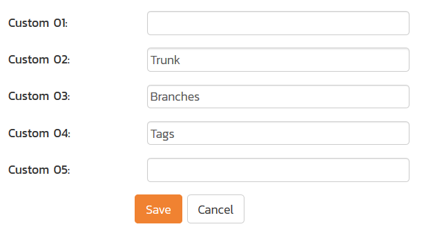
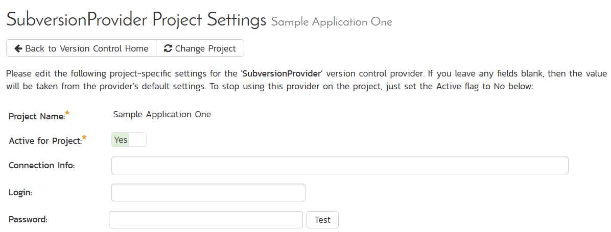

# Integrating with Subversion
!!! abstract "Compatible with SpiraTeam and SpiraPlan"

Subversion (also known as SVN) is a Software Configuration Management (SCM) system, that enables users to work on code simultaneously while preserving previous versions by avoiding collisions in code edits. While users working on the code will usually have a complete copy of the repository on their local systems, this plug-in will access the repository remotely by use of the "**svn://**" , "**http://**" and "**https://**" protocols. (Note that "**svn+ssh://**" may be supported on a server by server basis.)

Due to the methodologies in which IIS handles web requests and runs on the server, any SSH connection certificates that have trust issues will be automatically accepted. Therefore, we recommend using an IP address to connect to the server instead of a DNS name that could be redirected to an unsafe connection.

The current version of the Subversion plugin requires Spira v5.4.0.0 or later.

## Installing the Subversion Plug-In 
Cloud hosted users and on-premise users on Spira 6+ can skip this section: all required files are included as part of the normal installation process. 

To install the Subversion Version Control plug-in, follow these steps:

- Copy the file "SubversionProvider.dll" file into the "VersionControl" sub-folder of the Spira installation.
- If your server operating system is 64-bit, then copy all the files in the "**x64**" directory of the downloaded plug-in zip file into the "VersionControl" sub-folder of the Spira installation. *Note: Do not create an x64 folder under VersionControl, make sure the files live in the VersionControl folder itself.*
- If your server operating system is 32-bit, then copy all the files in the "**x32**" directory of the downloaded plug-in zip file into the "VersionControl" sub-folder of the Spira installation. *Note: Do not create an x32 folder under VersionControl, make sure the files live in the VersionControl folder itself.*

## Configuring Subversion in Spira
Before you can start using Subversion in Spira you need to setup, at a system level, how Subversion and Spira should work together: 

- Log in as a system admin, and go to System Admininstration > Integration > Source Code
- If there is not already an antry for "SubversionProvider" click "Add" to go to the Plug-in details page

Complete the form on this page as below:

-   **Name**: The name must be "SubversionProvider".
-   **Description**: The description is for your use only, and does not affect operation of the plug-in.
-   **Active**: If checked, the plug-in is active and able to be used for any project.
-   **Connection Info**: This field holds the root of the repository for any project accessing the plug-in, unless overridden in the Project Settings. Start the connection string with **svn://**, **http://**, or **https://**.
-   **Login / Password**: The user id and the password of the user to use while accessing and retrieving information from the Subversion server.
-   **Domain & Custom 05:** are not used by the plug-in and will be ignored.
-   **Custom 01**: This field is used for debugging. Please leave it blank unless specified by support.
-   **Custom 02-04:** These three fields are used to specify the **standard Subversion** layout, where there are specific folders for the Trunk, Branches and Tags. If you want to use the Branches feature in Spira, you need to populate all three fields.

-   **Custom 02:** The folder containing the Trunk (usually called Trunk or trunk)
-   **Custom 03:** The folder containing the Branches (usually called Branches or branches)
-   **Custom 04:** The folder containing the Tags (usually called Tags or tags)

When finished, click the "Insert" button and you will be taken back to the Source Code list page, with SubversionProvider listed as an available plug-in.

## Use Subversion for Your Product
Once Subversion has been configured at the system level, you are ready to use it for any products you need to. 

- First go to the product you want to use for Subversion as a product admin
- Go to Product Admin > General Settings > Source Code
- You will be taken to a list of all the providers on your system. Find the SubversionProvider row; make sure the product dropdown has your current product selected; and click the arrow to the right of the product name to manage Subversion for that Product
- You will now be on the "SubversionProvider Product Settings" page for your chosen product
- If not already active, set "Active" to use and click "Save"
- The product Subversion settings screen will now let you fully manage all its settings
- Make sure to override any of the system wide defaults (as outlined above). In particular, the **Connection Info** (the URL to the repo) should be set to the right repo for this product.
- Click "Save" after making any changes.

## Using Subversion with Spira
Source code setup for your product is complete. Click on the "Source Code" or "Commits" menu items under the Developing tab to navigate and browse the source code repository.

You can read more about working with source code in Spira at the links below:

- [Source code files](../Spira-User-Manual/Source-Code.md/#source-code-file-list)
- [Commits](../Spira-User-Manual/Commits.md/#commit-list)
- [Linking to artifacts in commit messages](../Spira-User-Manual/Commits.md/#linking-to-artifacts-in-commit-messages)
- [Troubleshooting source code integration](../Spira-User-Manual/Source-Code.md/#troubleshooting-source-code-integration)