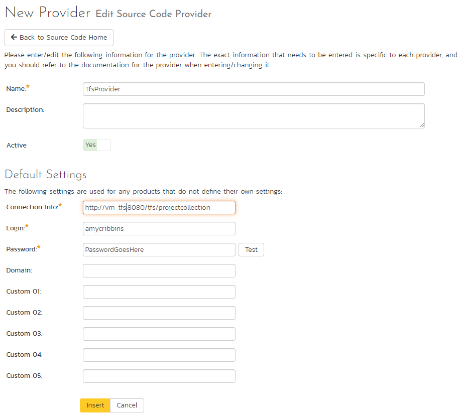
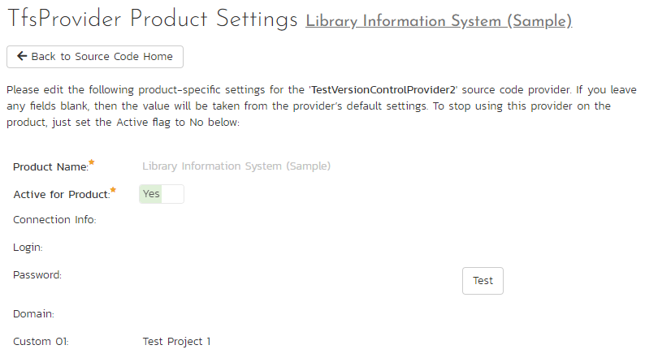
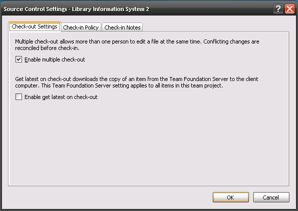
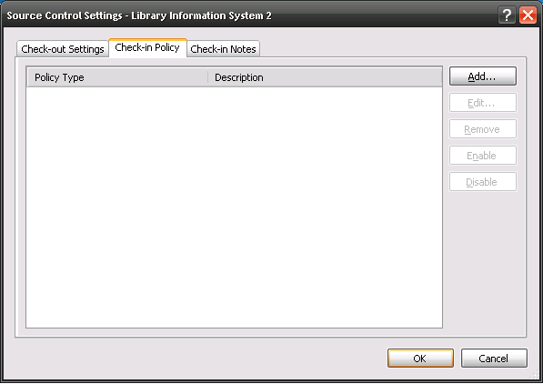
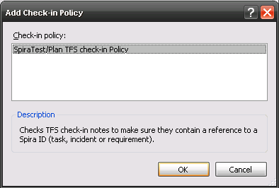

# Integrating with TFS

Microsoft Visual Studio Team System (VSTS) Team Foundation Server (TFS) from Microsoft® (hereafter referred to as TFS) is a Software Configuration Management (SCM) system that enables users to work on code simultaneously while preserving previous versions by avoiding collisions in code edits. This plug-in will allow users of SpiraPlan or SpiraTeam (hereafter referred to as SpiraTeam) to be able to browse a TFS repository and view commits linked to SpiraTeam artifacts. There are separate plug-ins for TFS 2005/2008, 2010 and 2012+. When connecting to a TFS 2010/2012+ repository, the connection URL will also need to be in a different format (see below).

While users working on the code will usually have a complete copy of the repository on their local systems, this plug-in will access the TFS repository remotely. The rest of this section outlines how to install and use the plug-in with SpiraTeam.

*Note: The plug-in will allow users to download and view different commits of files and view commit logs, but no changes to the repository are allowed through the plug-in.*

## Installing the TFS Plug-In 
To install the TFS Version Control plug-in, follow these steps:

-   Download the appropriate TFS provider from the Inflectra website (http://www.inflectra.com/SpiraTeam/Downloads.aspx) -- there are separate versions for TFS 2005/2008, 2010 and TFS 2012 or later.
-   Copy the following files from the plug-in zip-archive into the "VersionControl" sub-folder of the SpiraTeam installation:

    -   Microsoft.TeamFoundation.Client.dll
    -   Microsoft.TeamFoundation.Common.dll
    -   Microsoft.TeamFoundation.Common.Library.dll
    -   Microsoft.TeamFoundation.dll
    -   Microsoft.TeamFoundation.VersionControl.Client.dll
    -   Microsoft.TeamFoundation.VersionControl.Common.dll
    -   Microsoft.TeamFoundation.VersionControl.Common.Integration.dll
 -   TfsProvider.dll

## Configuring TFS in SpiraPlan
Before you can start using TFS in SpiraPlan you need to setup, at a system level, how TFS and SpiraPlan should work together: 

- Log in as a system admin, and go to System Admininstration > Integration > Source Code
- If there is not already an antry for "TfsProvider" click "Add" to go to the Plug-in details page

Complete the form on this page as below:

-   **Name**: The name must be "TfsProvider".
-   **Description**: The description is for your use only, and does not affect operation of the plug-in.
-   **Active**: If checked, the plug-in is active and able to be used for any project.
-   **Connection Info**: This field points to the URL used for accessing the Team Foundation Server. Typically TFS runs on website port 8080, but you may need to check with your IT administrator to verify. The exact connection URL will depend on your version of TFS:

    -   **For TFS 2005 / 2008:** <http://myservname:8080>
    -   **For TFS 2010:** <http://myservname:8080/tfs/projectcollection> where "projectcollection" is the name of the project collection you will be connecting to
    -   **For TFS 2012 or later:** <http://myservname:8080/tfs/projectcollection> where "projectcollection" is the name of the project collection you will be connecting to

-   **Login / Password**: The user id and the password of the user to use while accessing and retrieving information from the TFS repository. If the repository doesn't require a username/password, just use "*anonymous"* as both the username and password.
-   **Domain:** This is the Windows Domain that the TFS server is a member of. If the machine is not part of a domain, you should just use the TFS server name instead. **If you are connecting to a hosted Visual Studio Online (VSO) repository, you should leave the Domain blank.**
-   **Custom01 -- 05:** are not used by the TFS plug-in and can be ignored

When finished, click "Insert". You will be taken back to the Source Code list page, with TfsProvider listed as an available plug-in.

## Use TFS for Your Product
Once TFS has been configured at the system level, you are ready to use it for any products you need to. 

- First go to the product you want to use for TFS as a product admin
- Go to Product Admin > General Settings > Source Code
- You will be taken to a list of all the providers on your system. Find the TfsProvider row; make sure the product dropdown has your current product selected; and click the arrow to the right of the product name to manage TFS for that Product
- You will now be on the "TfsProvider Product Settings" page for your chosen product
- If not already active, set "Active" to use and click "Save"
- The product TFS settings screen will now let you fully manage all its settings
- Make sure to override any of the system wide defaults (as outlined above). In particular, the **Connection Info** (the URL to the repo) should be set to the right repo for this product.
- Custom 01 should contain the name of the equivalent team project in TFS.
- Click "Save" after making any changes.

## Using TFS with SpiraTeam
Source code setup for your product is complete. Click on the "Source Code" or "Commits" menu items under the Developing tab to navigate and browse the source code repository.

You can read more about working with source code in SpiraPlan at the links below:

- [Source code files](../Spira-User-Manual/Source-Code.md/#source-code-file-list)
- [Commits](../Spira-User-Manual/Commits.md/#commit-list)
- [Linking to artifacts in commit messages](../Spira-User-Manual/Commits.md/#linking-to-artifacts-in-commit-messages)
- [Troubleshooting source code integration](../Spira-User-Manual/Source-Code.md/#troubleshooting-source-code-integration)

## Enforcing Associations with a Custom Policy

As described in [Linking to artifacts in commit messages](../Spira-User-Manual/Commits.md/#linking-to-artifacts-in-commit-messages), you can easily associate check-ins of code in TFS with relevant SpiraTeam artifacts by adding the appropriate artifact identifier in the commit messages.

In order to enforce this process, one of our customers has written a custom Visual Studio 2008 and 2010/2012+ Team System check-in policy that will force users to enter at least one SpiraTeam artifact in each of the check-in comments. This policy will also check the IDs of the supplied artifacts to make sure they exist in the appropriate SpiraTeam installation.

To install the custom check-in policy, you should download the SpiraPolicySetup.msi (for 2008) or SpiraPolicy.vsix (for 2010+) installation package from the Add-Ons/Downloads section of the Inflectra website (<http://www.inflectra.com/SpiraTeam/Downloads.aspx>) and run the installation package on each workstation that has Visual Studio installed. Once this installation has been completed, you need to tell Visual Studio to add the custom check-in policy:

- Inside Visual Studio, go to Team \> Team Project Settings \> Source Control to open up the Source Code extensions dialog box:

- Click on the Check-in Policy tab to list the various check-in policies:

- Click on the \[Add...\] button to add a new check-in policy:

- Select the SpiraTeam/Plan TFS check-in Policy and click \[OK\]. This will bring up the SpiraTeam custom policy configuration dialog box:

- Enter the URL for the SpiraTeam server (you only need the server name and virtual directory portion) as well as a valid login and password. Then click \[Connect\] to get the list of projects.
- Select the checkboxes for which artifact types you want to be included in the artifact enforcement and click the \[OK\] button to confirm the settings.
- Now when a user checks-in a change to the TFS source code repository, they will be required to enter at least one SpiraTeam artifact, and the system will check to make sure that artifact actually exists in the specified project.