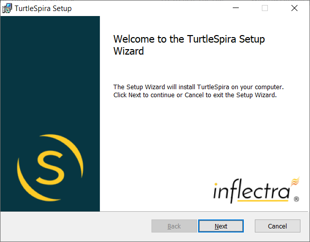
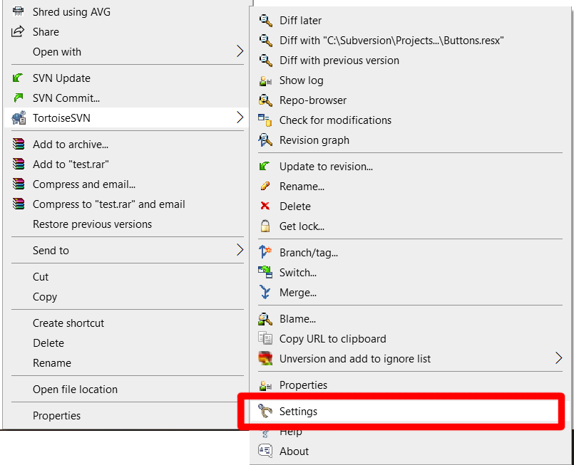
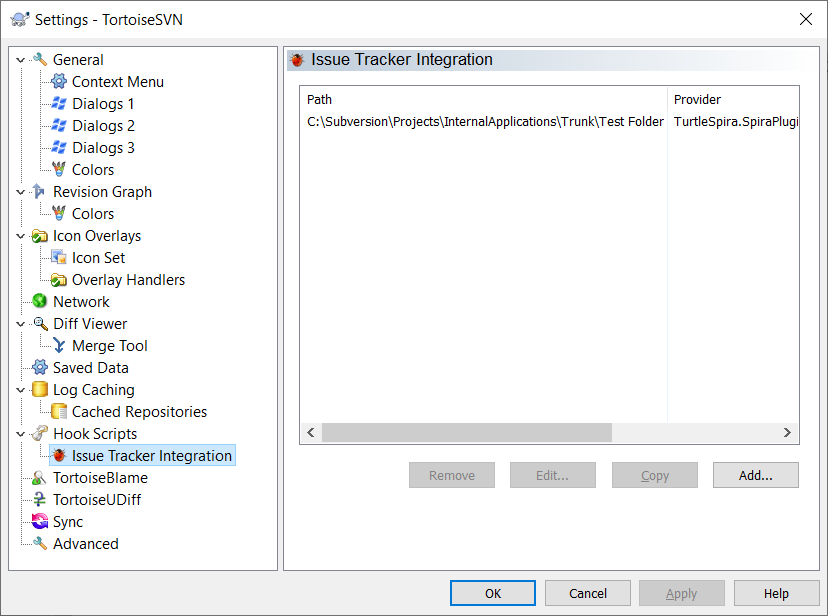
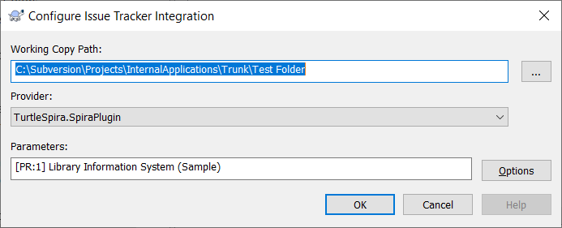
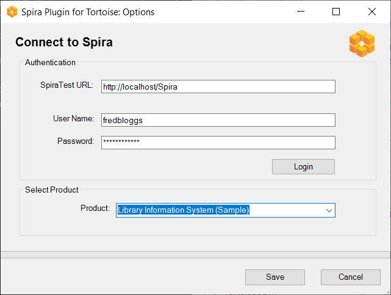
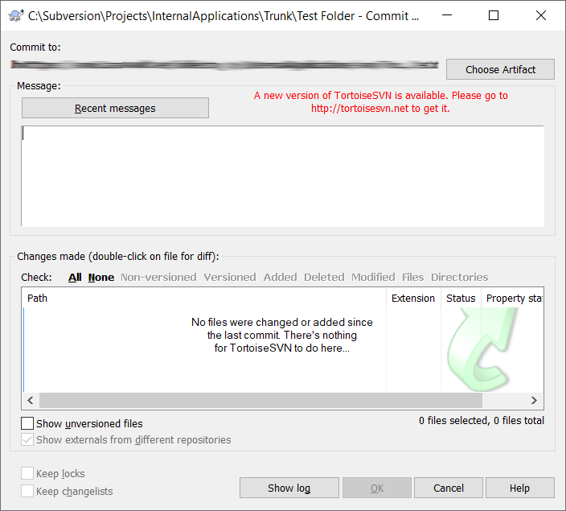
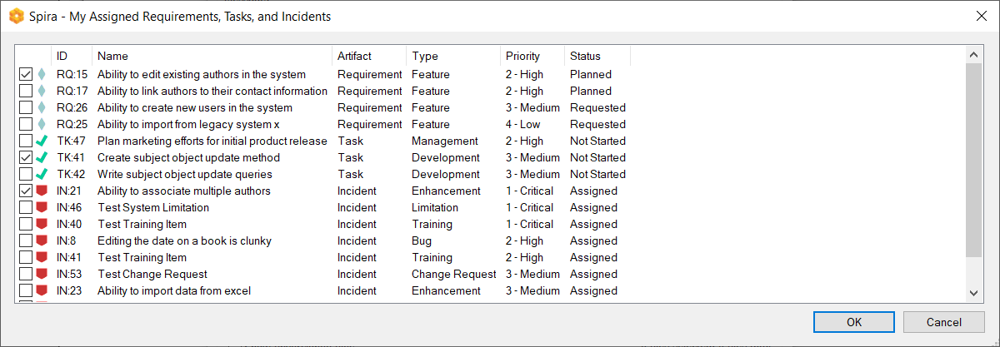
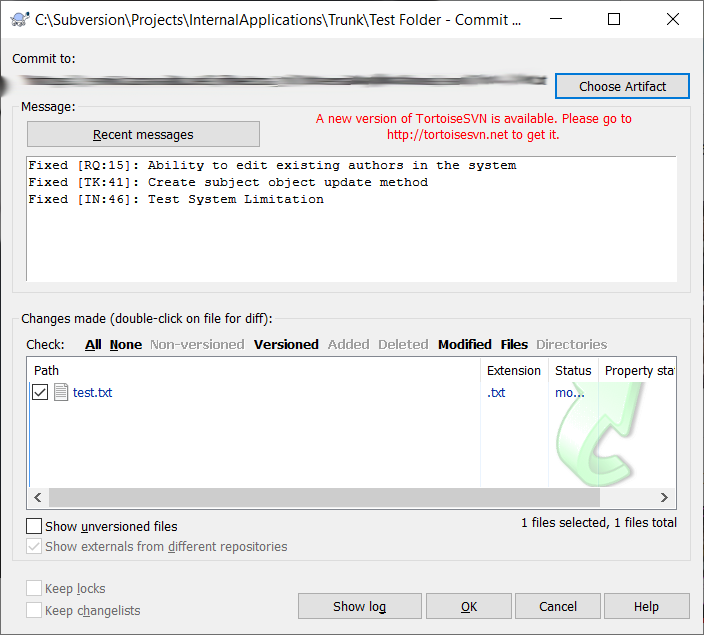
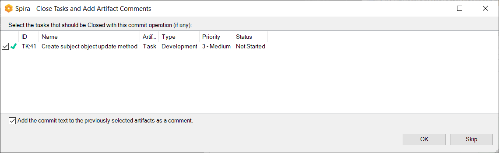
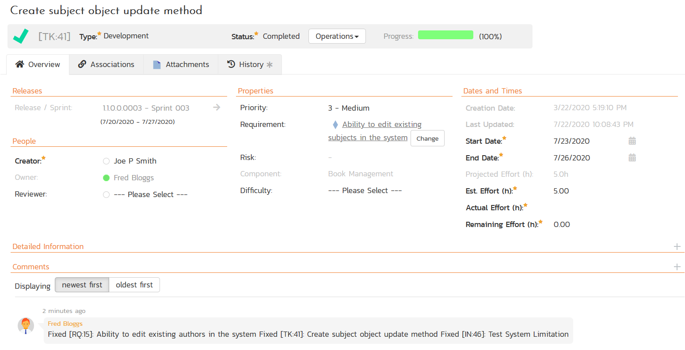

# Integrating with Tortoise

Tortoise is a family of Windows Explorer shell extensions that helps programmers manage different versions of the source code for their programs directly inside the standard Windows Explorer user interface.

There are different versions of Tortoise that are compatible with different version control systems.

## TortoiseSVN
TortoiseSVN is a [Subversion](../Integrating-with-Subversion) client, implemented as a Microsoft Windows shell extension, that helps programmers manage different versions of the source code for their programs. 

In Windows Explorer, besides showing context menu items for Subversion commands, TortoiseSVN provides icon overlay that indicates the status of Subversion working copies. 

## TortoiseGit
TortoiseGit is a [Git](../Integrating-with-Git) revision control client, implemented as a Windows shell extension and based on TortoiseSVN.

In Windows Explorer, besides showing context menu items for Git commands, TortoiseGit provides icon overlays that indicate the status of Git working trees and files. It also comes with the TortoiseGitMerge utility to visually compare two files and resolve conflicts. 

## TortoiseCVS
TortoiseCVS is a [CVS](../Integrating-with-CVS) client for Microsoft Windows. Unlike most CVS tools, it includes itself in Windows' shell by adding entries in the contextual menu of the file explorer, therefore it does not run in its own window. Moreover, it adds icons onto files and directories controlled by CVS, giving additional information to the user without having to run a full-scale stand-alone application.

## Using the Spira Plugin for Tortoise
The Spira [issue-tracker plugin](https://tortoisesvn.net/issuetrackerplugins.html) for Tortoise (called **TurtleSpira**) works with all variants of Tortoise, including TortoiseGit,TortoiseSVN, and TortoiseCVS, and lets you streamline your workflow for linking source code commits / revisions to assigned artifacts in SpiraTeam, SpiraPlan, or SpiraTest.

The Tortoise plugin system lets you integrate different issue trackers. With such plugins it is possible to fetch information directly from the issue tracker, interact with the user and provide information back to Tortoise about open issues, verify log messages entered by the user and even run actions after a successful commit to e.g, close an issue.

### Installing the TurtleSpira Plugin

You need to download the TurtleSpira windows installer package from the Inflectra website and run it on the same computer that already has Tortoise installed:

Once it has finished installing, you need to go to the Tortoise > Settings and bring up the Settings dialog box:

On the main Settings menu, click on the **Hook Scripts > Issue Tracker Integration**.

Click on the **Add** button to bring up the dialog box to configure the issue tracker integration:

You need to fill out the following fields in the dialog box:

- **Working Copy Path**: Enter or browse to the location of a Subversion/CVS/Git repository working directory that you wish to integrate with Spira.
- **Provider**: Choose the **TurtleSpira.SpiraPlugin** provider from the dropdown list.
- **Parameters**: You can leave this blank for now.

Then Click on the **Options** button to bring up the Spira configuration dialog box:

You need to enter the URL, User Name, and Password to your Spira instance and click the **Login** button. Once it connects, then choose the appropriate Product from the dropdown list and then click **Save**.

You have now installed and configured the TurtleSpira plugin.

### Committing a Code Change Linked to Spira Artifacts

Now we want to commit a change we have made to some source code files and associate that change with artifacts in Spira that are assigned to me. For example, I might be fixing a bug, implementing a feature, or completing a task associated with a requirement.

When you choose the menu option in Tortoise to commit the change, it displays the following dialog box:

Click on the **Choose Artifact** button on the top-right of the dialog box:

This screen will list all of the Spira requirements, tasks, and incidents assigned to you. Simply select the checkboxes of the items you want to associate with this commit operation and click **OK**:

The plugin will automatically populate the list of requirements, tasks and incidents into the commit text. Now click the **OK** button to commit the change:

Check the box of any tasks that you want the plugin to automatically close for you in Spira. If the source code revision completed all the work on the task, you should check the box. If the revision was merely part of the task, you should leave it unchecked.

In addition, there is a checkbox which will tell the plugin to add the commit text as comments onto all the selected artifacts.

Once that has been done, you will see the following comments appear in Spira:

