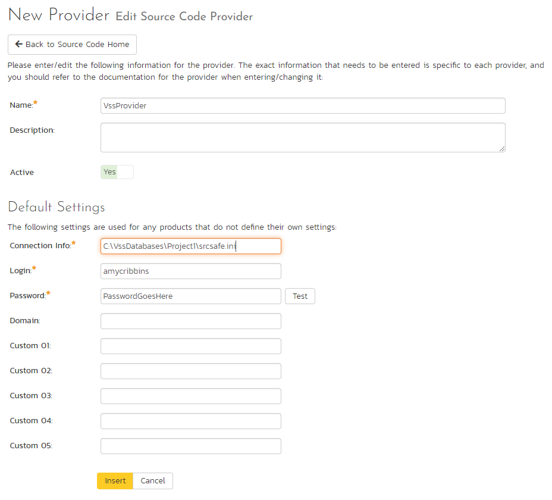

# Integrating with VSS
!!! abstract "Compatible with SpiraTeam and SpiraPlan"

Visual SourceSafe® (VSS) from Microsoft® is a Software Configuration Management (SCM) system that enables users to work on code simultaneously while preserving previous versions by avoiding collisions in code edits. This plug-in will allow users of Spira to be able to browse a VSS database and view commits linked to Spira artifacts.

While users working on the code will usually have a complete copy of the repository on their local systems, this plug-in will access the VSS database remotely.The rest of this section outlines how to install and use the plug-in with Spira.

*Note: The plug-in will allow users to download and view different commits of files and view commit logs, but no changes to the repository are allowed through the plug-in.*

## Installing the VSS Plug-In 
To install the VSS Version Control plug-in, follow these steps:

-   Install a copy of Visual SourceSafe on the same server that is running Spira (if it is already installed on the server, you can disregard this step).
-   Copy the following files from the plug-in zip-archive into the "VersionControl" sub-folder of the Spira installation:

    -   VssProvider.dll
    -   SourceSafe.Interop.dll

## Configuring VSS in Spira
Before you can start using VSS in Spira you need to setup, at a system level, how VSS and Spira should work together: 

- Log in as a system admin, and go to System Admininstration > Integration > Source Code
- If there is not already an antry for "VssProvider" click "Add" to go to the Plug-in details page

Complete the form on this page as below:

-   **Name**: The name must be "VssProvider".
-   **Description**: The description is for your use only, and does not affect operation of the plug-in.
-   **Active**: If checked, the plug-in is active and able to be used for any project.
-   **Connection Info**: This field points to the filepath where the srcsafe.ini file is located (which contains the VSS database information). For example: `C:\VssDatabases\Project1\srcsafe.ini`
-   **Login / Password**: The user id and the password of the user to use while accessing and retrieving information from the VSS database. If the repository doesn't require a password, just use "*anonymous"* as the password.
-   **Domain:** is not used by the VSS plug-in and can be ignored
-   **Custom01 -- 05:** are not used by the VSS plug-in and can be ignored

When finished, click "Insert". You will be taken back to the Source Code list page, with VssProvider listed as an available plug-in.

## Use VSS for Your Product
Once VSS has been configured at the system level, you are ready to use it for any products you need to. 

- First go to the product you want to use for VSS as a product admin
- Go to Product Admin > General Settings > Source Code
- You will be taken to a list of all the providers on your system. Find the VssProvider row; make sure the product dropdown has your current product selected; and click the arrow to the right of the product name to manage VSS for that Product
- You will now be on the "VssProvider Product Settings" page for your chosen product
- If not already active, set "Active" to use and click "Save"
- The product VSS settings screen will now let you fully manage all its settings
- Make sure to override any of the system wide defaults (as outlined above). In particular, the **Connection Info** (the URL to the repo) should be set to the right repo for this product.
- Click "Save" after making any changes.

## Using VSS with Spira
Source code setup for your product is complete. Click on the "Source Code" or "Commits" menu items under the Developing tab to navigate and browse the source code repository.

You can read more about working with source code in Spira at the links below:

- [Source code files](../Spira-User-Manual/Source-Code.md/#source-code-file-list)
- [Commits](../Spira-User-Manual/Commits.md/#commit-list)
- [Linking to artifacts in commit messages](../Spira-User-Manual/Commits.md/#linking-to-artifacts-in-commit-messages)
- [Troubleshooting source code integration](../Spira-User-Manual/Source-Code.md/#troubleshooting-source-code-integration)

## Troubleshooting
If you have the VSS database located on a remote file-share on a > separate server to Spira, you will need to modify the identify > used by the IIS Application Pool running Spira. By default the > IIS Application Pool will run as the special Windows user "NETWORK > SERVICE". Whilst this is a secure account with low privileges for > normal use of the system, it may not have sufficient permissions > to access the VSS repository over your Local Area Network (LAN). > We recommend changing the IIS Application Pool to instead run as a > Windows Domain user that has permissions to access the remote > file-share containing the VSS database.