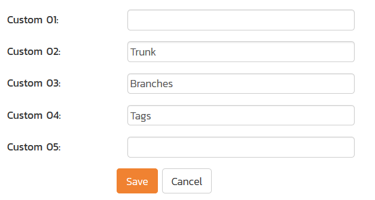
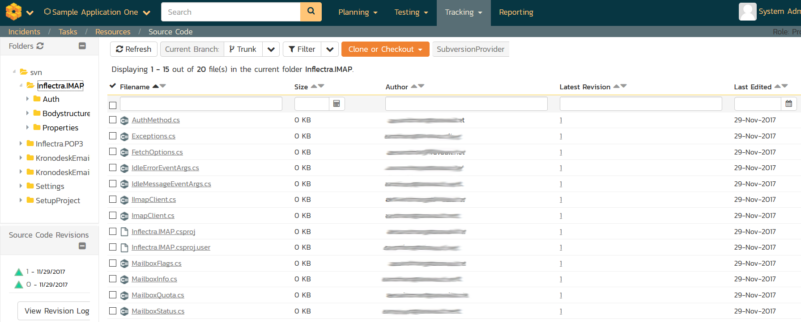
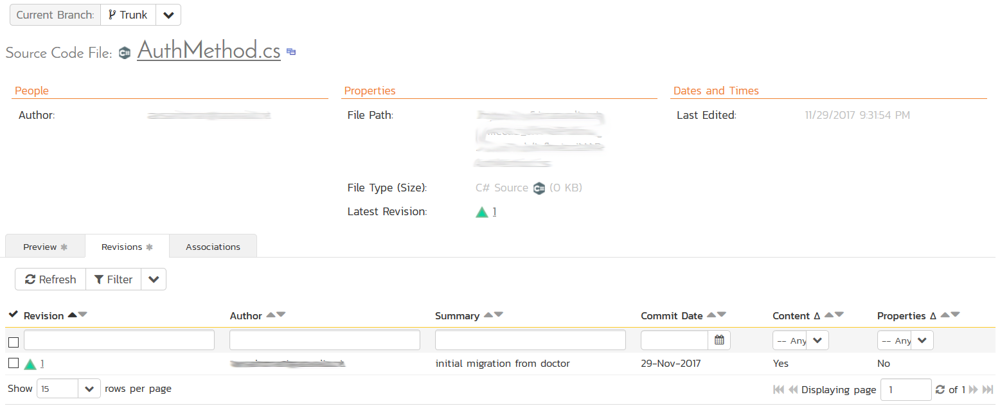
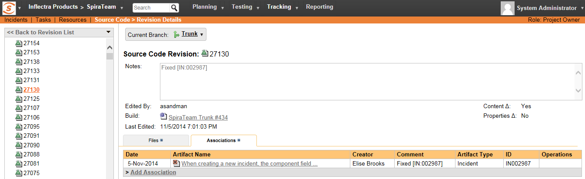

# Integrating with Subversion

Subversion (also known as SVN) is a Software Configuration Management
(SCM) system, that enables users to work on code simultaneously while
preserving previous versions by avoiding collisions in code edits. While
users working on the code will usually have a complete copy of the
repository on their local systems, this plug-in will access the
repository remotely by use of the "**svn://**" , "**http://**" and
"**https://**" protocols. (Note that "**svn+ssh://**" may be supported
on a server by server basis.)

Due to the methodologies in which IIS handles web requests and runs on
the server, any SSH connection certificates that have trust issues will
be automatically accepted. Therefore, we recommend using an IP address
to connect to the server instead of a DNS name that could be redirected
to an unsafe connection.

The current version of the Subversion plugin requires SpiraPlan or
SpiraTeam v5.4.0.0 or later.

## Installing the Subversion Plug-In To install the Subversion Version Control plug-in, follow these steps:

-   ## Copy the following files into place on your Web Server's SpiraTeam installation:

-   ## Copy the file "SubversionProvider.dll" file into the "VersionControl" sub-folder of the SpiraTeam installation.

-   If your server operating system is 64-bit, then copy all the
files in the "**x64**" directory of the downloaded plug-in zip
file into the "VersionControl" sub-folder of the SpiraTeam
installation. *Note: Do not create an x64 folder under
VersionControl, make sure the files live in the VersionControl
folder itself.*

-   If your server operating system is 32-bit, then copy all the
files in the "**x32**" directory of the downloaded plug-in zip
file into the "VersionControl" sub-folder of the SpiraTeam
installation. *Note: Do not create an x32 folder under
VersionControl, make sure the files live in the VersionControl
folder itself.*

-   Log in as the Administrator and go into SpiraTeam main
Administration page and click on the "Version Control" link under
**System**.

-   Click the "Add" button to enter the Plug-in details page. The fields
required are as follows:

-   **Name**: The name must be "SubversionProvider".

-   **Description**: The description is for your use only, and does
not affect operation of the plug-in.

-   **Active**: If checked, the plug-in is active and able to be
used for any project.

-   **Connection Info**: This field holds the root of the repository
for any project accessing the plug-in, unless overridden in the
Project Settings. Start the connection string with **svn://**,
**http://**, or **https://**.

-   **Login / Password**: The user id and the password of the user
to use while accessing and retrieving information from the
Subversion server.

-   **Custom 01**: This field is used for debugging. Please leave it
blank unless specified by support.

-   **Custom 02-04:** These three fields are used to specify the
**standard Subversion** layout, where there are specific folders
for the Trunk, Branches and Tags:

If you want to use the Branches feature in SpiraTeam, you need
to populate all three fields:

-   **Custom 02:** The folder containing the Trunk (usually
called Trunk or trunk)

-   **Custom 03:** The folder containing the Branches (usually
called Branches or branches)

-   **Custom 04:** The folder containing the Tags (usually
called Tags or tags)

-   **Other Fields**: The other fields (Domain, Custom 05) are not
used by the plug-in and will be ignored.

-   When finished, click the "Insert" button and you will be taken back
to the Version Control integration list page, with
SubversionProvider listed as an available plug-in.

-   Verify that you are in the correct project using the drop-down at
top, and click on the "Project Settings" link for the
SubversionProvider. You will get a screen listing all the same
configuration settings:

-   Be sure to change the Active field to Yes, or the repository
will not be available for the current project.

-   Any other settings entered on this page will override - and have
the same use as - the general settings that you created above.
You would use these settings if you will have more than one
project access different code repositories.

-   Initial setup is complete, click on the "Source Code" menu under the
Tracking tab to navigate and browse the source code repository.

## Using Subversion with SpiraTeam

While being able to browse the source code repository can be useful in
itself, the real strength comes from linking artifacts in SpiraTeam -
including Incidents, Requirements, and Tasks - to revisions checked into
the software repository.

### Viewing the Repository Tree

View the source code tree by selecting the "Source Code" link under the
Tracking tab. You will get a screen similar to:

This means that SpiraTeam is making the initial connection to Subversion
and building its local cache. Once it has finished building the cache,
you'll see a screen that looks like:

The folder tree of the repository is on the left, and files in the
current selected directory will be listed in the right table. The file
view will display the filename, the current revision number of the file
and the date of the last commit. You can filter and sort on any of the
columns, as well.

The page will display the folders and files for the currently selected
branch (in the example above "Trunk"), you can change the current branch
at any time by selecting it from the dropdown menu:

If you click on the **Clone or Checkout** button, SpiraTeam will display
the URL you should use for connecting to Subversion using your SVN
client:

### Viewing File Details

To view the file details, click on a file in the right-hand side of the
repository. The file details page displays the details on the selected
revision. By default, it will be the HEAD revision, unless you clicked
to view the file details from a revision. By clicking on the file name,
you can download the specified revision of the file to your local
machine. This does not do an SVN checkout; you are merely downloading
the file to your local machine.

Underneath the file details are tabs that show a preview of the file
(with syntax highlighting), a list of all the revisions that this file
belongs in, or was committed to, who performed the commit, and the log
message for the commit, and a tab that shows any artifact associations.
Throughout SpiraTeam, revisions are indicated by the

 icon:

### Revision Details

By clicking on a revision in SpiraTeam, you will be taken to the
revision details page.

The revision details screen shows the log for the Commit, the commit
date and author. At the bottom of the page are two tabs, Files and
Associations. The Files tab lists all files that were a part of this
commit, with their full path and the action that was performed on them
for this commit. Possible values are Added, Modified, or Deleted.

The Associations tab shows any artifact (Incident, Task, Requirement,
Test Case, Test Set, etc.) that the log message references. See [Linking Artifacts](#linking-artifacts) for information on how to link a revision with a Subversion
Commit:

### Linking Artifacts

Linking an artifact is quite simple. To maintain the readability of
Subversion's commit messages, we adopted a bracket token. The token is
in the format of:

**\[<artifact identifier\>:<artifact id\>\]**

The first half, the Artifact Identifier, is a two-letter code that is
used throughout SpiraTeam, and is visible on almost every page in the
application. For example, a requirement's identifier is "**RQ**".
Incidents are "**IN**", and test cases are "**TC**". The artifact ID is
the number of the artifact. So by creating a commit message that reads:

SpiraTeam will automatically detect tokens and will include links to
them under the Associations tab for a revision detail.
If you forget to add the association during the commit, you can use the
'Add Association' option within SpiraTeam to add the association after
the fact.

## Troubleshooting

While integration with Subversion is rather complex, as a user you will
only receive a couple of errors that will prevent the integration from
working:

-   SpiraTeam will not display the login page, and there is an error
> (either on the page or in the Application Event Log) that says
> "Could not load file or assembly." Subversion control and library
> files come in both 32-bit and 64-bit ("**Win32**" or "**x64**")
> versions. If this error occurs, it is most likely that the wrong
> version of the files were installed. Download the correct version
> from the Inflectra website, and overwrite the files in the
> VersionControl folder.

-   SpiraTeam reports that the login information is incorrect. In this
> case, double check the Version Control settings, both for the
> Project (which overrides the general settings) and the general
> settings. Project settings will over-ride the general settings. Be
> sure to use a user that has access to all nodes in the tree
> starting from the root repository location.

-   If you are taken back to the repository screen and given a message
> saying that the requested file was deleted from the system, this
> means that an attempt was made to view details on a file that is
> no longer part of the HEAD revision. This can happen when a file
> is deleted or renamed, and this is a normal condition in the code
> repository, not necessarily an error with Subversion or SpiraTeam.

