Contents

[1. Introduction 1](#introduction)

[2. Jetbrains IDEs 2](#jetbrains-ides)

[3. Eclipse / Mylyn 8](#eclipse-mylyn)

[4. Visual Studio 19](#visual-studio)

[5. Visual Studio Code 24](#visual-studio-code)

[6. Visual Studio 2010 29](#visual-studio-2010)

[7. Visual Studio 2005 - 2008 33](#visual-studio-2005---2008)

[Legal Notices 37](#legal-notices)

#  1. Introduction

SpiraTeam® is an integrated Application Lifecycle Management (ALM)
system that manages your project\'s requirements, releases, test cases,
issues and tasks in one unified environment:

SpiraTeam® contains all of the features provided by SpiraTest^®^ - our
highly acclaimed quality assurance system and SpiraPlan® - our
agile-enabled project management solution. With integrated customizable
dashboards of key project information, SpiraTeam® allows you to take
control of your entire project lifecycle and synchronize the hitherto
separate worlds of development and testing.

SpiraTeam provides all this functionality in an easily accessible,
highly usable web interface that can be used by managers, testers and
developers alike. However, we recognize that developers are already
comfortable working in their Integrated Development Environments (IDEs).
To reduce the number of different applications developers need to use,
SpiraPlan, SpiraTest and SpiraTeam can be integrated with such IDEs so
that developers can implement requirements, complete tasks and fix
incidents from within the same environment that they develop the
software code.

This guide outlines how to integrate and use SpiraTest, SpiraPlan and
SpiraTeam in conjunction with various IDEs that are commonly used in
software development. This guide assumes that the reader is familiar
with both SpiraTeam and the appropriate IDE being discussed. For
information regarding how to use SpiraTeam, please refer to the
*SpiraTeam User Manual*.

# 2. Jetbrains IDEs

This section outlines how to use SpiraTest, SpiraPlan or SpiraTeam
(hereafter referred to as SpiraTeam) in conjunction with any Jetbrains
integrated development environment (IDE) for viewing Requirements, Tasks
and Incidents. Rather than develop a new user-interface from scratch,
the SpiraTeam plug-in uses the robust tool window functionality in
Jetbrains IDEs which allows users to customize their experience.

## 2.1. Installing the Jetbrains Plug-In

This section outlines how to install the SpiraTeam plug-in for
Jetbrains. It assumes that you already have a working installation of
SpiraTest, SpiraPlan or SpiraTeam v5.0 or later and an up-to-date
version of your Jetbrains IDE. For this tutorial we will be installing
the plug-in in IntelliJ, Jetbrains' Java IDE.

If you have an earlier version of SpiraTeam, you will need to upgrade to
at least v5.0 before trying to integrate with Jetbrains.

To obtain the Jetbrains plug-in, open up the Jetbrains settings dialog
at File \> Settings. This will open the settings dialog. Click on the
"Plugins" section on the left. Your screen should look something like
this:

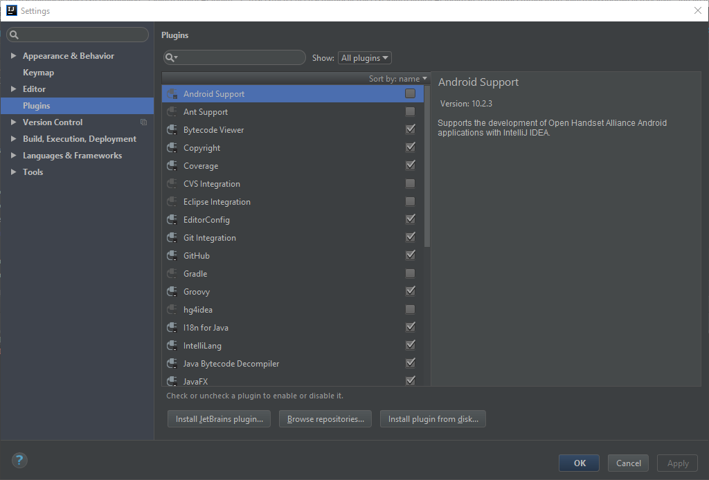

Click on the "Browse repositories" button on the bottom of the screen,
and enter "SpiraTeam" into the search bar. You should see the following
result:

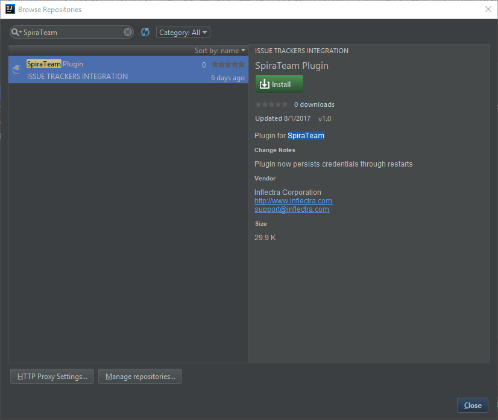

Click the Install button. After it has installed you will be asked to
restart your IDE.

After your IDE has restarted, go to View \> Tool Windows \> SpiraTeam to
open up the SpiraTeam Tool Window.

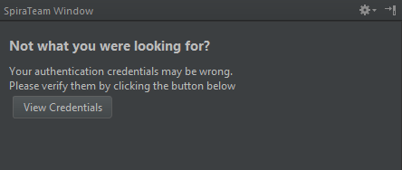

Click on the "View Credentials" button and put in your log-in
credentials. Please note that you can obtain the RSS Token by going to
your user profile inside SpiraTeam. If the RSS Token is blank, make sure
to enable RSS, and click Save.

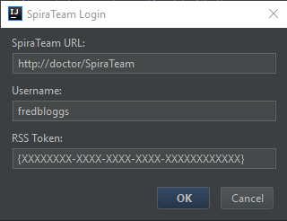

Once you press the OK button, wait for the window to close. If your
log-in information is correct, you should see the following screen in
the SpiraTeam Tool Window:

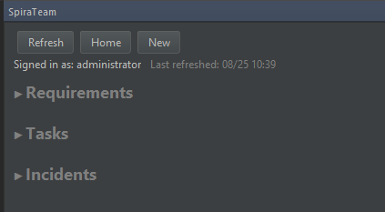

## 2.2. Viewing Requirements, Tasks and Incidents in Jetbrains

Clicking on Requirements, Tasks or Incidents will expand a list of their
respective item's that are open and are assigned to you. If, for
instance, you have no open requirements assigned to you, you will not
see the "Requirements" title in the SpiraTeam window. Here is an example
of all three expanded:

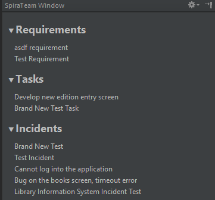

Clicking on any requirement, task or incident will open up additional
information in the bottom of the tool window. Clicking the title in this
additional information panel will open the relevant item in SpiraTeam in
your default browser.

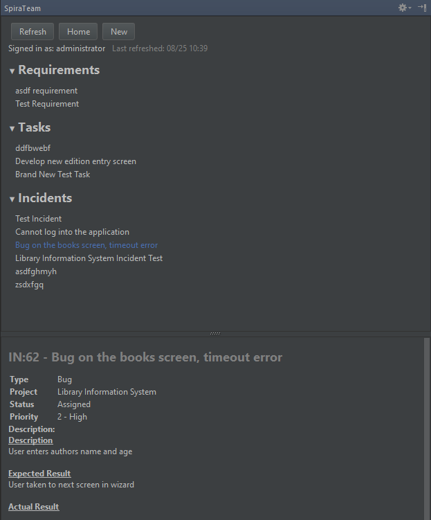

## 2.3 Creating new Requirements, Tasks, and Incidents in Jetbrains

Clicking the "New" button at the top of the SpiraTeam window or
navigating to Tools \> SpiraTeam \> New Item will bring up the new item
popup.

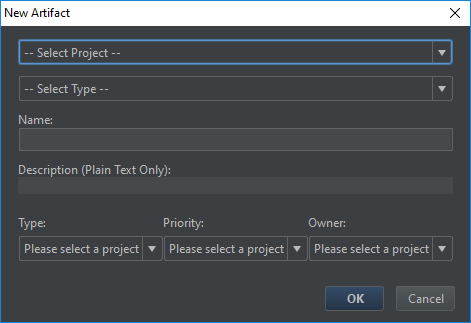

After you select your project and item type, the type, priority and
owner fields will populate appropriately. If you do not wish to select a
priority or owner, simply select "---None --" for either of them, and
the field will not be populated in SpiraTeam.

Once you press OK, your artifact will be created and you will get a
notification in the SpiraTeam Tool Window like this one:

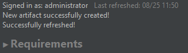

Clicking on the notification label will dismiss it.

## 2.4 Miscellaneous Functions

If you want to change the user you are signed in as, you simply need to
click on your username on the right of the "Signed in as" label.

Clicking the "Refresh" button will refresh your assigned items from the
server, while the "Home" button will take you to your My Page in your
default browser. Navigating to Tools \> SpiraTeam will bring up another
way of interacting with SpiraTeam

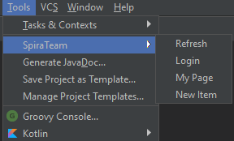

# 3. Eclipse / Mylyn

This section outlines how to use SpiraTest, SpiraPlan or SpiraTeam
(hereafter referred to as SpiraTeam) in conjunction with the Eclipse
integrated development environment (IDE) for implementing Requirements,
completing Tasks and fixing Incidents. Rather than develop a new
user-interface from scratch, the SpiraTeam plug-in uses the generic
Mylyn task-based interface that allows Eclipse users to manage their
local tasks and tasks from any compatible repository in a single
interface.

## 3.1. Installing the Eclipse Plug-In

This section outlines how to install the SpiraTeam plug-in for Eclipse.
It assumes that you already have a working installation of SpiraTest,
SpiraPlan or SpiraTeam v5.0 or later and a working installation of
Eclipse v4.6 (Neon) or later with the Mylyn plug-in installed.

If you have an earlier version of SpiraTeam, you will need to upgrade to
at least v5.0 before trying to integrate with Eclipse.

To obtain the Eclipse plug-in, open up the Eclipse application and click
on Help \> Eclipse Marketplace. Enter "SpiraTeam" in the 'Find' text
box. Once you hit enter, you should see the following result:

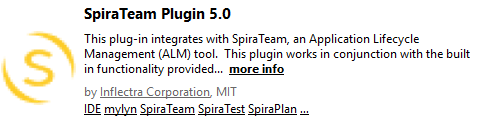

Click the Install button, accept the terms of the license and click
"Finish". Eclipse will advise you that our software contains unsigned
content, press "OK" to continue the installation. After you restart
Eclipse, you can start to use our plug-in.

Alternatively, you can click Help \> Install New Software. This will
display the Eclipse installation wizard:

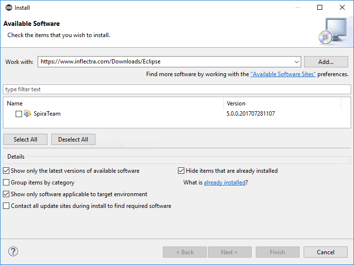

Enter <https://www.inflectra.com/Downloads/Eclipse> as the download site
in the "Work with:" text box and uncheck the "Group items by category"
checkbox. Once you hit enter, the wizard should display "SpiraTeam".
Select the Feature's checkbox and click "Next" or "Finish" to tell
Eclipse to download and install the feature and dependent plug-ins.
During this process you may be asked to agree to our software license
and to allow the installation of unsigned software. Once you have
completed these steps, you should now have our SpiraTeam plug-in
installed and ready to use.

To check that the individual plugins have been installed, you can go to
Help \> About Eclipse and then click on the \[Installation Details\]
button. On the page that appears, click on the Plugins tab and you will
see the two Inflectra plugins listed (Core and UI).

Now that you have the plug-ins installed, the next steps are:

1.  Connect to the appropriate SpiraTeam repository

2.  Download your assigned SpiraTeam artifacts (Requirements, Tasks and
Incidents)

3.  Work on the downloaded SpiraTeam artifacts

## 3.2. Connecting to the SpiraTeam Repository

To connect to a SpiraTeam repository, you need to first display the
appropriate Eclipse views. To do this, go to Window \> Show View \>
"Other..." and then under the Tasks section, display both the Task
Repositories view and the Task List view:

> 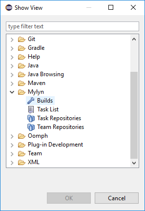

> 

Once you have chosen to select the Task Repositories, the following tab
will be displayed:

Where any existing repositories will listed along with the built-in
"Local" repository that is used to manage tasks created natively within
Eclipse/Mylyn.

To connect to a new SpiraTeam repository, right-click on the window and
choose "Add Task Repository..." which will bring up the following
selection box:

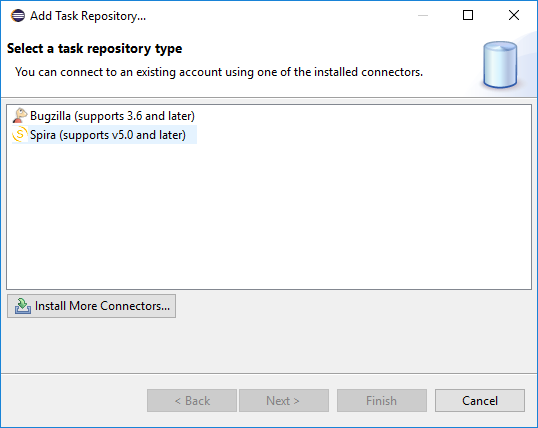

Choose the "Spira" repository entry and click \[Next\]. This will bring
up the repository configuration dialog box:

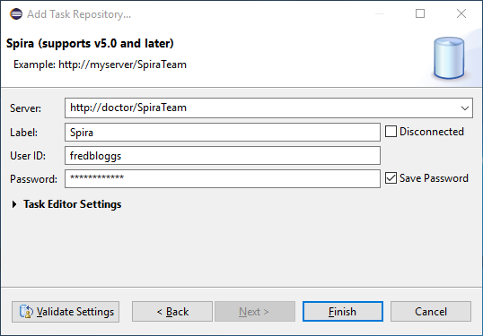

On this screen, you need to fill out the information used to connect to
your SpiraTeam server:

**Server** -- This should be the URL to the SpiraTeam instance that you
are accessing.

**Label** -- This is a "friendly" name for that server that will be used
inside Eclipse.

**User ID** -- This needs to be a valid username that has access to
SpiraTeam.

**Password** -- This needs to be the correct password for the username
specified.

Once you have entered the information, click \[Finish\] to complete the
"Add Repository" wizard. Once this has been done, Eclipse will ask you
if you would like to add a new query for this repository. You can choose
either Yes or No. The process for adding a new query to the SpiraTeam
repository is described in the next section.

## 3.3. Adding Queries to the Repository

Once you have added the SpiraTeam repository, the repository list view
should now look something like:

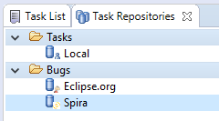

You can now add a new query by right-clicking on the SpiraTeam
repository instance and choosing "New Query...". This will bring up the
new query wizard:

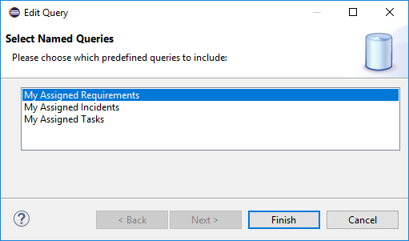

Currently the SpiraTeam Eclipse/Mylyn plugin only supports the three
predefined queries listed above. You can choose to add a list of
Requirements, Incidents or Tasks that are assigned to you. Once you have
added the appropriate queries (depending on which types of artifact get
assigned to you), the list of Requirements, Incidents and or Tasks will
be downloaded from the server and added to your Task List in Eclipse:

When you hover the mouse over any of the items in the list of
Requirements, Incidents or Tasks, you will see a popup tooltip that
provides additional information:

Artifacts in the list have various states, based on your interaction
with them. Unread artifacts are those with new changes, which you
haven't seen yet. These artifacts are denoted as having "incoming
changes" (coming from repository). When you open and edit the artifact,
it will have local modifications which haven't been sent to SpiraTeam
repository yet (outgoing changes).

The following UI Legend explains meaning of various icons which are
displayed in the Eclipse/Mylyn Task List:

As you can see, the different SpiraTeam artifacts are represented by
different graphic overlays that let you know if the Eclipse/Mylyn task
is really a SpiraTeam Requirement, Incident or Task.

To refresh the list of tasks in Eclipse, you can either right-click on
the appropriate query folder and choose "Synchronize" or just press the
F5 key on the keyboard.

Each of the different artifacts (Requirements, Incidents and Tasks)
works slightly differently, so please refer to the appropriate section
for details on how to view and edit.

## 3.4. Viewing and Editing Requirements in Eclipse

When you view the list of Requirements in the Eclipse task list, it will
have the following general form:

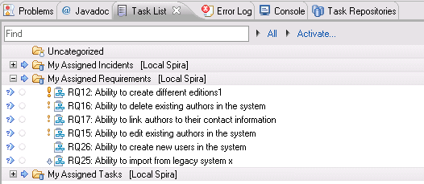

Each Requirement is listed by name and number, together with its
importance indicated by the equivalent Eclipse/Mylyn priority icon. To
view the details of a specific Requirement, you should double-click on
the Requirement, and the Requirements editor will be opened:

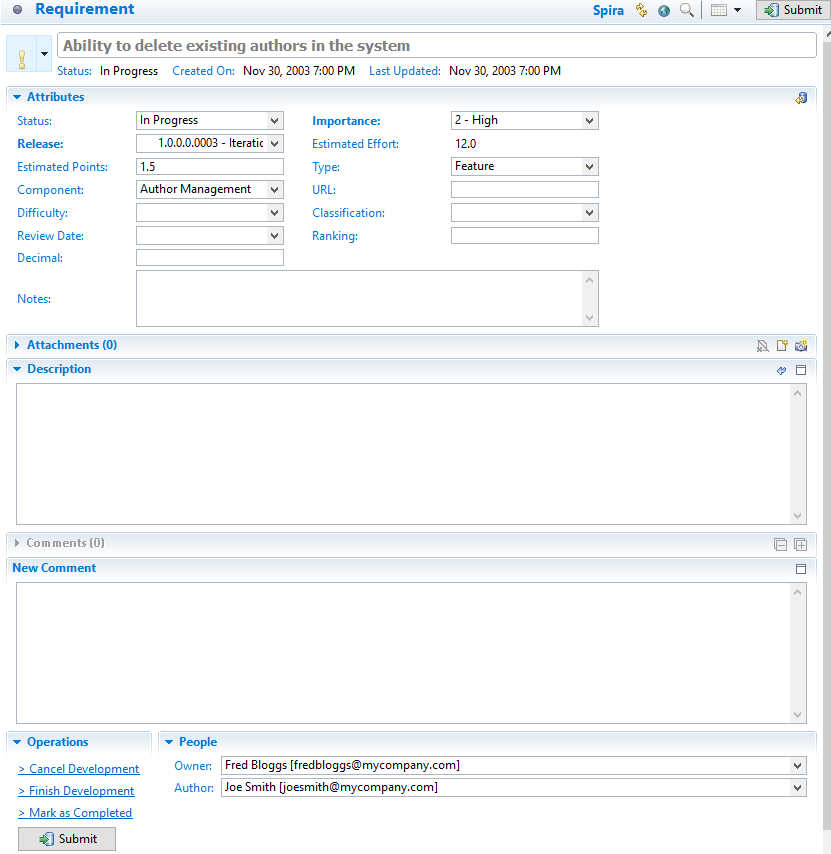

The Requirements editor screen is divided up into several sections:

**Header** -- this displays the name and ID of the Requirement, together
with a graphical indication of its priority, its status, creation date
and last-update date.

**Attributes** -- this displays the various SpiraTeam-specific
attributes of the Requirement, including status, importance, scheduled
release, component ID and planned effort. Any custom properties defined
for the requirement will also be displayed.

**Attachments** -- this displays the list of documents, web-links and
screenshots attached to the Requirement. You can also upload new files
and screenshots to the Requirement from within Eclipse.

**Description** -- this displays the detailed description of the
Requirement.

**Comments** -- this displays a threaded list of all the comments that
have been added to the Requirement in SpiraTeam.

**New Comment** -- this allows you to add a new comment to the
Requirement. The new comments will be sent to the SpiraTeam server when
\[Submit\] is clicked.

**People** -- this displays the name and email address of the person who
wrote the Requirement (author) and the person who it's currently
assigned-to (owner).

**Operations** -- this contains the list of operations that can be
performed on the Requirement. More information on operations can be
found below.

You can make changes to the Requirement by simply changing the values in
the appropriate dropdown list or editing the information in any of the
text boxes. Once you have happy with the changes, you can update the
version on the SpiraTeam server by clicking the \[Submit\] button. If
there are any data validation errors, they will be displayed. Once you
have corrected them, the Requirement changes will be accepted by the
system.

In addition to making updates, you can perform the following actions on
the Requirement:

**Workflow Transitions** -- these are the blue hyperlinks displayed
directly above the \[Submit\] button in the actions tab. These allow you
to ***change the status of the Requirement*** and when clicked, the
fields in the Attributes section will change based on the new status.\
*Note: changing the Type of the Requirement will disable the workflow
transition hyperlinks until \[Submit\] is clicked.*

Refresh the Requirement from the version on the server. This will update
the local copy of the Requirement with the latest changes made on the
SpiraTeam server.

Browse the version of the Requirement on the server. Clicking the
"globe" icon will open up a browser and display the Requirement directly
in SpiraTeam.

## 3.5. Viewing and Editing Tasks in Eclipse

When you view the list of Tasks in the Eclipse task list, it will have
the following general form:

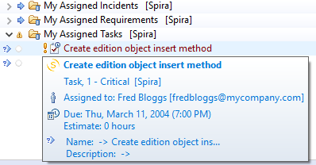

Each Task is listed by name and number, together with its priority
indicated by the equivalent Eclipse/Mylyn priority icon. To view the
details of a specific Task, you should double-click on the Task, and the
Tasks editor will be opened:

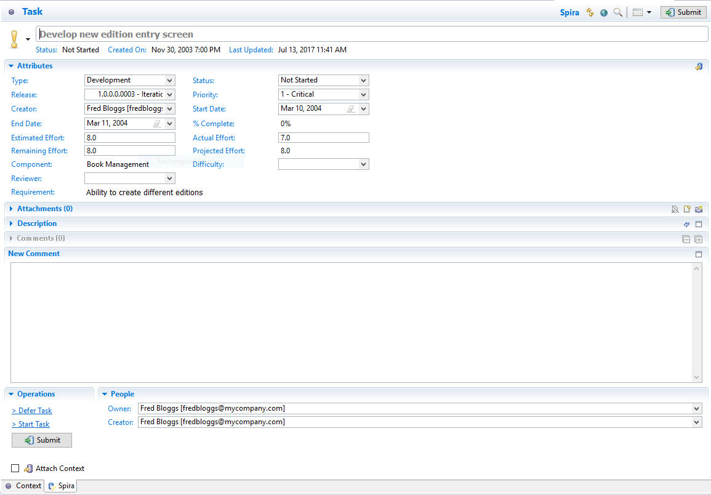

The Tasks editor screen is divided up into several sections:

**Header** -- this displays the name and ID of the Task, together with a
graphical indication of its priority, its status, creation date and
last-update date.

**Attributes** -- this displays the various SpiraTeam-specific
attributes of the Task, including status, scheduled release, priority,
start-date, end-date, % complete, estimated effort, actual effort, the
name/id of the Requirement it belongs to and its component. Any custom
properties defined for the task will also be displayed.

**Attachments** -- this displays the list of documents, web-links and
screenshots attached to the Task. You can also upload new files and
screenshots to the Task from within Eclipse.

**Description** -- this displays the detailed description of the Task.

**Comments** -- this displays a threaded list of all the comments that
have been added to the Task in SpiraTeam.

**New Comment** -- this allows you to add a new comment to the Task. The
new comments will be sent to the SpiraTeam server when \[Submit\] is
clicked.

**People** -- this displays the name and email address of the person who
created the Task (creator) and the person who it's currently assigned-to
(owner).

**Operations** -- this contains the list of operations that can be
performed on the Task. More information on operations can be found
below.

You can make changes to the task by simply changing the values in the
appropriate dropdown list or editing the information in any of the text
boxes. Once you have happy with the changes, you can update the version
on the SpiraTeam server by clicking the \[Submit\] button. If there are
any data validation errors (e.g. you have to enter a start-date to make
the Task In-Progress), they will be displayed. Once you have corrected
them, the Task changes will be accepted by the system.

In addition to making updates, you can perform the following actions on
the Task:

**Workflow Transitions** -- these are the blue hyperlinks displayed
directly above the \[Submit\] button in the actions tab. These allow you
to ***change the status of the Task*** and when clicked, the fields in
the Attributes section will change based on the new status.\
*Note: changing the Type of the Task will disable the workflow
transition hyperlinks until \[Submit\] is clicked.*

Refresh the Task from the version on the server. This will update the
local copy of the Task with the latest changes made on the SpiraTeam
server.

Browse the version of the Task on the server. Clicking the "globe" icon
will open up a browser and display the Task directly in SpiraTeam.

## 3.6. Viewing and Editing Incidents in Eclipse

When you view the list of Incidents in the Eclipse task list, it will
have the following general form:

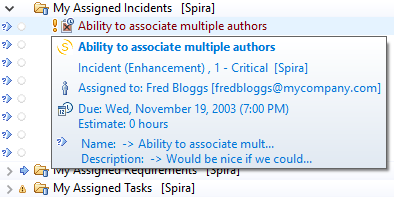

Each Incident is listed by name and number, together with its priority
indicated by the equivalent Eclipse/Mylyn priority icon. To view the
details of a specific Incident, you should double-click on the Incident,
and the Incidents editor will be opened:

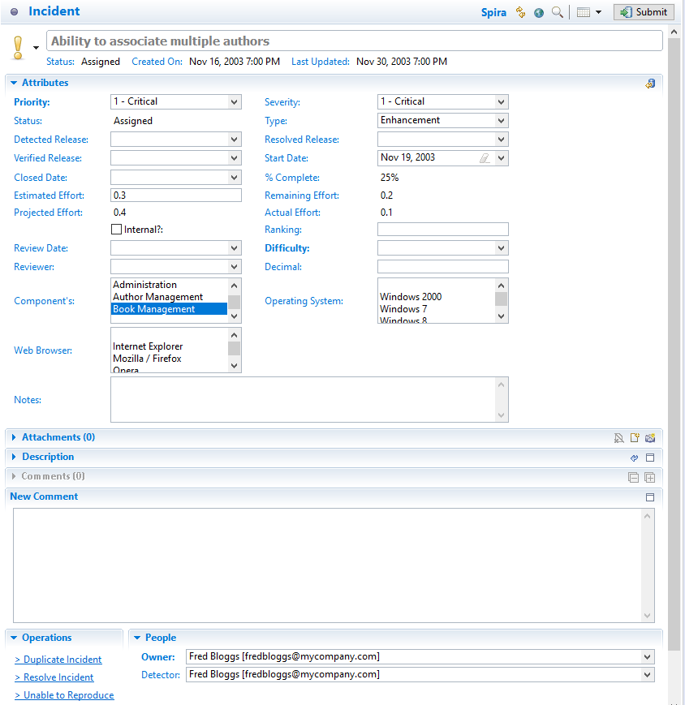

The Incidents editor screen is divided up into several sections:

**Header** -- this displays the name and ID of the Incident, together
with a graphical indication of its priority, its status, creation date
and last-update date.

**Attributes** -- this displays the various SpiraTeam-specific
attributes of the Incident, including priority, severity, status, type,
detected release, resolved release, verified release, start-date,
closed-date, % complete, estimated effort, actual effort and component
Id's. Any custom properties defined for the incident will also be
displayed.

**Attachments** -- this displays the list of documents, web-links and
screenshots attached to the Incident. You can also upload new files and
screenshots to the Task from within Eclipse.

**Description** -- this displays the detailed description of the
Incident.

**Comments** -- this displays a threaded list of all the comments that
have been added to the Incident in SpiraTeam.

**New Comment** -- this allows you to add a new comment to the Incident.
The new comments will be sent to the SpiraTeam server when \[Submit\] is
clicked.

**People** -- this displays the name and email address of the person who
found the Incident (detector) and the person who it's currently
assigned-to (owner).

**Operations** -- this contains the list of operations that can be
performed on the Incident. See below for more information on how to use
this section.

You can make changes to the Incident by simply changing the values in
the appropriate dropdown list or editing the information in any of the
text boxes. Once you have happy with the changes, you can update the
version on the SpiraTeam server by clicking the \[Submit\] button. If
there are any data validation errors (e.g. you have to enter a
start-date to make the Incident In-Progress), they will be displayed.
Once you have corrected them, the Incident changes will be accepted by
the system.

In addition to making simple updates, you can perform the following
actions on the Incident:

**Submit** -- clicking the submit button will commit the changes made on
the Incident to the SpiraTeam Server.

**Workflow Transitions** -- these are the blue hyperlinks displayed
directly above the \[Submit\] button in the actions tab. These allow you
to ***change the status of the Incident*** and when clicked, the fields
in the Attributes section will change based on the new status.\
*Note: changing the Type of the Incident will disable the workflow
transition hyperlinks until \[Submit\] is clicked.*

Refresh the Incident from the version on the server. This will update
the local copy of the Incident with the latest changes made on the
SpiraTeam server.

Browse the version of the Incident on the server. Clicking the "globe"
icon will open up a browser and display the Incident directly in
SpiraTeam.

# 4. Visual Studio

This section outlines how to use SpiraTest, SpiraPlan or SpiraTeam
(hereafter referred to as SpiraTeam) in conjunction with the Visual
Studio (VS) integrated development environment (IDE) for viewing
Requirements, completing Tasks and fixing Incidents.

This add-in is meant for use with Visual Studio 2012 or later and
SpiraTest, SpiraPlan or SpiraTeam (hereafter referred to as SpiraTeam)
version v5.0 or later. It does require that .NET v4.5 be installed;
however this is required by Visual Studio 2012 by default.

## 4.1. Installing the Visual Studio Add-In

The addin is downloadable from [Microsoft's Visual Studio
Gallery](http://visualstudiogallery.msdn.microsoft.com/ef3e5da0-ac1e-48de-9c4b-0a8479ef8498),
or from within Visual Studio by going to *Tools* -\> *Extension Manager*
and searching for "SpiraTeam". If downloaded from within Visual Studio,
after installation the IDE will need to be restarted. If downloaded from
the browser, double-click on the VSIP file and it will walk you through
the installation process.

## 4.2. Adding and Assigning SpiraTeam Projects

After installing, a new menu item will appear under the "View" menu:

To view the Project Explorer, select "SpiraTeam Project Explorer" from
the View menu. The tool window will open, and may be docked like any
other tool window. When a solution is loaded that hasn't a SpiraTeam
project assigned to it -- or if no solution is open -- the tool window
will give a message saying so:

Once a project is loaded that contains linked SpiraTeam projects, or a
SpiraTeam project is added to the current open solution, then the tool
window will load in the SpiraTeam projects and display them.

To add, remove, and assign a SpiraTeam project to the open solution,
click the SpiraTeam Configuration Button in the Tool Window (looks like
a cog), which will open the configuration dialog:

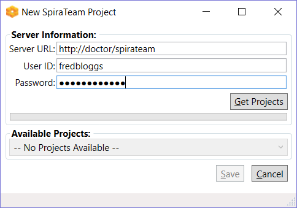

In the fields, enter in the following:

-   **Server URL**: The root address of your SpiraTeam installation. For
> example:\
> <https://server1/SpiraTeam/>\
> Do not put "login.aspx" or any other page address in this field.

-   **User ID**: Your user ID you use to log into the SpiraTeam
> application.

-   **Password**: Your password you use to log into the SpiraTeam
> application.

Once entered, click the "Get Projects" button. The add-in will connect
to the server and get a list of projects that you are assigned to.

Select the SpiraTeam project that you want to add, and click the "Save"
button.

Clicking "Save" will return you to the IDE, and if you made any changes
in the configuration, the Project Explorer will refresh and update its
display.

## 4.3. Viewing SpiraTeam Project Artifacts

Once a solution is opened and there is a SpiraTeam project assigned, you
can view the project's contents. At this time, the add-in will display
the following items:

-   **Users:** Users in your Spira contacts list

-   **Incidents**: Assigned to you and open.

-   **Tasks**: Assigned to you and not completed.

-   **Requirements**: Assigned to you and not developed yet.

Double-clicking on a node (or clicking on the item's arrow) will open
that item up and show all the sub-items:

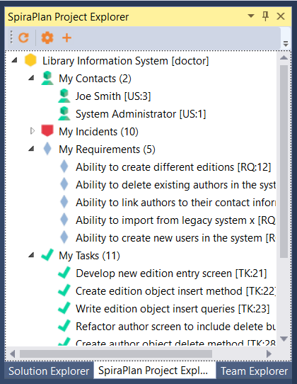

Clicking the Refresh button on the toolbar will refresh the highlighted
item in the tree, and all sub-items contained within it. SpiraTeam
projects in the Project Explorer.

All items have a right-click menu, and the options available for items
are as follows:

-   **View in Browser**: Opens the details of the item in your current
web browser.

-   **Refresh List**: For folders and project only. Refreshes the folder
or project's contents.

-   **Copy to Clipboard**: Copies the artifact's token into the
clipboard, for easy pasting into Version Control commits or
descriptions.

## 4.4. Viewing Artifact Details

By double-clicking an artifact in the Project Explorer (or choosing View
in Browser), you can open the details for the item in the current tab of
your web browser:

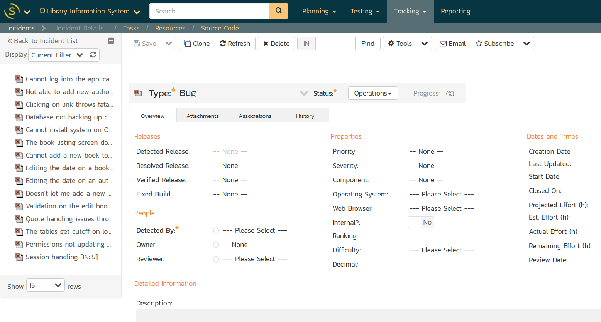

In addition, when you select one of the items in the add-in treeview,
the add-in will display the properties for that item in the standard
Visual Studio properties window:

This lets you decide whether you want to open the item in SpiraTeam
before actually doing so. In a similar vein, there is a helpful tooltip
displayed for all items in the tree:

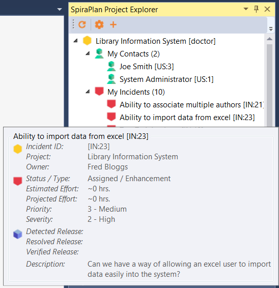

## 4.5. Creating a Task

If you click on the (+) icon in the extension toolbar you will be able
to quickly log a new task in SpiraTeam or SpiraPlan, making it easier to
track new developer tasks and have them sync across machines:

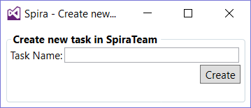

Just enter the name of the new task and it will be created in SpiraTeam,
then displayed in the task list:

## 4.6. Troubleshooting

The add-in is designed to capture all errors so that when something
unexpected happens, work isn't lost. In most situations where an error
occurs, a notification will be displayed of the error. In the Project
Explorer, hover the mouse over the error node to get a full description
of the error.

Errors will also be logged to the desktop's Application Event Log or a
text file in case there was a problem connecting to the Event Log on the
local computer. Contact support with the Application Event Log and
inform them of the issue.

# 5. Visual Studio Code

This plugin creates a new custom view which allows you to seamlessly
view your assigned Spira Tasks, Requirements, and Incidents as well as
create brand new Tasks right from Visual Studio Code.

## Guide Basics

Unfortunately, this plugin only works with version 5.3 and above of the
Spira ALM suite. If you have an older version, you need to update to use
this plugin.

This guide assumes you are familiar with Visual Studio Code and have
already installed our plugin from the store.

## Logging in

Open the command palette and type in \'credentials\' as shown:

Hit return to begin the Spira authentication process. You should see an
input box that asks you to type the base URL of your Spira service. This
should access the \'root\' directory of your Spira, not including the
ending slash. An example is provided below:

Hit return when you typed in your URL to move on to the next step. You
will be prompted to enter your Spira username, which you use when
signing into your Spira subscription. See the example below for
assistance.

After you entered your username, hit return to move onto your final
step. You will be prompted to enter your RSS Token, which must be
enabled in your user profile to work.

Here is the location of the RSS Token in your profile:

Here is a sample image of a (fake) RSS Token:

## Viewing your Assigned Requirements, Tasks, and Incidents

You should see a new icon on the left menu where the explorer, search
bar, version control, etc are expanded from. Alternatively, you can
expand the view by pressing alt+s Here is an image of the Spira icon:

Click on the new icon to open the Spira panel where you can see all of
the Tasks, Requirements, and Incidents that are assigned to you. You can
expand/collapse any of the different types of items. You should now see
a view similar to this:

Clicking on one of the different items, \'Cannot log into the
application\' for instance will bring up a view similar to this:

Clicking on the name of the artifact highlighted in blue will
conveniently open the selected item in your default browser.

## Refreshing your Assigned Items from Spira

### Refreshing Automatically

By default, your assigned items are refreshed every 60 seconds. If you
would like to change this, see [Changing Auto-Refresh
Time](https://marketplace.visualstudio.com/items?itemName=Inflectra.spira-extension-vscode#changing-auto-refresh-time)

Changing the setting will affect how often the server is pinged to
refresh the list. If you put in 0 or below, the list will never
automatically refresh, and a value between 1 and 5 will default to 5
seconds. If you changed the setting from 0 or below to above 0, please
refresh manually as shown below:

### Refreshing Manually

Running \'Spira - Refresh\' in the command palette or hitting alt+s,
alt+r by default on windows will refresh manually.

## Creating a new Task

You can easily create a new task in VS Code by running \'Spira - Create
New Task\' in the command palette or by hitting alt+s, alt+t on windows.
This will take any highlighted text and dump it into the name prompt.
Feel free to change the name if you like.

Hit return and select a project from the dropdown as shown below:

Hit return and you should see it in the Spira panel on the left and get
a popup in the bottom right telling you it was a success!

## Settings

### Changing Auto-Refresh Time

By default, the panel will refresh every 60 seconds, but this can easily
be changed or disabled altogether through settings. To change this, open
up your settings and search for \'spira\' as shown below:

### Disabling an Item Type

If you like, you can prevent displaying a particular item type. This can
be particularly useful if you only want to view your assigned tasks,
which should also decrease load times. To accomplish this, simply search
\'spira\' in settings and switch any of the \'showType\' settings to
false. See the image below for an example:

#  

# 6. Visual Studio 2010

This section outlines how to use SpiraTest, SpiraPlan or SpiraTeam
(hereafter referred to as SpiraTeam) in conjunction with the Visual
Studio (VS) integrated development environment (IDE) for viewing
Requirements, completing Tasks and fixing Incidents.

This add-in is meant for use with Visual Studio 2010 or later and
SpiraTest, SpiraPlan or SpiraTeam (hereafter referred to as SpiraTeam)
version v4.0 or later. It does require that .NET v4.0 is installed;
however this is required by Visual Studio 2010 by default.

## 6.1. Installing the Visual Studio Add-In

The Visual Studio 2010 version can be downloaded from the Inflectra
SpiraTeam add-ons webpage:

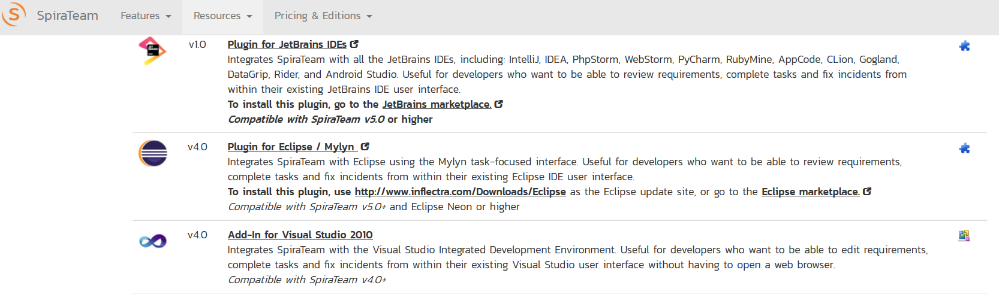

Please do not use the version in the Visual Studio gallery, that is the
newer Visual Studio 2012 extension (described in section 4) which is not
compatible with Visual Studio 2010.

## 6.2. Adding and Assigning SpiraTeam Projects

After installing, a new menu item will
appear under the "View" menu.

To view the Project Explorer, select "SpiraTeam Project Explorer" from
the View menu. The tool window will open, and may be docked like any
other tool window. When a solution is loaded that hasn't had any
SpiraTeam projects assigned to it -- or if no solution is open -- the
tool window will give a message saying so. Once a project is loaded that
contains linked SpiraTeam projects, or a SpiraTeam project is added to
the current open solution, then the tool window will load in the
SpiraTeam projects and display them.

To add, remove, and assign a SpiraTeam project to the open solution,
click the Configuration Button in the Tool Window
(

), which will open the configuration
dialog:

Click the New button
(

) to link to a new SpiraTeam project. The
"new SpiraTeam Project" dialog will open. In the fields, enter in the
following:

-   **Server URL**: The root address of your SpiraTeam installation. For
> example:\
> <https://server1/SpiraTeam/>\
> Do not put "login.aspx" or any other page address in this field.

-   **User ID**: Your user ID you use to log into the SpiraTeam
> application.

-   **Password**: Your password you use to log into the SpiraTeam
> application.

Once entered, click the "Get Projects" button. The add-in will connect
to the server and get a list of projects that you are assigned to.
Select the SpiraTeam project that you want to add, and click the "Save"
button. Your project will appear in the dialog in the format of "Project
Name \[Server\]". With a project selected in the left box, you can also
Edit
(

) and Delete
(

) the project.

With a solution loaded, you can select any number of SpiraTeam projects
and assign them to the open Solution, by highlighting them, and clicking
the "Add \>" button. All projects assigned to the open solution will
appear in the right side.

Clicking "Save" will return you to the IDE, and if you made any changes
in the configuration, the Project Explorer will refresh and update its
display.

## 6.3. Viewing SpiraTeam Project Artifacts

Once a solution is opened and there is a SpiraTeam project assigned, you
can view the project's contents. At this time, the add-in will display
the following items:

 **Incidents**: Assigned to you and
unassigned.

 **Tasks**: Assigned to you and
unassigned.

 **Requirements**: Assigned to you and
unassigned.

By default, the Project Explorer will not show closed and completed
items. However, by clicking the 'View Closed'
(

) button in the toolbar, the Project
Explorer will be updated to show closed and completed items as well.

Double-clicking on a node (or clicking on the item's arrow) will open
that item up and show all the sub-items:

Clicking the Refresh
(

) button on the toolbar will refresh the
highlighted item in the tree, and all sub-items contained within it.
SpiraTeam projects in the Project Explorer.

All items have a right-click menu, and the options available for items
are as follows:

-   **View Details**: Opens the details of the item in a tool window
inside the IDE.

-   **View in Browser**: Opens the details of the item in a browser.

-   **Start/Stop Timer**: For Tasks and Incidents only. Starts or Stops
a work timer for that item.

-   **Refresh List**: For folders and project only. Refreshes the folder
or project's contents.

-   **Copy to Clipboard**: Copies the artifact's token into the
clipboard, for easy pasting into Version Control commits or
descriptions.

## 6.4. Viewing Artifact Details

By double-clicking an artifact in the Project Explorer, you can open the
details for the item in the main tabbed-document view. All the details
screens are very similar.

All of the fields closely match the fields as they appear in SpiraTeam's
interface. The toolbar at top lets you Save the item, Refresh the
details, and view the item in the browser if you so wish. Tasks and
Incidents also have a Work Timer button on the toolbar, which lets a
developer mark an item as being worked on, and when the developer stops
working, it will update the fields with any time worked. Incident
screens also have the Workflow steps up in the toolbar under the "Change
Status" dropdown.

Once you make changes to the artifact, changes are saved to the server
when the "Save" button is clicked.

***Note:** Due to platform architecture differences, the HTML
description may not appear and save exactly as entered, and there is no
'Source HTML' view. If visual integrity/layout is important, then we
recommend editing the description and resolution fields in SpiraTeam's
Web user interface instead.*

### 6.4.1 Data Concurrency and Errors while Saving

In the case an item was changed by someone else while the details screen
was open, you will get an error indicating that the item was changed.
There are two possible options at this point:

1.  If the data that was changed locally does not conflict with any
changes made by the other user, then you will be given the option to
Merge or Reload the data.

2.  If a field was changed locally that was also changed by another
user, the only option that will be given will be to reload the data.

If you opt to merge, then changes taken from the other user will be
merged with your changes, and the item will be saved to the server.
However, if you choose to reload, then your changes will be lost and you
will need to make your changes again.

For incidents, some fields may be marked as being required by the
current workflow. In this case, the labels will be highlighted in bold.
If you try to save an item without all required fields, an error will be
displayed, and the field in error will be highlighted in red.

Details screen for an Incident

## 6.6 Troubleshooting

The add-in is designed to capture all errors so that when something
unexpected happens, work isn't lost. In most situations where an error
occurs, a notification will be displayed of the error. In the Project
Explorer, hover the mouse over the error node to get a full description
of the error. Errors will also be logged to the desktop's Application
Event Log or a text file in case there was a problem connecting to the
Event Log on the local computer.

A common symptom of an internal error is a blank or empty Details screen
-- if this occurs when opening an artifact, save all your open work and
restart Visual Studio. Contact support with the Application Event Log
and inform them of the issue.

#  

# 7. Visual Studio 2005 - 2008

This section outlines how to use SpiraTest, SpiraPlan or SpiraTeam
(hereafter referred to as SpiraTeam) in conjunction with the Visual
Studio (VS) integrated development environment (IDE) for viewing
Requirements, completing Tasks and fixing Incidents.

The Add-In will operate in Visual Studio 2005 and 2008 but does require
that the .NET framework version 3.5 SP1 is installed. It is normally
installed with Visual Studio 2008 SP1 and Visual Studio 2010, but can be
separately installed on a system with Visual Studio 2005 by downloading
the installation file from Microsoft:
<http://www.microsoft.com/downloads/details.aspx?FamilyID=ab99342f-5d1a-413d-8319-81da479ab0d7>

Visual Studio Express versions cannot support Add-Ins, you must at least
have the standard version of the IDE for the Add-In to appear in the
menu bar.

## 
7.1. Installing the Visual Studio Add-In

Download and execute the Add-In installation file from the Inflectra
website. The add-in will be automatically added to VS's menu bar.

## 7.2. Adding and Assigning SpiraTeam Projects

To view the Project Explorer, select "SpiraTeam Project Explorer" from
the View menu. The tool window will open, and can be docked with any
existing tool windows. When a solution is loaded that hasn't had any
SpiraTeam projects assigned to it -- or if no solution is open -- the
dialog will report so. If you have already assigned SpiraTeam projects
to the open solution, they will each be loaded in a tree format in the
tool window.

Visual Studio will remember the docking and location of the window, so
that if you close it you can re-open it by selecting the menu option a
second time. The window will re-open in the last position before it was
closed.

Once the Project Explorer is open, click the "Configuration" button
(

) in the Project Explorer's toolbar to
open the SpiraTeam project dialog. Note that if you have no solution
open, you can add, remove, and edit SpiraTeam projects, but you can only
assign them to a solution when that solution is open:

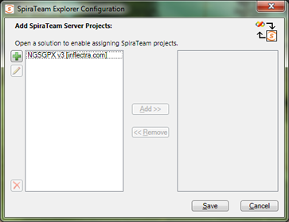

Click the New button
(

) to link to a new SpiraTeam project. The
"new SpiraTeam Project" dialog will open. In the fields, enter in the
following:

-   **Server URL**: The root address of your SpiraTeam installation. For
> example:\
> <https://server1/SpiraTeam/>\
> Do not put "login.aspx" or any other page address in this field.

-   **User ID**: Your user ID you use to log into the SpiraTeam
> application.

-   **Password**: Your password you use to log into the SpiraTeam
> application.

Once entered, click the "Get Projects" button. The add-in will connect
to the server and get a list of projects that you are assigned to.
Select the SpiraTeam project that you want to add, and click the "Save"
button. Your project will appear in the dialog in the format of "Project
Name \[Server\]". With a project selected in the left box, you can also
Edit
(

) and Delete
(

) the project.

With a solution loaded, you can select any number of SpiraTeam projects
and assign them to the open Solution, by highlighting them, and clicking
the "Add \>" button. All projects assigned to the open solution will
appear in the right side.

Clicking "Save" will return you to the IDE, and if you made any changes
in the configuration, the Project Explorer will refresh and update its
display.

## 7.3. Viewing SpiraTeam Project Artifacts

Once a solution is opened and there is a SpiraTeam
project assigned, you can view the project's contents. At this time, the
add-in will display the following items:

 **Incidents**: Assigned to you,
unassigned.

 **Tasks**: Assigned to you, unassigned.

 **Requirements**: Assigned to you.

By default, the Project Explorer will not show closed and completed
items. However, by clicking the 'View Closed'
(

) button in the toolbar, the Project
Explorer will be updated to show closed and completed items as well.

Double-clicking on a node (or clicking on the item's arrow) will open
that item up and show all the sub-items.

Clicking the Refresh
(

) button on the toolbar will refresh the
SpiraTeam projects in the Project Explorer. Double-clicking an artifact
will open its details in the main tabbed document area for viewing and
editing.

## 7.4. Viewing Artifact Details

By double-clicking an artifact in the Project Explorer, you can open the
details for the item in the main tabbed-document view. All the details
screens are very similar, here is the Incident Details view for
reference:

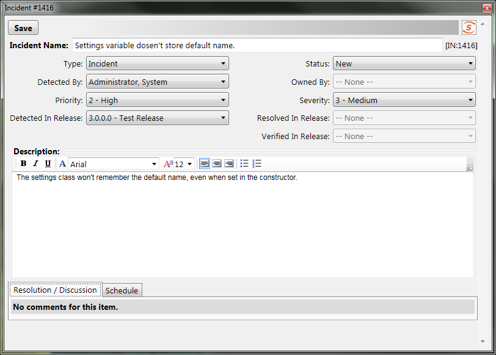

The top of the window has the "Save" button, and any informational or
warning messages will appear to the right of the Save button. The rest
of the window has detail fields relating to the item, and depending on
the current workflow, some fields may be required or disabled. (Note
that at this time, Requirements are read-only.)

Once you make changes to the artifact, changes are saved to the server
when the "Save" button is clicked.

*Note that due to platform architecture differences, the HTML
description may not appear and save exactly as entered, and there is no
'Source HTML' view. If visual integrity/layout is important, then we
recommend editing the description and resolution fields in SpiraTeam's
Web user interface instead.*

## 7.5. Data Concurrency Warnings

When trying to save an artifact, you may get a warning at the top of the
window stating that the item was modified by another user. This error is
telling you that changes were made to the item after the data on your
screen was pulled from the server.

When this happens, you may see some fields highlighted in yellow or red.
The colors represent data collisions:

-   Yellow -- Any field highlighted yellow is a field that you tried to
change that wasn't changed by the other user.

-   Red -- Any field highlighted in red is a field that both you and the
other user tried to change.

-   No Highlight -- Fields without a highlight were possibly changed by
the other user, but you did not make any changes to those fields.

When a concurrency issue occurs, the new data is loaded from the server,
losing your changes due to possible workflow collisions. Simply review
the changed data and make your changes accordingly.

## 7.6 Troubleshooting

The add-in is designed to capture all errors so that when something
unexpected happens, work isn't lost. In most situations where an error
occurs, a notification will be displayed of the error. In the Project
Explorer, hover the mouse over the error node to get a full description
of the error. Errors will also be logged to the desktop's Application
Event Log.

A common symptom of an internal error is a blank or empty Details screen
-- if this occurs when opening an artifact, save all your open work and
restart Visual Studio. Contact support with the Application Event Log
and inform them of the issue.

# Legal Notices

This publication is provided as is without warranty of any kind, either
express or implied, including, but not limited to, the implied
warranties of merchantability, fitness for a particular purpose, or
non-infringement.

This publication could include technical inaccuracies or typographical
errors. Changes are periodically added to the information contained
herein; these changes will be incorporated in new editions of the
publication. Inflectra Corporation may make improvements and/or changes
in the product(s) and/or program(s) and/or service(s) described in this
publication at any time.

The sections in this guide that discuss internet web security are
provided as suggestions and guidelines. Internet security is constantly
evolving field, and our suggestions are no substitute for an up-to-date
understanding of the vulnerabilities inherent in deploying internet or
web applications, and Inflectra cannot be held liable for any losses due
to breaches of security, compromise of data or other cyber-attacks that
may result from following our recommendations.

SpiraTest®, SpiraPlan®, SpiraTeam® and Inflectra® are registered
trademarks of Inflectra Corporation in the United States of America and
other countries. Microsoft^®^, Windows^®^, Explorer^®^ and Microsoft
Project^®^ are registered trademarks of Microsoft Corporation. All other
trademarks and product names are property of their respective holders.

Please send comments and questions to:

> Technical Publications
>
> Inflectra Corporation
>
> 8121 Georgia Ave, Suite 504
>
> Silver Spring, MD 20910-4957
>
> U.S.A.
>
> [*support\@inflectra.com*](mailto:support@inflectra.com)
